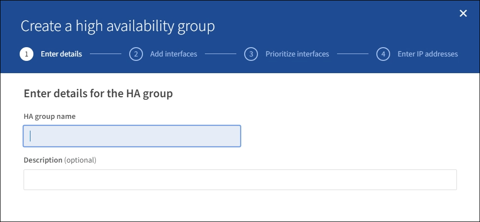

= Configurare i gruppi ad alta disponibilità
:allow-uri-read: 
:icons: font
:imagesdir: ../media/

[role="lead"]
È possibile configurare i gruppi ad alta disponibilità (ha) per fornire l'accesso altamente disponibile ai servizi sui nodi Admin o Gateway.

.Di cosa hai bisogno
* Hai effettuato l'accesso a Grid Manager utilizzando un xref:../admin/web-browser-requirements.adoc[browser web supportato].
* Si dispone dell'autorizzazione di accesso root.
* Se si intende utilizzare un'interfaccia VLAN in un gruppo ha, l'interfaccia VLAN è stata creata. Vedere xref:../admin/configure-vlan-interfaces.adoc[Configurare le interfacce VLAN].
* Se si intende utilizzare un'interfaccia di accesso per un nodo in un gruppo ha, l'interfaccia è stata creata:
+
** *Red Hat Enterprise Linux o CentOS (prima di installare il nodo)*: xref:../rhel/creating-node-configuration-files.adoc[Creare file di configurazione del nodo]
** *Ubuntu o Debian (prima di installare il nodo)*: xref:../ubuntu/creating-node-configuration-files.adoc[Creare file di configurazione del nodo]
** *Linux (dopo l'installazione del nodo)*: xref:../maintain/linux-adding-trunk-or-access-interfaces-to-node.adoc[Linux: Aggiunta di interfacce di accesso o trunk a un nodo]
** *VMware (dopo l'installazione del nodo)*: xref:../maintain/vmware-adding-trunk-or-access-interfaces-to-node.adoc[VMware: Aggiunta di interfacce di accesso o trunk a un nodo]

== Creare un gruppo ad alta disponibilità

Quando si crea un gruppo ad alta disponibilità, selezionare una o più interfacce e organizzarle in ordine di priorità. Quindi, assegnare uno o più indirizzi VIP al gruppo.

Un'interfaccia deve essere un nodo gateway o un nodo amministratore per essere incluso in un gruppo ha. Un gruppo ha può utilizzare solo un'interfaccia per un dato nodo; tuttavia, altre interfacce per lo stesso nodo possono essere utilizzate in altri gruppi ha.

=== Accedere alla procedura guidata

. Selezionare *CONFIGURATION* > *Network* > *High Availability groups*.
. Selezionare *Crea*.

=== Inserire i dettagli del gruppo ha

. Fornire un nome univoco per il gruppo ha.
+

. Facoltativamente, inserire una descrizione per il gruppo ha.
. Selezionare *continua*.

=== Aggiungere interfacce al gruppo ha

. Selezionare una o più interfacce da aggiungere a questo gruppo ha.
+
Utilizzare le intestazioni di colonna per ordinare le righe o inserire un termine di ricerca per individuare le interfacce più rapidamente.

+
image::../media/ha_group_add_interfaces.png[Gruppi HA Aggiungi interfacce]

+

NOTE: Dopo aver creato un'interfaccia VLAN, attendere fino a 5 minuti per visualizzare la nuova interfaccia nella tabella.

+
.Linee guida per la selezione delle interfacce
** Selezionare almeno un'interfaccia.
** È possibile selezionare una sola interfaccia per un nodo.
** Se il gruppo ha è per la protezione ha dei servizi Admin Node, che includono Grid Manager e Tenant Manager, selezionare le interfacce solo sui nodi Admin.
** Se il gruppo ha è per la protezione ha del traffico client S3 o Swift, selezionare le interfacce sui nodi di amministrazione, sui nodi gateway o su entrambi.
** Se il gruppo ha è per la protezione ha del servizio CLB obsoleto, selezionare le interfacce solo sui nodi gateway.
** Se si selezionano interfacce su diversi tipi di nodi, viene visualizzata una nota informativa. Si ricorda che, in caso di failover, i servizi forniti dal nodo precedentemente attivo potrebbero non essere disponibili sul nodo appena attivo. Ad esempio, un nodo gateway di backup non può fornire la protezione ha dei servizi del nodo amministratore. Analogamente, un nodo amministratore di backup non può eseguire tutte le procedure di manutenzione che il nodo amministratore primario può fornire.
** Se non è possibile selezionare un'interfaccia, la relativa casella di controllo è disattivata. Il suggerimento fornisce ulteriori informazioni.
+
image::../media/vlan_parent_interface_tooltip.png[Suggerimento per l'interfaccia VLAN]

** Non è possibile selezionare un'interfaccia se il relativo valore di sottorete o il gateway è in conflitto con un'altra interfaccia selezionata.
** Non è possibile selezionare un'interfaccia configurata se non dispone di un indirizzo IP statico.

. Selezionare *continua*.

=== Determinare l'ordine di priorità

. Determinare l'interfaccia primaria e le interfacce di backup (failover) per questo gruppo ha.
+
Trascinare e rilasciare le righe per modificare i valori nella colonna *Ordine di priorità*.

+
image::../media/ha_group_determine_failover.png[I gruppi HA determinano l'ordine di priorità]

+

IMPORTANT: Se il gruppo ha fornisce l'accesso a Grid Manager, è necessario selezionare un'interfaccia sul nodo di amministrazione primario come interfaccia primaria. Alcune procedure di manutenzione possono essere eseguite solo dal nodo di amministrazione primario.

+
La prima interfaccia nell'elenco è l'interfaccia primaria. L'interfaccia principale è l'interfaccia attiva a meno che non si verifichi un errore.

+
Se il gruppo ha include più di un'interfaccia e l'interfaccia primaria non funziona, gli indirizzi VIP passano all'interfaccia con la priorità più alta disponibile. Se l'interfaccia non funziona, gli indirizzi VIP passano alla successiva interfaccia con la priorità più alta disponibile e così via.

. Selezionare *continua*.

=== Inserire gli indirizzi IP

. Nel campo *Subnet CIDR*, specificare la subnet VIP nella notazione CIDR: Un indirizzo IPv4 seguito da una barra e dalla lunghezza della subnet (0-32).
+
L'indirizzo di rete non deve avere bit host impostati. Ad esempio, `192.16.0.0/22`.

+

NOTE: Se si utilizza un prefisso a 32 bit, l'indirizzo di rete VIP funge anche da indirizzo del gateway e da indirizzo VIP.

+
image::../media/ha_group_select_virtual_ips.png[I gruppi HA inseriscono i VIP]

. Facoltativamente, se un client S3, Swift, amministrativo o tenant accede a questi indirizzi VIP da una sottorete diversa, immettere l'indirizzo IP del gateway*. L'indirizzo del gateway deve trovarsi all'interno della subnet VIP.
+
Gli utenti client e admin utilizzeranno questo gateway per accedere agli indirizzi IP virtuali.

. Inserire uno o più *indirizzi IP virtuali* per il gruppo ha. È possibile aggiungere fino a 10 indirizzi IP. Tutti i VIP devono trovarsi all'interno della subnet VIP.
+
Specificare almeno un indirizzo IPv4. In alternativa, è possibile specificare ulteriori indirizzi IPv4 e IPv6.

. Selezionare *Create ha group* (Crea gruppo ha) e selezionare *Finish* (fine).
+
Viene creato il gruppo ha ed è ora possibile utilizzare gli indirizzi IP virtuali configurati.

NOTE: Attendere fino a 15 minuti per applicare le modifiche a un gruppo ha a tutti i nodi.

=== Passi successivi

Se si utilizza questo gruppo ha per il bilanciamento del carico, creare un endpoint per il bilanciamento del carico per determinare il protocollo di porta e di rete e per allegare eventuali certificati richiesti. Vedere xref:configuring-load-balancer-endpoints.adoc[Configurare gli endpoint del bilanciamento del carico].

== Modificare un gruppo ad alta disponibilità

È possibile modificare un gruppo ad alta disponibilità (ha) per modificarne nome e descrizione, aggiungere o rimuovere interfacce, modificare l'ordine di priorità o aggiungere o aggiornare indirizzi IP virtuali.

Ad esempio, potrebbe essere necessario modificare un gruppo ha se si desidera rimuovere il nodo associato a un'interfaccia selezionata in una procedura di decommissionamento del sito o del nodo.

.Fasi
. Selezionare *CONFIGURATION* > *Network* > *High Availability groups*.
+
La pagina High Availability groups (gruppi ad alta disponibilità) mostra tutti i gruppi ha esistenti.

+
image::../media/ha_groups_page_with_groups.png[Pagina HA Groups con gruppi]

. Selezionare la casella di controllo relativa al gruppo ha che si desidera modificare.
. Eseguire una delle seguenti operazioni in base a quanto si desidera aggiornare:
+
** Selezionare *azioni* *Modifica indirizzo IP virtuale* per aggiungere o rimuovere indirizzi VIP.
** Selezionare *azioni* *Modifica gruppo ha* per aggiornare il nome o la descrizione del gruppo, aggiungere o rimuovere interfacce, modificare l'ordine di priorità o aggiungere o rimuovere indirizzi VIP.

. Se si seleziona *Modifica indirizzo IP virtuale*:
+
.. Aggiornare gli indirizzi IP virtuali per il gruppo ha.
.. Selezionare *Salva*.
.. Selezionare *fine*.

. Se si seleziona *Edit ha group* (Modifica gruppo ha):
+
.. Facoltativamente, aggiornare il nome o la descrizione del gruppo.
.. Facoltativamente, selezionare o deselezionare le caselle di controllo per aggiungere o rimuovere interfacce.
+

NOTE: Se il gruppo ha fornisce l'accesso a Grid Manager, è necessario selezionare un'interfaccia sul nodo di amministrazione primario come interfaccia primaria. Alcune procedure di manutenzione possono essere eseguite solo dal nodo di amministrazione primario

.. Facoltativamente, trascinare e rilasciare le righe per modificare l'ordine di priorità dell'interfaccia primaria e di qualsiasi interfaccia di backup per questo gruppo ha.
.. Facoltativamente, aggiornare gli indirizzi IP virtuali.
.. Selezionare *Salva*, quindi *fine*.

NOTE: Attendere fino a 15 minuti per applicare le modifiche a un gruppo ha a tutti i nodi.

== Rimuovere un gruppo ad alta disponibilità

È possibile rimuovere uno o più gruppi ad alta disponibilità (ha) alla volta. Tuttavia, non è possibile rimuovere un gruppo ha se è associato a uno o più endpoint del bilanciamento del carico.

Per evitare interruzioni del client, aggiornare le applicazioni client S3 o Swift prima di rimuovere un gruppo ha. Aggiornare ciascun client per la connessione utilizzando un altro indirizzo IP, ad esempio l'indirizzo IP virtuale di un gruppo ha diverso o l'indirizzo IP configurato per un'interfaccia durante l'installazione.

.Fasi
. Selezionare *CONFIGURATION* > *Network* > *High Availability groups*.
. Selezionare la casella di controllo per ciascun gruppo ha che si desidera rimuovere. Quindi, selezionare *azioni* *Rimuovi gruppo ha*.
. Esaminare il messaggio e selezionare *Delete ha group* (Elimina gruppo ha) per confermare la selezione.
+
Tutti i gruppi ha selezionati vengono rimossi. Nella pagina dei gruppi ad alta disponibilità viene visualizzato un banner verde di successo.

