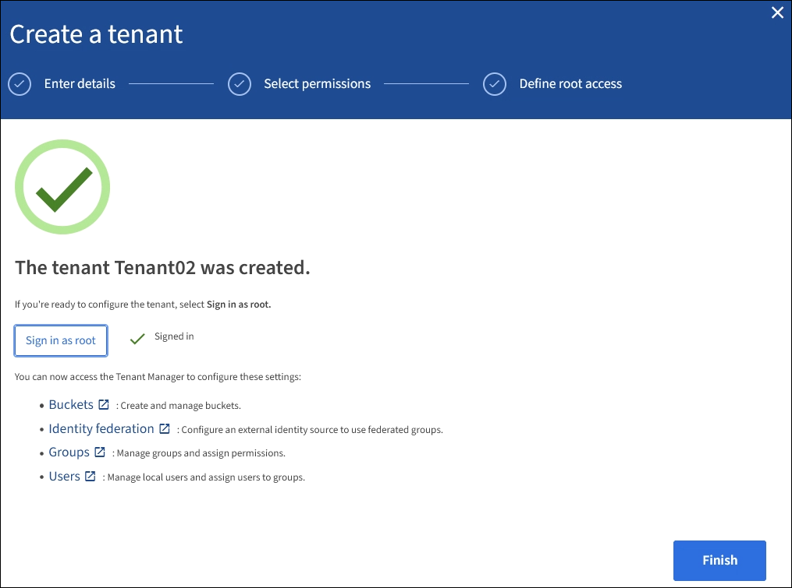

= Creare un account tenant
:allow-uri-read: 
:icons: font
:imagesdir: ../media/

[role="lead"]
È necessario creare almeno un account tenant per controllare l'accesso allo storage nel sistema StorageGRID.

Quando si crea un account tenant, specificare un nome, un protocollo client e, facoltativamente, una quota di storage. Se SSO (Single Sign-on) è attivato per StorageGRID, specificare anche quale gruppo federato dispone dell'autorizzazione di accesso root per configurare l'account tenant. Se StorageGRID non utilizza il single sign-on, è necessario specificare se l'account tenant utilizzerà la propria origine di identità e configurare la password iniziale per l'utente root locale del tenant.

Grid Manager offre una procedura guidata che illustra la procedura per la creazione di un account tenant. I passaggi variano in base al tipo di operazione xref:using-identity-federation.adoc[federazione delle identità] e. xref:configuring-sso.adoc[single sign-on] Sono configurati e se l'account Grid Manager utilizzato per creare l'account tenant appartiene a un gruppo amministrativo con l'autorizzazione di accesso root.

.Di cosa hai bisogno
* Hai effettuato l'accesso a Grid Manager utilizzando un xref:../admin/web-browser-requirements.adoc[browser web supportato].
* Si dispone di autorizzazioni di accesso specifiche.
* Se l'account tenant utilizza l'origine dell'identità configurata per Grid Manager e si desidera concedere l'autorizzazione di accesso root per l'account tenant a un gruppo federato, il gruppo federated è stato importato in Grid Manager. Non è necessario assegnare alcuna autorizzazione Grid Manager a questo gruppo di amministratori. Vedere xref:managing-admin-groups.adoc[istruzioni per la gestione dei gruppi di amministratori].

.Fasi
. Selezionare *TENANT*.
. Selezionare *Create* (Crea) e immettere le seguenti informazioni per il tenant:
+
.. *Nome*: Immettere un nome per l'account tenant. I nomi dei tenant non devono essere univoci. Una volta creato, l'account tenant riceve un ID account numerico univoco.
.. *Descrizione* (opzionale): Inserire una descrizione che consenta di identificare il tenant.
.. *Client type* (tipo client): Selezionare il tipo di client *S3* o *Swift*.
.. *Storage quota* (opzionale): Se si desidera che il tenant disponga di una quota di storage, immettere un valore numerico per la quota e selezionare le unità corrette (GB, TB o PB).
+
image::../media/tenant_create_wizard_step_1.png[Pagina account tenant - vuota]

. Selezionare *continua* e configurare il tenant S3 o Swift.

[role="tabbed-block"]
====
.Tenant S3
--
Selezionare le autorizzazioni appropriate per il tenant. Alcune di queste autorizzazioni hanno requisiti aggiuntivi. Per ulteriori informazioni, consultare la guida in linea per ciascuna autorizzazione.

* Consentire i servizi della piattaforma
* USA origine identità propria (selezionabile solo se SSO non viene utilizzato)
* Allow S3 Select (Consenti selezione S3) (vedere xref:manage-s3-select-for-tenant-accounts.adoc[Manage S3 (Gestisci S3): Selezionare per gli account tenant])

--
.Tenant rapido
--
Se il tenant utilizzerà la propria origine di identità, selezionare *Usa origine di identità propria* (selezionabile solo se SSO non viene utilizzato).

--
====
. Selezionare *continua* e definire l'accesso root per l'account tenant.

[role="tabbed-block"]
====
.Federazione di identità non configurata
--
. Immettere una password per l'utente root locale.
. Selezionare *Crea tenant*.

--
.SSO attivato
--
Quando SSO è abilitato per StorageGRID, il tenant deve utilizzare l'origine dell'identità configurata per il gestore di griglia. Nessun utente locale può accedere. Specificare quale gruppo federato dispone dell'autorizzazione di accesso Root per configurare l'account tenant.

. Selezionare un gruppo federated esistente da Grid Manager per ottenere l'autorizzazione di accesso root iniziale per il tenant.
+

NOTE: Se si dispone di autorizzazioni adeguate, i gruppi federated esistenti di Grid Manager vengono elencati quando si seleziona il campo. In caso contrario, immettere il nome univoco del gruppo.

. Selezionare *Crea tenant*.

--
.SSO non abilitato
--
. Completare i passaggi descritti nella tabella a seconda che il tenant gestisca i propri gruppi e utenti o utilizzi l'origine dell'identità configurata per Grid Manager.
+
[cols="1a,3a"]
|===
| Se il tenant... | Eseguire questa operazione... 

 a| 
Gestire i propri gruppi e utenti
 a| 
.. Selezionare *Usa origine propria identità*.
+
*Nota*: Se questa casella di controllo è selezionata e si desidera utilizzare la federazione di identità per gruppi e utenti tenant, il tenant deve configurare la propria origine di identità. Vedere xref:../tenant/index.adoc[istruzioni per l'utilizzo degli account tenant].

.. Specificare una password per l'utente root locale del tenant, quindi selezionare *Crea tenant*.
.. Selezionare *Accedi come root* per configurare il tenant oppure selezionare *fine* per configurarlo in un secondo momento.

 a| 
Utilizzare i gruppi e gli utenti configurati per Grid Manager
 a| 
.. Eseguire una o entrambe le operazioni seguenti:
+
*** Selezionare un gruppo federated esistente da Grid Manager che deve disporre dell'autorizzazione di accesso root iniziale per il tenant.
+
*Nota*: Se si dispone di autorizzazioni adeguate, i gruppi federated esistenti di Grid Manager vengono elencati quando si seleziona il campo. In caso contrario, immettere il nome univoco del gruppo.

*** Specificare una password per l'utente root locale del tenant.

.. Selezionare *Crea tenant*.

|===

--
====
. Per accedere subito al tenant:
+
** Se si accede a Grid Manager su una porta con restrizioni, selezionare *Restricted* nella tabella tenant per ulteriori informazioni sull'accesso a questo account tenant.
+
L'URL del tenant manager ha il seguente formato:

+
`https://_FQDN_or_Admin_Node_IP:port_/?accountId=_20-digit-account-id_/`

+
*** `_FQDN_or_Admin_Node_IP_` È un nome di dominio completo o l'indirizzo IP di un nodo amministratore
*** `_port_` è la porta solo tenant
*** `_20-digit-account-id_` È l'ID account univoco del tenant

** Se si accede a Grid Manager sulla porta 443 ma non è stata impostata una password per l'utente root locale, nella tabella tenant di Grid Manager, selezionare *Sign in* (Accedi) e immettere le credenziali per un utente nel gruppo federated di accesso root.
** Se si accede a Grid Manager sulla porta 443 e si imposta una password per l'utente root locale:
+
... Selezionare *Accedi come root* per configurare il tenant ora.
+
Al momento dell'accesso, vengono visualizzati i collegamenti per la configurazione di bucket o container, federazione di identità, gruppi e utenti.

+

... Selezionare i collegamenti per configurare l'account tenant.
+
Ciascun collegamento apre la pagina corrispondente in Tenant Manager. Per completare la pagina, consultare xref:../tenant/index.adoc[istruzioni per l'utilizzo degli account tenant].

... In caso contrario, selezionare *fine* per accedere al tenant in un secondo momento.

. Per accedere al tenant in un secondo momento:
+
[cols="1a,2a"]
|===
| Se si utilizza... | Eseguire una di queste operazioni... 

 a| 
Porta 443
 a| 
** Da Grid Manager, selezionare *TENANT* e selezionare *Sign in* (Accedi) a destra del nome del tenant.
** Inserire l'URL del tenant in un browser Web:
+
`https://_FQDN_or_Admin_Node_IP_/?accountId=_20-digit-account-id_/`

+
*** `_FQDN_or_Admin_Node_IP_` È un nome di dominio completo o l'indirizzo IP di un nodo amministratore
*** `_20-digit-account-id_` È l'ID account univoco del tenant

 a| 
Una porta con restrizioni
 a| 
** Da Grid Manager, selezionare *TENANT* e selezionare *Restricted*.
** Inserire l'URL del tenant in un browser Web:
+
`https://_FQDN_or_Admin_Node_IP:port_/?accountId=_20-digit-account-id_`

+
*** `_FQDN_or_Admin_Node_IP_` È un nome di dominio completo o l'indirizzo IP di un nodo amministratore
*** `_port_` è la porta limitata solo tenant
*** `_20-digit-account-id_` È l'ID account univoco del tenant

|===

.Informazioni correlate
* xref:controlling-access-through-firewalls.adoc[Controllo dell'accesso tramite firewall]
* xref:manage-platform-services-for-tenants.adoc[Gestire i servizi della piattaforma per gli account tenant S3]

