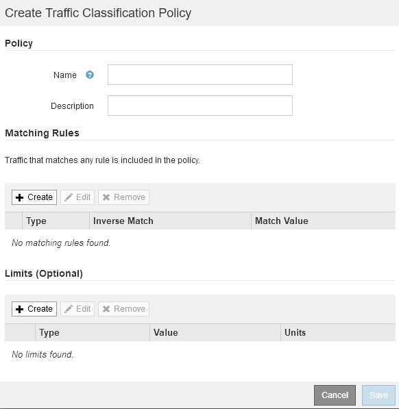
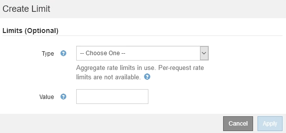

= Creare policy di classificazione del traffico
:allow-uri-read: 
:icons: font
:imagesdir: ../media/

[role="lead"]
È possibile creare criteri di classificazione del traffico se si desidera monitorare e, facoltativamente, limitare il traffico di rete per bucket, tenant, subnet IP o endpoint del bilanciamento del carico. Facoltativamente, è possibile impostare limiti per una policy in base alla larghezza di banda, al numero di richieste simultanee o alla velocità di richiesta.

.Di cosa hai bisogno
* Hai effettuato l'accesso a Grid Manager utilizzando un xref:../admin/web-browser-requirements.adoc[browser web supportato].
* Si dispone dell'autorizzazione di accesso root.
* Sono stati creati endpoint di bilanciamento del carico che si desidera associare.
* Hai creato i tenant che desideri abbinare.

.Fasi
. Selezionare *CONFIGURAZIONE* > *rete* > *classificazione del traffico*.
+
Viene visualizzata la pagina Criteri di classificazione del traffico.

+
image::../media/traffic_classification_policies_main_screen.png[Criteri di classificazione del traffico - schermata principale]

. Selezionare *Crea*.
+
Viene visualizzata la finestra di dialogo Crea policy di classificazione del traffico.

+

. Nel campo *Nome*, immettere un nome per la policy.
+
Immettere un nome descrittivo per poter riconoscere il criterio.

. Facoltativamente, aggiungere una descrizione per la policy nel campo *Descrizione*.
+
Ad esempio, descrivi a cosa si applica questa policy di classificazione del traffico e a cosa limiterà.

. Creare una o più regole corrispondenti per il criterio.
+
Le regole corrispondenti controllano le entità interessate da questa policy di classificazione del traffico. Ad esempio, selezionare tenant se si desidera che questo criterio venga applicato al traffico di rete di un tenant specifico. In alternativa, selezionare Endpoint se si desidera applicare questo criterio al traffico di rete su un endpoint specifico del bilanciamento del carico.

+
.. Selezionare *Crea* nella sezione *regole corrispondenti*.
+
Viene visualizzata la finestra di dialogo Create Matching Rule (Crea regola corrispondente).

+
image::../media/traffic_classification_policy_create_matching_rule.png[Crea regola corrispondente]

.. Dal menu a discesa *Type*, selezionare il tipo di entità da includere nella regola di corrispondenza.
.. Nel campo *valore di corrispondenza*, immettere un valore di corrispondenza in base al tipo di entità scelta.
+
*** Bucket (bucket): Immettere il nome di un bucket.
*** Bucket Regex (Regex bucket): Immettere un'espressione regolare che verrà utilizzata per far corrispondere un set di nomi di bucket.
+
L'espressione regolare non è ancorata. Utilizzare l'ancora {caret} per trovare la corrispondenza all'inizio del nome del bucket e utilizzare l'ancora per la corrispondenza alla fine del nome.

*** CIDR: Immettere una subnet IPv4, nella notazione CIDR, che corrisponda alla subnet desiderata.
*** Endpoint: Selezionare un endpoint dall'elenco degli endpoint esistenti. Questi sono gli endpoint del bilanciamento del carico definiti nella pagina endpoint del bilanciamento del carico. Vedere xref:configuring-load-balancer-endpoints.adoc[Configurare gli endpoint del bilanciamento del carico].
*** Tenant (tenant): Selezionare un tenant dall'elenco dei tenant esistenti. L'abbinamento dei tenant si basa sulla proprietà del bucket a cui si accede. L'accesso anonimo a un bucket corrisponde al tenant proprietario del bucket.

.. Se si desidera far corrispondere tutto il traffico di rete _tranne_ corrispondente al valore Type and Match appena definito, selezionare la casella di controllo *Inverse*. In caso contrario, lasciare deselezionata la casella di controllo.
+
Ad esempio, se si desidera che questo criterio venga applicato a tutti gli endpoint del bilanciamento del carico tranne uno, specificare l'endpoint del bilanciamento del carico da escludere e selezionare *inverso*.

+

IMPORTANT: Per un criterio contenente più adattatori in cui almeno uno è un adattatore inverso, fare attenzione a non creare un criterio che corrisponda a tutte le richieste.

.. Selezionare *Applica*.
+
La regola viene creata ed elencata nella tabella regole corrispondenti.

+
image::../media/traffic_classification_policy_rules.png[Regole di corrispondenza dei criteri di traffico]

.. Ripetere questi passaggi per ogni regola che si desidera creare per il criterio.
+

NOTE: Il traffico che corrisponde a qualsiasi regola viene gestito dal criterio.

. Facoltativamente, creare limiti per la policy.
+

NOTE: Anche se non si creano limiti, StorageGRID raccoglie le metriche in modo da poter monitorare il traffico di rete corrispondente alla policy.

+
.. Selezionare *Crea* nella sezione *limiti*.
+
Viene visualizzata la finestra di dialogo Create Limit (Crea limite).

+

.. Nell'elenco a discesa *tipo*, selezionare il tipo di limite che si desidera applicare al criterio.
+
Nell'elenco seguente, *in* si riferisce al traffico dai client S3 o Swift al bilanciamento del carico StorageGRID, mentre *out* si riferisce al traffico dal bilanciamento del carico ai client S3 o Swift.

+
*** Larghezza di banda aggregata in
*** Larghezza di banda aggregata in uscita
*** Richieste di lettura simultanee
*** Richieste di scrittura simultanee
*** Larghezza di banda per richiesta in
*** Larghezza di banda per richiesta in uscita
*** Velocità richiesta di lettura
*** Tasso di richieste di scrittura
+
[NOTE]
====
È possibile creare policy per limitare la larghezza di banda aggregata o per limitare la larghezza di banda per richiesta. Tuttavia, StorageGRID non può limitare entrambi i tipi di larghezza di banda contemporaneamente. I limiti di larghezza di banda aggregati potrebbero imporre un ulteriore impatto minore sulle performance sul traffico non limitato.

====
+
Per i limiti di larghezza di banda, StorageGRID applica la policy che meglio corrisponde al tipo di limite impostato. Ad esempio, se si dispone di una policy che limita il traffico in una sola direzione, il traffico nella direzione opposta sarà illimitato, anche se il traffico corrisponde a criteri aggiuntivi con limiti di larghezza di banda. StorageGRID implementa le corrispondenze "`Best`" per i limiti di larghezza di banda nel seguente ordine:

+
**** Indirizzo IP esatto (/32 mask)
**** Nome esatto del bucket
**** Regex. Bucket
**** Tenant
**** Endpoint
**** Corrispondenze CIDR non esatte (non /32)
**** Corrispondenze inverse

.. Nel campo *valore*, immettere un valore numerico per il tipo di limite scelto.
+
Le unità previste vengono visualizzate quando si seleziona un limite.

.. Selezionare *Applica*.
+
Il limite viene creato ed è elencato nella tabella dei limiti.

+
image::../media/traffic_classification_policy_limits.png[Limiti delle policy sul traffico]

.. Ripetere questi passaggi per ciascun limite che si desidera aggiungere al criterio.
+
Ad esempio, se si desidera creare un limite di larghezza di banda di 40 Gbps per un livello SLA, creare un limite di larghezza di banda aggregata in limite e un limite di larghezza di banda aggregato in uscita e impostare ciascuno su 40 Gbps.

+

NOTE: Per convertire megabyte al secondo in gigabit al secondo, moltiplicare per otto. Ad esempio, 125 MB/s equivale a 1,000 Mbps o 1 Gbps.

. Al termine della creazione di regole e limiti, selezionare *Salva*.
+
La policy viene salvata ed è elencata nella tabella Traffic Classification Policies (Criteri di classificazione del traffico).

+
image::../media/traffic_classification_policies_main_screen_w_examples.png[Esempio di policy sul traffico]

+
Il traffico dei client S3 e Swift viene ora gestito in base alle policy di classificazione del traffico. È possibile visualizzare i diagrammi di traffico e verificare che i criteri stiano applicando i limiti di traffico previsti. Vedere xref:viewing-network-traffic-metrics.adoc[Visualizzare le metriche del traffico di rete].

