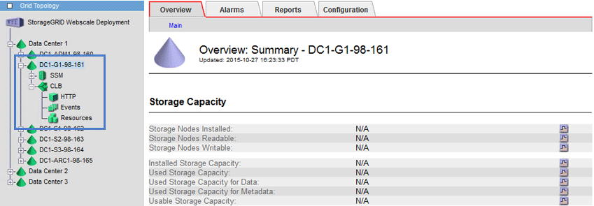

= Come funziona il bilanciamento del carico - servizio CLB (obsoleto)
:allow-uri-read: 
:icons: font
:imagesdir: ../media/

[role="lead"]
Il servizio di bilanciamento del carico di connessione (CLB) sui nodi gateway è obsoleto. Il servizio Load Balancer è ora il meccanismo di bilanciamento del carico consigliato.

Il servizio CLB utilizza il bilanciamento del carico di livello 4 per distribuire le connessioni di rete TCP in entrata dalle applicazioni client al nodo di storage ottimale in base alla disponibilità, al carico di sistema e al costo del collegamento configurato dall'amministratore. Quando si sceglie il nodo di storage ottimale, il servizio CLB stabilisce una connessione di rete bidirezionale e inoltra il traffico da e verso il nodo selezionato. La CLB non prende in considerazione la configurazione Grid Network quando indirizza le connessioni di rete in entrata.

Per visualizzare le informazioni sul servizio CLB, selezionare *SUPPORT* *Tools* *Grid topology*, quindi espandere un nodo gateway fino a quando non è possibile selezionare *CLB* e le opzioni sottostanti.

Se si sceglie di utilizzare il servizio CLB, si consiglia di configurare i costi di collegamento per il sistema StorageGRID.

* xref:what-link-costs-are.adoc[Quali sono i costi di collegamento]
* xref:updating-link-costs.adoc[Aggiornare i costi dei collegamenti]

