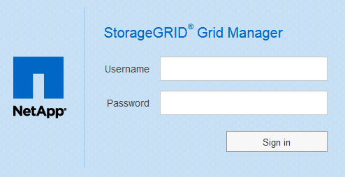

= Accedi a Grid Manager
:allow-uri-read: 
:icons: font
:imagesdir: ../media/

[role="lead"]
Per accedere alla pagina di accesso di Grid Manager, immettere il nome di dominio completo (FQDN) o l'indirizzo IP di un nodo amministratore nella barra degli indirizzi di un browser Web supportato.

.Di cosa hai bisogno
* Si dispone delle credenziali di accesso.
* Hai l'URL per Grid Manager.
* Si sta utilizzando un xref:../admin/web-browser-requirements.adoc[browser web supportato].
* I cookie sono attivati nel browser Web.
* Si dispone di autorizzazioni di accesso specifiche.

.A proposito di questa attività
Ogni sistema StorageGRID include un nodo di amministrazione primario e un numero qualsiasi di nodi di amministrazione non primari. Per gestire il sistema StorageGRID, è possibile accedere a Grid Manager da qualsiasi nodo amministrativo. Tuttavia, i nodi Admin non sono esattamente gli stessi:

* Le conferme di allarme (sistema legacy) eseguite su un nodo di amministrazione non vengono copiate in altri nodi di amministrazione. Per questo motivo, le informazioni visualizzate per gli allarmi potrebbero non apparire identiche su ciascun nodo di amministrazione.
* Alcune procedure di manutenzione possono essere eseguite solo dal nodo di amministrazione primario.

Se i nodi di amministrazione sono inclusi in un gruppo ad alta disponibilità (ha), la connessione viene eseguita utilizzando l'indirizzo IP virtuale del gruppo ha o un nome di dominio completo che viene mappato all'indirizzo IP virtuale. Il nodo di amministrazione primario deve essere selezionato come interfaccia principale del gruppo, in modo che quando si accede a Grid Manager, si accede al nodo di amministrazione primario, a meno che il nodo di amministrazione primario non sia disponibile.

.Fasi
. Avviare un browser Web supportato.
. Nella barra degli indirizzi del browser, immettere l'URL per Grid Manager:
+
`https://_FQDN_or_Admin_Node_IP_/`

+
dove `_FQDN_or_Admin_Node_IP_` È un nome di dominio completo o l'indirizzo IP di un nodo di amministrazione o l'indirizzo IP virtuale di un gruppo ha di nodi di amministrazione.

+
Se è necessario accedere a Grid Manager su una porta diversa da quella standard per HTTPS (443), immettere la seguente voce, dove `_FQDN_or_Admin_Node_IP_` È un nome di dominio completo o un indirizzo IP e porta è il numero di porta:

+
`https://_FQDN_or_Admin_Node_IP:port_/`

. Se viene richiesto un avviso di protezione, installare il certificato utilizzando l'installazione guidata del browser (vedere xref:using-storagegrid-security-certificates.adoc[Informazioni sui certificati di sicurezza]).
. Accedi a Grid Manager:
+
** Se il sistema StorageGRID non utilizza il Single Sign-on (SSO):
+
... Immettere il nome utente e la password per Grid Manager.
... Selezionare *Accedi*.
+

** Se SSO è attivato per il sistema StorageGRID ed è la prima volta che si accede all'URL dal browser:
+
... Selezionare *Accedi*. È possibile lasciare vuoto il campo ID centro di costo.
+
image::../media/sso_sign_in_first_time.gif[Schermata di accesso se SSO è attivato e non sono presenti cookie]

... Immettere le credenziali SSO standard nella pagina di accesso SSO dell'organizzazione. Ad esempio:
+
image::../media/sso_organization_page.gif[Esempio di pagina di accesso all'organizzazione per SSO]

** Se SSO è abilitato per il sistema StorageGRID e si è precedentemente effettuato l'accesso a Grid Manager o a un account tenant:
+
... Effettuare una delle seguenti operazioni:
+
**** Inserire *0* (l'ID account per Grid Manager) e selezionare *Accedi*.
**** Selezionare *Grid Manager* se compare nell'elenco degli account recenti e selezionare *Sign in* (Accedi).
+
image::../media/sign_in_grid_manager_sso.gif[Selezionare Grid Manager dall'elenco degli account recenti se SSO è attivato]

... Accedi con le tue credenziali SSO standard nella pagina di accesso SSO della tua organizzazione. Una volta effettuato l'accesso, viene visualizzata la home page di Grid Manager, che include la dashboard. Per informazioni sulle informazioni fornite, vedere xref:../monitor/viewing-dashboard.adoc[Visualizza la dashboard].

+
image::../media/grid_manager_dashboard.png[Dashboard]

. Se si desidera accedere a un altro nodo amministratore:
+
[cols="1a,2a"]
|===
| Opzione | Fasi 

 a| 
SSO non abilitato
 a| 
.. Nella barra degli indirizzi del browser, inserire il nome di dominio completo o l'indirizzo IP dell'altro nodo di amministrazione. Includere il numero di porta come richiesto.
.. Immettere il nome utente e la password per Grid Manager.
.. Selezionare *Accedi*.

 a| 
SSO attivato
 a| 
Nella barra degli indirizzi del browser, inserire il nome di dominio completo o l'indirizzo IP dell'altro nodo di amministrazione.

Se si è effettuato l'accesso a un nodo di amministrazione, è possibile accedere ad altri nodi di amministrazione senza dover effettuare nuovamente l'accesso. Tuttavia, se la sessione SSO scade, vengono richieste nuovamente le credenziali.

*Nota:* SSO non è disponibile sulla porta limitata di Grid Manager. Se si desidera che gli utenti eseguano l'autenticazione con Single Sign-on, è necessario utilizzare la porta HTTPS predefinita (443).

|===

.Informazioni correlate
* xref:controlling-access-through-firewalls.adoc[Controllo dell'accesso tramite firewall]
* xref:configuring-sso.adoc[Configurare il single sign-on]
* xref:managing-admin-groups.adoc[Gestire i gruppi di amministratori]
* xref:managing-high-availability-groups.adoc[Gestire i gruppi ad alta disponibilità]
* xref:../tenant/index.adoc[Utilizzare un account tenant]
* xref:../monitor/index.adoc[Monitorare e risolvere i problemi]

