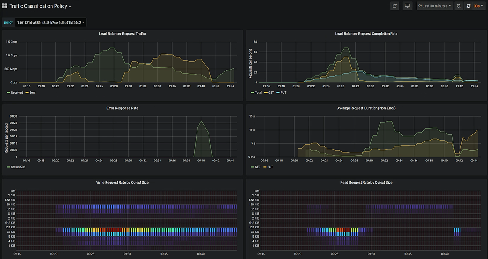

= Visualizzare le metriche del traffico di rete
:allow-uri-read: 
:icons: font
:imagesdir: ../media/

[role="lead"]
È possibile monitorare il traffico di rete visualizzando i grafici disponibili nella pagina Traffic Classification Policies (Criteri di classificazione del traffico).

.Di cosa hai bisogno
* Hai effettuato l'accesso a Grid Manager utilizzando un xref:../admin/web-browser-requirements.adoc[browser web supportato].
* Si dispone dell'autorizzazione di accesso root o dell'autorizzazione account tenant.

.A proposito di questa attività
Per qualsiasi criterio di classificazione del traffico esistente, è possibile visualizzare le metriche per il servizio Load Balancer per determinare se il criterio limita correttamente il traffico nella rete. I dati nei grafici possono aiutare a determinare se è necessario modificare la policy.

Anche se non vengono impostati limiti per una policy di classificazione del traffico, vengono raccolte le metriche e i grafici forniscono informazioni utili per comprendere le tendenze del traffico.

.Fasi
. Selezionare *CONFIGURAZIONE* > *rete* > *classificazione del traffico*.
+
Viene visualizzata la pagina Traffic Classification Policies (Criteri di classificazione del traffico) e i criteri esistenti sono elencati nella tabella.

+
image::../media/traffic_classification_policies_main_screen_w_examples.png[Esempio di policy sul traffico per il grafico]

+

NOTE: I pulsanti *Crea*, *Modifica* e *Rimuovi* sono disattivati se si dispone dell'autorizzazione account tenant ma non si dispone dell'autorizzazione di accesso root.

. Selezionare il pulsante di opzione a sinistra della policy per la quale si desidera visualizzare le metriche.
. Selezionare *metriche*.
+
Viene visualizzata una nuova finestra del browser e i grafici della policy di classificazione del traffico. I grafici visualizzano le metriche solo per il traffico corrispondente al criterio selezionato.

+
È possibile selezionare altri criteri da visualizzare utilizzando l'elenco a discesa *policy*.

+

+
I grafici seguenti sono inclusi nella pagina Web.

+
** Load Balancer Request Traffic: Questo grafico fornisce una media mobile di 3 minuti del throughput dei dati trasmessi tra gli endpoint del bilanciamento del carico e i client che eseguono le richieste, in bit al secondo.
** Tasso di completamento della richiesta di bilanciamento del carico: Questo grafico fornisce una media mobile di 3 minuti del numero di richieste completate al secondo, suddiviso per tipo di richiesta (GET, PUT, HEAD e DELETE). Questo valore viene aggiornato quando le intestazioni di una nuova richiesta sono state convalidate.
** Tasso di risposta agli errori: Questo grafico fornisce una media mobile di 3 minuti del numero di risposte agli errori restituite ai client al secondo, suddiviso per codice di risposta agli errori.
** Durata media della richiesta (non errore): Questo grafico fornisce una media mobile di 3 minuti delle durate della richiesta, suddivisa per tipo di richiesta (GET, PUT, HEAD e DELETE). Ogni durata della richiesta inizia quando un'intestazione di richiesta viene analizzata dal servizio Load Balancer e termina quando il corpo di risposta completo viene restituito al client.
** Write Request Rate by Object Size (velocità di richiesta di scrittura per dimensione oggetto): Questa mappa termica fornisce una media mobile di 3 minuti della velocità di completamento delle richieste di scrittura in base alle dimensioni dell'oggetto. In questo contesto, le richieste di scrittura si riferiscono solo alle richieste PUT.
** Read Request Rate by Object Size (velocità richiesta di lettura per dimensione oggetto): Questa mappa termica fornisce una media mobile di 3 minuti della velocità di completamento delle richieste di lettura in base alle dimensioni dell'oggetto. In questo contesto, le richieste di lettura si riferiscono solo alle richieste GET. I colori nella mappa termica indicano la frequenza relativa delle dimensioni di un oggetto all'interno di un singolo grafico. I colori più freddi (ad esempio, viola e blu) indicano tassi relativi inferiori, mentre i colori più caldi (ad esempio, arancione e rosso) indicano tassi relativi più elevati.

. Posizionare il cursore su un grafico a linee per visualizzare una finestra a comparsa di valori su una parte specifica del grafico.
+
image::../media/traffic_classification_policy_graph_popup_closeup.png[Valori a comparsa Traffic Line Graph]

. Spostare il cursore su una mappa termica per visualizzare una finestra a comparsa che mostra la data e l'ora del campione, le dimensioni degli oggetti aggregati nel conteggio e il numero di richieste al secondo durante tale periodo di tempo.
+
image::../media/traffic_classification_policy_heatmap_closeup.png[Valori a comparsa del grafico a barre del traffico]

. Utilizzare l'elenco a discesa *Policy* in alto a sinistra per selezionare un criterio diverso.
+
Vengono visualizzati i grafici relativi al criterio selezionato.

. In alternativa, accedere ai grafici dal menu *SUPPORT*.
+
.. Selezionare *SUPPORT* *Tools* *Metrics*.
.. Nella sezione *Grafana* della pagina, selezionare *Traffic Classification Policy*.
.. Selezionare il criterio dall'elenco a discesa in alto a sinistra nella pagina.
+
Le policy di classificazione del traffico sono identificate dal loro ID. Gli ID policy sono elencati nella pagina Traffic Classification Policies.

. Analizzare i grafici per determinare la frequenza con cui il criterio limita il traffico e se è necessario modificare il criterio.

.Informazioni correlate
xref:../monitor/index.adoc[Monitorare e risolvere i problemi]
