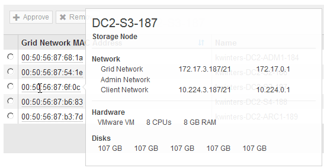

= Eseguire l'espansione
:allow-uri-read: 
:icons: font
:imagesdir: ../media/

[role="lead"]
Quando si esegue l'espansione, i nuovi nodi grid vengono aggiunti all'implementazione StorageGRID esistente.

.Di cosa hai bisogno
* Hai effettuato l'accesso a Grid Manager utilizzando un xref:../admin/web-browser-requirements.adoc[browser web supportato].
* Si dispone dell'autorizzazione di accesso Maintenance o Root.
* Si dispone della passphrase di provisioning.
* Sono stati implementati tutti i nodi grid che vengono aggiunti in questa espansione.
* Se si aggiungono nodi di storage, si conferma che tutte le operazioni di riparazione dei dati eseguite come parte di un ripristino sono state completate. Vedere xref:../maintain/checking-data-repair-jobs.adoc[Controllare i lavori di riparazione dei dati].
* Se si aggiunge un nuovo sito, è necessario rivedere e aggiornare le regole ILM prima di avviare la procedura di espansione per assicurarsi che le copie degli oggetti non vengano memorizzate nel nuovo sito fino al completamento dell'espansione. Ad esempio, se una regola utilizza il pool di storage predefinito (tutti i nodi di storage), è necessario creare un nuovo pool di storage che contenga solo i nodi di storage esistenti e aggiornare la regola ILM per utilizzare il nuovo pool di storage. In caso contrario, gli oggetti verranno copiati nel nuovo sito non appena il primo nodo del sito diventa attivo. Consultare le istruzioni per xref:../ilm/index.adoc[Gestione degli oggetti con ILM].

.A proposito di questa attività
L'esecuzione dell'espansione comprende le seguenti fasi:

. Per configurare l'espansione, specificare se si desidera aggiungere nuovi nodi griglia o un nuovo sito e approvare i nodi griglia da aggiungere.
. Si avvia l'espansione.
. Durante il processo di espansione, viene scaricato un nuovo file del pacchetto di ripristino.
. È possibile monitorare lo stato delle fasi di configurazione della griglia, che vengono eseguite automaticamente. L'insieme di fasi dipende dai tipi di nodi di griglia che vengono aggiunti e dall'eventuale aggiunta di un nuovo sito.
+

IMPORTANT: Alcune fasi potrebbero richiedere molto tempo per essere eseguite su una griglia di grandi dimensioni. Ad esempio, lo streaming di Cassandra su un nuovo nodo di storage potrebbe richiedere solo pochi minuti se il database Cassandra è vuoto. Tuttavia, se il database Cassandra include una grande quantità di metadati degli oggetti, questa fase potrebbe richiedere diverse ore o più. Non riavviare i nodi di storage durante le fasi "espansione del cluster Cassandra" o "Avvio di Cassandra e dati in streaming".

.Fasi
. Selezionare *MANUTENZIONE* > *attività* > *espansione*.
+
Viene visualizzata la pagina Grid Expansion (espansione griglia). La sezione Pending Nodes (nodi in sospeso) elenca tutti i nodi pronti per l'aggiunta.

+
image::../media/grid_expansion_page.png[Schermata che mostra la pagina Grid Expansion]

. Selezionare *Configure Expansion* (Configura espansione).
+
Viene visualizzata la finestra di dialogo Site Selection (selezione sito).

+
image::../media/configure_expansion_dialog.gif[Finestra di dialogo Site Selection]

. Selezionare il tipo di espansione che si desidera avviare:
+
** Se si sta aggiungendo un nuovo sito, selezionare *nuovo* e immettere il nome del nuovo sito.
** Se si aggiungono nodi griglia a un sito esistente, selezionare *esistente*.

. Selezionare *Salva*.
. Esaminare l'elenco *Pending Nodes* (nodi in sospeso) e confermare che mostra tutti i nodi della griglia implementati.
+
Se necessario, spostare il cursore del mouse sull'indirizzo *Grid Network MAC Address* di un nodo per visualizzare i dettagli relativi a tale nodo.

+

+

NOTE: Se manca un nodo Grid, confermare che è stato implementato correttamente.

. Dall'elenco dei nodi in sospeso, approvare i nodi della griglia per questa espansione.
+
.. Selezionare il pulsante di opzione accanto al primo nodo della griglia in sospeso che si desidera approvare.
.. Selezionare *approva*.
+
Viene visualizzato il modulo di configurazione del nodo della griglia.

+
image::../media/grid_node_configuration.gif[Modulo Grid Node Configuration]

.. Se necessario, modificare le impostazioni generali:
+
*** *Sito*: Il nome del sito a cui verrà associato il nodo della griglia. Se si aggiungono più nodi, assicurarsi di selezionare il sito corretto per ciascun nodo. Se si aggiunge un nuovo sito, tutti i nodi vengono aggiunti al nuovo sito.
*** *Name*: Il nome host che verrà assegnato al nodo e il nome che verrà visualizzato in Grid Manager.
*** *Ruolo NTP*: Ruolo NTP (Network Time Protocol) del nodo Grid. Le opzioni disponibili sono *automatico*, *primario* e *Client*. Selezionando *automatico*, il ruolo primario viene assegnato ai nodi di amministrazione, ai nodi di storage con servizi ADC, ai nodi gateway e a tutti i nodi di griglia che hanno indirizzi IP non statici. A tutti gli altri nodi della griglia viene assegnato il ruolo Client.
+

NOTE: Assegnare il ruolo NTP primario ad almeno due nodi in ciascun sito. In questo modo, il sistema offre un accesso ridondante a fonti di sincronizzazione esterne.

*** *Servizio ADC* (solo nodi di storage): Se questo nodo di storage eseguirà il servizio ADC (Administrative Domain Controller). Il servizio ADC tiene traccia della posizione e della disponibilità dei servizi grid. Almeno tre nodi di storage in ogni sito devono includere il servizio ADC. Non è possibile aggiungere il servizio ADC a un nodo dopo averlo implementato.
+
**** Se si aggiunge questo nodo per sostituire un nodo di storage, selezionare *Sì* se il nodo da sostituire include il servizio ADC. Poiché non è possibile decommissionare un nodo di storage se rimangono pochi servizi ADC, ciò garantisce che un nuovo servizio ADC sia disponibile prima che il vecchio servizio venga rimosso.
**** In caso contrario, selezionare *automatico* per consentire al sistema di determinare se questo nodo richiede il servizio ADC. Informazioni sul quorum di ADC xref:../maintain/understanding-adc-service-quorum.adoc[qui].

.. Se necessario, modificare le impostazioni per Grid Network, Admin Network e Client Network.
+
*** *IPv4 Address (CIDR)*: Indirizzo di rete CIDR per l'interfaccia di rete. Ad esempio: 172.16.10.100/24
*** *Gateway*: Il gateway predefinito del nodo Grid. Ad esempio: 172.16.10.1
*** *Subnet (CIDR)*: Una o più sottoreti per la rete di amministrazione.

.. Selezionare *Salva*.
+
Il nodo della griglia approvata passa all'elenco dei nodi approvati.

+
image::../media/grid_expansion_approved_nodes.png[Schermata che mostra i nodi approvati]

+
*** Per modificare le proprietà di un nodo della griglia approvato, selezionare il relativo pulsante di opzione e selezionare *Modifica*.
*** Per spostare di nuovo un nodo della griglia approvato nell'elenco Pending Nodes (nodi in sospeso), selezionare il relativo pulsante di opzione e selezionare *Reset* (Ripristina).
*** Per rimuovere in modo permanente un nodo di rete approvato, spegnere il nodo. Quindi, selezionare il pulsante di opzione corrispondente e selezionare *Rimuovi*.

.. Ripetere questi passaggi per ogni nodo griglia in sospeso che si desidera approvare.
+

NOTE: Se possibile, è necessario approvare tutte le note della griglia in sospeso ed eseguire una singola espansione. Se si eseguono più piccole espansioni, sarà necessario più tempo.

. Una volta approvati tutti i nodi della griglia, immettere la *Provisioning Passphrase* e selezionare *Espandi*.
+
Dopo alcuni minuti, questa pagina viene aggiornata per visualizzare lo stato della procedura di espansione. Quando sono in corso attività che influiscono su un singolo nodo della griglia, la sezione Grid Node Status (Stato nodo griglia) elenca lo stato corrente di ciascun nodo della griglia.

+

NOTE: Durante questo processo, il programma di installazione dell'appliance StorageGRID mostra il passaggio dell'installazione dalla fase 3 alla fase 4, finalizzare l'installazione. Al termine della fase 4, il controller viene riavviato.

+
image::../media/grid_expansion_progress.png[Questa immagine viene spiegata dal testo circostante.]

+

NOTE: Un'espansione del sito include un'attività aggiuntiva per configurare Cassandra per il nuovo sito.

. Non appena viene visualizzato il collegamento *Download Recovery Package*, scaricare il file Recovery Package.
+
È necessario scaricare una copia aggiornata del file del pacchetto di ripristino il prima possibile dopo aver apportato modifiche alla topologia della griglia al sistema StorageGRID. Il file Recovery Package consente di ripristinare il sistema in caso di errore.

+
.. Selezionare il collegamento per il download.
.. Inserire la passphrase di provisioning e selezionare *Avvia download*.
.. Al termine del download, aprire `.zip` archiviare e confermare che include un `gpt-backup` directory e a. `_SAID.zip` file. Quindi, estrarre `_SAID.zip` accedere al `/GID*_REV*` e confermare la possibilità di aprire `passwords.txt` file.
.. Copiare il file del pacchetto di ripristino scaricato (.zip) in due posizioni sicure e separate.
+

IMPORTANT: Il file del pacchetto di ripristino deve essere protetto perché contiene chiavi di crittografia e password che possono essere utilizzate per ottenere dati dal sistema StorageGRID.

. Seguire le istruzioni per aggiungere un nodo di storage a un sito esistente o aggiungere un nuovo sito.

[role="tabbed-block"]
====
.Aggiungere il nodo di storage al sito esistente
--
Se si aggiungono uno o più nodi di storage a un sito esistente, monitorare l'avanzamento della fase "Avvio di Cassandra e dati in streaming" esaminando la percentuale indicata nel messaggio di stato.

image::../media/grid_expansion_starting_cassandra.png[Grid Expansion > Avvio di Cassandra e dati in streaming]

Questa percentuale stima il completamento dell'operazione di streaming Cassandra in base alla quantità totale di dati Cassandra disponibili e alla quantità già scritta nel nuovo nodo.

IMPORTANT: Non riavviare i nodi di storage durante le fasi di "espansione del cluster Cassandra" o "avvio di Cassandra e dati in streaming". Il completamento di queste fasi potrebbe richiedere molte ore per ogni nuovo nodo di storage, soprattutto se i nodi di storage esistenti contengono una grande quantità di metadati degli oggetti.

--
.Aggiungi nuovo sito
--
Se si aggiunge un nuovo sito, utilizzare `nodetool status` Monitorare i progressi dello streaming Cassandra e verificare quanti metadati sono stati copiati nel nuovo sito durante la fase di "espansione del cluster Cassandra". Il carico totale di dati sul nuovo sito deve essere inferiore a circa il 20% del totale di un sito corrente.

IMPORTANT: Non riavviare i nodi di storage durante le fasi di "espansione del cluster Cassandra" o "avvio di Cassandra e dati in streaming". Il completamento di queste fasi potrebbe richiedere molte ore per ogni nuovo nodo di storage, soprattutto se i nodi di storage esistenti contengono una grande quantità di metadati degli oggetti.

--
====
. Continuare a monitorare l'espansione fino al completamento di tutte le attività e alla ricomposizione del pulsante *Configure Expansion* (Configura espansione).

.Al termine
A seconda dei tipi di nodi griglia aggiunti, è necessario eseguire ulteriori operazioni di integrazione e configurazione. Vedere xref:configuring-expanded-storagegrid-system.adoc[Fasi di configurazione dopo l'espansione].
