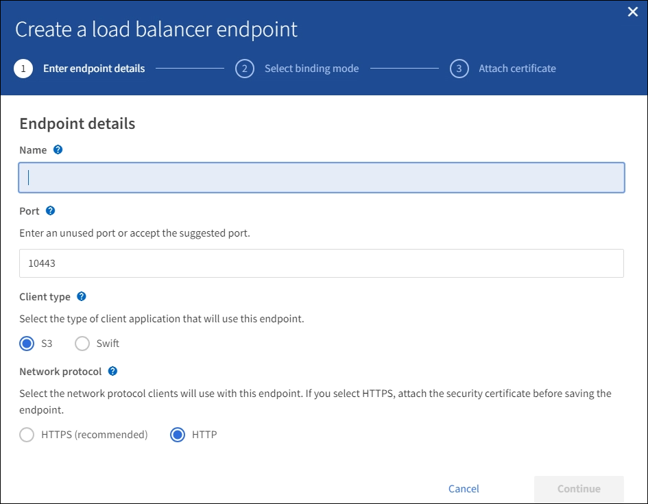

= Creare un endpoint di bilanciamento del carico per FabricPool
:allow-uri-read: 
:icons: font
:imagesdir: ../media/

[role="lead"]
Quando si configura StorageGRID per l'utilizzo con FabricPool, è necessario configurare un endpoint di bilanciamento del carico e caricare il certificato dell'endpoint di bilanciamento del carico, utilizzato per proteggere la connessione tra ONTAP e StorageGRID.

.Di cosa hai bisogno
* Hai effettuato l'accesso a Grid Manager utilizzando un xref:../admin/web-browser-requirements.adoc[browser web supportato].
* Si dispone dell'autorizzazione di accesso root.
* Sono disponibili i seguenti file:
+
** Server Certificate (certificato server): Il file di certificato del server personalizzato.
** Server Certificate Private Key (chiave privata certificato server): Il file di chiave privata del certificato del server personalizzato.
** BUNDLE CA: Un singolo file opzionale contenente i certificati di ogni autorità di certificazione di emissione intermedia (CA). Il file deve contenere ciascuno dei file di certificato CA con codifica PEM, concatenati in ordine di catena del certificato.

.A proposito di questa attività
Per ulteriori informazioni su questa attività, vedere xref:../admin/configuring-load-balancer-endpoints.adoc[Configurare gli endpoint del bilanciamento del carico].

.Fasi
. Selezionare *CONFIGURATION* > *Network* > *Load Balancer Endpoints*.
. Selezionare *Crea*.
+

. Inserire i dettagli dell'endpoint.
+
[cols="1a,2a"]
|===
| Campo | Descrizione 

 a| 
Nome
 a| 
Un nome descrittivo per l'endpoint

 a| 
Porta
 a| 
La porta StorageGRID che si desidera utilizzare per il bilanciamento del carico. Per impostazione predefinita, questo campo è 10433, ma è possibile inserire qualsiasi porta esterna non utilizzata. Se si immette 80 o 443, l'endpoint viene configurato solo sui nodi gateway, poiché queste porte sono riservate sui nodi Admin.

*Nota:* le porte utilizzate da altri servizi di rete non sono consentite. Vederexref:../network/network-port-reference.adoc[Riferimento porta di rete].

Quando si collega StorageGRID come livello cloud FabricPool, è necessario fornire lo stesso numero di porta a ONTAP.

 a| 
Tipo di client
 a| 
Selezionare *S3*.

 a| 
Protocollo di rete
 a| 
Selezionare *HTTPS*.

*Nota*: L'utilizzo di *HTTP* è supportato ma non consigliato.

|===
. Selezionare *continua*.
. Specificare la modalità di binding.
+
Utilizzare l'impostazione *Global* (scelta consigliata) o limitare l'accessibilità di questo endpoint a una delle seguenti opzioni:

+
** Interfacce di rete specifiche di nodi specifici.
** Indirizzi IP virtuali (VIP) specifici ad alta disponibilità (ha). Utilizzare questa opzione solo se si richiedono livelli di isolamento dei carichi di lavoro molto più elevati.

. Selezionare *continua*.
. Selezionare *carica certificato* (consigliato), quindi selezionare il certificato del server, la chiave privata del certificato e il bundle CA opzionale.
. Selezionare *Crea*.

NOTE: Le modifiche a un certificato endpoint possono richiedere fino a 15 minuti per essere applicate a tutti i nodi.
