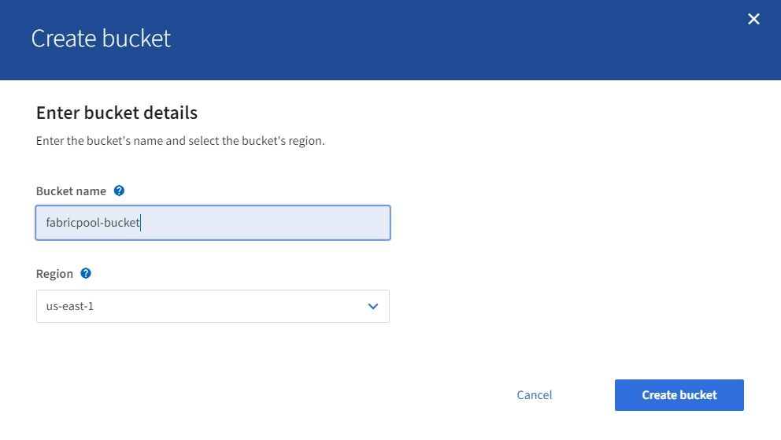

= Creare un bucket S3 e ottenere una chiave di accesso
:allow-uri-read: 
:icons: font
:imagesdir: ../media/

[role="lead"]
Prima di utilizzare StorageGRID con un carico di lavoro FabricPool, è necessario creare un bucket S3 per i dati FabricPool. È inoltre necessario ottenere una chiave di accesso e una chiave di accesso segreta per l'account tenant che si utilizzerà per FabricPool.

.Di cosa hai bisogno
* È stato creato un account tenant per l'utilizzo di FabricPool.

.A proposito di questa attività
Queste istruzioni descrivono come utilizzare il gestore tenant StorageGRID per creare un bucket e ottenere le chiavi di accesso. È inoltre possibile eseguire queste attività utilizzando l'API di gestione dei tenant o l'API REST di StorageGRID S3. In alternativa, se si utilizza ONTAP 9.10, è possibile creare il bucket utilizzando l'installazione guidata di FabricPool.

Per saperne di più:

* xref:../tenant/index.adoc[Utilizzare un account tenant]
* xref:../s3/index.adoc[Utilizzare S3]

.Fasi
. Accedi al tenant manager.
+
È possibile effettuare una delle seguenti operazioni:

+
** Dalla pagina account tenant in Grid Manager, selezionare il collegamento *Accedi* per il tenant e immettere le credenziali.
** Immettere l'URL dell'account tenant in un browser Web e le credenziali.

. Creare un bucket S3 per i dati FabricPool.
+
È necessario creare un bucket unico per ogni cluster ONTAP che si intende utilizzare.

+
.. Selezionare *STORAGE (S3)* > *Bucket*.
.. Selezionare *Crea bucket*.
.. Immettere il nome del bucket StorageGRID che si intende utilizzare con FabricPool. Ad esempio, `fabricpool-bucket`.
+

IMPORTANT: Non è possibile modificare il nome del bucket dopo averlo creato.

+
I nomi dei bucket devono essere conformi alle seguenti regole:

+
*** Deve essere unico in ogni sistema StorageGRID (non solo univoco all'interno dell'account tenant).
*** Deve essere conforme al DNS.
*** Deve contenere almeno 3 e non più di 63 caratteri.
*** Può essere una serie di una o più etichette, con etichette adiacenti separate da un punto. Ogni etichetta deve iniziare e terminare con una lettera minuscola o un numero e può utilizzare solo lettere minuscole, numeri e trattini.
*** Non deve essere simile a un indirizzo IP formattato con testo.
*** Non utilizzare i periodi nelle richieste di stile ospitate virtuali. I punti causano problemi con la verifica del certificato con caratteri jolly del server.

.. Selezionare la regione per questo bucket.
+
Per impostazione predefinita, tutti i bucket vengono creati in `us-east-1` regione.

+

.. Selezionare *Crea bucket*.

+

NOTE: Per i bucket FabricPool, il livello di coerenza consigliato è *Read-after-new-write*, che è l'impostazione predefinita per un nuovo bucket. Non modificare i bucket FabricPool per utilizzare *Available* o qualsiasi altro livello di coerenza.

. Creare una chiave di accesso e una chiave di accesso segreta.
+
.. Selezionare *STORAGE (S3)* > *My access key*.
.. Selezionare *Crea chiave*.
.. Selezionare *Crea chiave di accesso*.
.. Copiare l'ID della chiave di accesso e la chiave di accesso segreta in una posizione sicura oppure selezionare *Download .csv* per salvare un foglio di calcolo contenente l'ID della chiave di accesso e la chiave di accesso segreta.
+
Questi valori verranno immessi in ONTAP quando si configura StorageGRID come livello cloud FabricPool.

+

IMPORTANT: Se in futuro si creano una nuova chiave di accesso e una chiave di accesso segreta, ricordarsi di aggiornare immediatamente i valori corrispondenti in ONTAP per garantire che ONTAP possa memorizzare e recuperare i dati in StorageGRID senza interruzioni.

