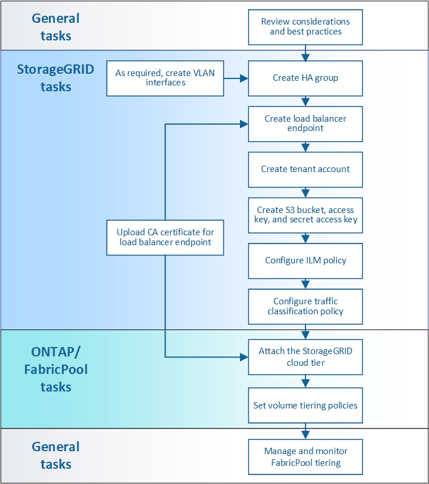

= Configure StorageGRID for FabricPool: Panoramica
:allow-uri-read: 
:icons: font
:imagesdir: ../media/

[role="lead"]
Se si utilizza il software NetApp ONTAP, è possibile utilizzare NetApp FabricPool per eseguire il tiering dei dati inattivi o a freddo su un sistema di storage a oggetti NetApp StorageGRID.

== A proposito di queste istruzioni

Seguire queste istruzioni per:

* Ottieni una panoramica sulla configurazione di un sistema di storage a oggetti StorageGRID per l'utilizzo con FabricPool.
* Scopri come ottenere le informazioni che fornisci a ONTAP quando Aggiungi StorageGRID come Tier cloud FabricPool.
* Scopri le Best practice per la configurazione del criterio ILM (Information Lifecycle Management) di StorageGRID, di un criterio di classificazione del traffico StorageGRID e di altre opzioni StorageGRID per un carico di lavoro FabricPool.

== Workflow di configurazione

== Prima di iniziare

* Decidere quale criterio di tiering dei volumi FabricPool utilizzare per eseguire il tiering dei dati ONTAP inattivi in StorageGRID.
* Pianificare e installare un sistema StorageGRID per soddisfare le esigenze di capacità e performance dello storage.
* Familiarizzare con il software di sistema StorageGRID, incluso il gestore del grid e il gestore del tenant.
* Consulta queste risorse aggiuntive, che forniscono dettagli sull'utilizzo e la configurazione di FabricPool:
+
** https://www.netapp.com/pdf.html?item=/media/17239-tr4598pdf.pdf["TR-4598: Best practice FabricPool in ONTAP 9.9.1"^]
** https://docs.netapp.com/us-en/ontap/index.html["Documentazione di ONTAP 9"^]

== Che cos'è FabricPool?

FabricPool è una soluzione di storage ibrido ONTAP che utilizza un aggregato flash dalle performance elevate come Tier delle performance e un archivio di oggetti come Tier del cloud. I dati vengono memorizzati sul supporto di storage primario o nel datastore degli oggetti in base al fatto che l'accesso sia frequente o meno. L'utilizzo di aggregati abilitati per FabricPool consente di ridurre i costi dello storage senza compromettere performance, efficienza o protezione.

Non sono necessarie modifiche architetturali e puoi continuare a gestire i dati e l'ambiente applicativo dal sistema di storage centrale ONTAP.

== Che cos'è StorageGRID?

StorageGRID è un'architettura di storage che gestisce i dati come oggetti, rispetto ad altre architetture di storage come lo storage a blocchi o file. Gli oggetti vengono conservati all'interno di un singolo contenitore (ad esempio un bucket) e non vengono nidificati come file all'interno di una directory all'interno di altre directory. Sebbene lo storage a oggetti offra generalmente performance inferiori rispetto allo storage a blocchi o a file, è notevolmente più scalabile. I bucket StorageGRID possono contenere petabyte di dati e miliardi di oggetti.

== Perché utilizzare StorageGRID come Tier cloud FabricPool?

FabricPool può eseguire il tiering dei dati ONTAP a diversi provider di archivi di oggetti, tra cui StorageGRID. A differenza dei cloud pubblici che potrebbero impostare un numero massimo di IOPS (Input/Output Operations per Second) supportati a livello di bucket o container, le performance di StorageGRID sono scalabili in base al numero di nodi in un sistema. L'utilizzo di StorageGRID come livello cloud FabricPool ti consente di conservare i tuoi dati nel tuo cloud privato per ottenere le massime performance e il controllo completo sui tuoi dati.

Inoltre, non è necessaria una licenza FabricPool quando si utilizza StorageGRID come livello cloud.

== È possibile utilizzare più cluster ONTAP con StorageGRID?

Queste istruzioni descrivono come connettere StorageGRID a un singolo cluster ONTAP. Tuttavia, è possibile collegare lo stesso sistema StorageGRID a più cluster ONTAP.

L'unico requisito per il tiering dei dati da più cluster ONTAP a un singolo sistema StorageGRID è l'utilizzo di un bucket S3 diverso per ciascun cluster. In base ai tuoi requisiti, puoi utilizzare lo stesso gruppo ad alta disponibilità (ha), endpoint di bilanciamento del carico e account tenant per tutti i cluster, oppure puoi configurare ciascuno di questi elementi per ciascun cluster.
