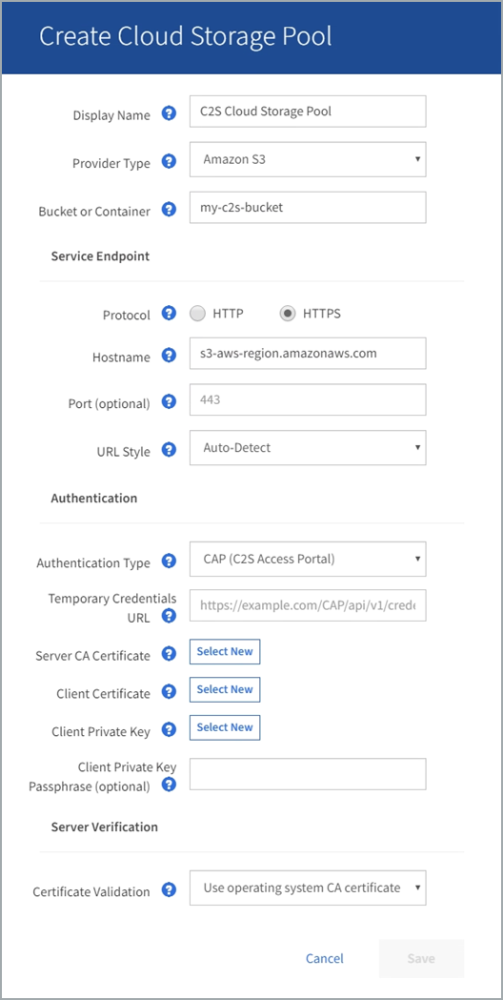

= C2S S3: Specificare i dettagli di autenticazione per un pool di storage cloud
:allow-uri-read: 
:icons: font
:imagesdir: ../media/

[role="lead"]
Per utilizzare il servizio servizi cloud commerciali (C2S) S3 come pool di storage cloud, è necessario configurare il portale di accesso C2S (CAP) come tipo di autenticazione, in modo che StorageGRID possa richiedere credenziali temporanee per accedere al bucket S3 nel proprio account C2S.

.Di cosa hai bisogno
* Sono state inserite le informazioni di base per un pool di storage cloud Amazon S3, incluso l'endpoint del servizio.
* Si conosce l'URL completo che StorageGRID utilizzerà per ottenere le credenziali temporanee dal server CAP, inclusi tutti i parametri API obbligatori e facoltativi assegnati all'account C2S.
* Si dispone di un certificato CA del server emesso da un'autorità di certificazione governativa (CA) appropriata. StorageGRID utilizza questo certificato per verificare l'identità del server CAP. Il certificato CA del server deve utilizzare la codifica PEM.
* Si dispone di un certificato client emesso da un'autorità di certificazione governativa (CA) appropriata. StorageGRID utilizza questo certificato per identificare se stesso nel server CAP. Il certificato client deve utilizzare la codifica PEM e deve avere ottenuto l'accesso all'account C2S.
* Si dispone di una chiave privata con codifica PEM per il certificato client.
* Se la chiave privata per il certificato client è crittografata, si dispone della passphrase per la decrittografia.

.Fasi
. Nella sezione *Authentication*, selezionare *CAP (C2S Access Portal)* dall'elenco a discesa *Authentication Type* (tipo di autenticazione).
+
Vengono visualizzati i campi DI autenticazione CAP C2S.

+

. Fornire le seguenti informazioni:
+
.. Per *URL credenziali temporanee*, immettere l'URL completo che StorageGRID utilizzerà per ottenere le credenziali temporanee dal server CAP, inclusi tutti i parametri API obbligatori e facoltativi assegnati all'account C2S.
.. Per *certificato CA server*, selezionare *Seleziona nuovo* e caricare il certificato CA con codifica PEM che StorageGRID utilizzerà per verificare il server CAP.
.. Per *certificato client*, selezionare *Seleziona nuovo* e caricare il certificato con codifica PEM che StorageGRID utilizzerà per identificarsi nel server CAP.
.. Per *Client Private Key*, selezionare *Select New* (Seleziona nuovo) e caricare la chiave privata con codifica PEM per il certificato del client.
+
Se la chiave privata è crittografata, è necessario utilizzare il formato tradizionale. (Il formato crittografato PKCS n. 8 non è supportato).

.. Se la chiave privata del client è crittografata, immettere la passphrase per la decrittografia della chiave privata del client. In caso contrario, lasciare vuoto il campo *Client Private Key Passphrase* (Password chiave privata client).

. Nella sezione verifica server, fornire le seguenti informazioni:
+
.. Per *convalida certificato*, selezionare *Usa certificato CA personalizzato*.
.. Selezionare *Select New* (Seleziona nuovo) e caricare il certificato CA con codifica PEM.

. Selezionare *Salva*.

Quando si salva un pool di storage cloud, StorageGRID esegue le seguenti operazioni:

* Convalida l'esistenza del bucket e dell'endpoint del servizio e la possibilità di raggiungerli utilizzando le credenziali specificate.
* Scrive un file di marker nel bucket per identificare il bucket come un Cloud Storage Pool. Non rimuovere mai questo file, denominato `x-ntap-sgws-cloud-pool-uuid`.

Se la convalida del Cloud Storage Pool non riesce, viene visualizzato un messaggio di errore che spiega perché la convalida non è riuscita. Ad esempio, se si verifica un errore nel certificato o se il bucket specificato non esiste già, potrebbe essere visualizzato un errore.

image::../media/cloud_storage_pool_create_error.gif[Errore di creazione del pool di storage cloud]

Consultare le istruzioni per xref:troubleshooting-cloud-storage-pools.adoc[Risoluzione dei problemi relativi ai pool di storage cloud], Risolvere il problema, quindi provare a salvare nuovamente il Cloud Storage Pool.
