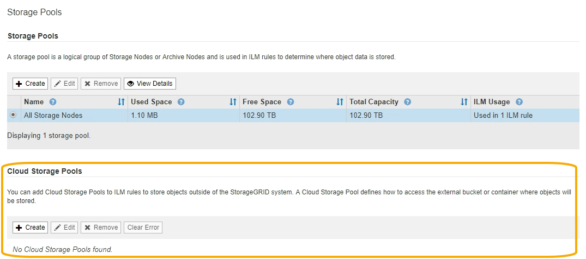

= Creare un pool di storage cloud
:allow-uri-read: 
:icons: font
:imagesdir: ../media/

[role="lead"]
Quando crei un pool di storage cloud, specifica il nome e la posizione del bucket o del container esterno che StorageGRID utilizzerà per memorizzare gli oggetti, il tipo di provider cloud (Amazon S3 o Azure Blob Storage) e le informazioni necessarie per accedere al bucket o al container esterno da parte di StorageGRID.

.Di cosa hai bisogno
* Hai effettuato l'accesso a Grid Manager utilizzando un xref:../admin/web-browser-requirements.adoc[browser web supportato].
* Si dispone di autorizzazioni di accesso specifiche.
* Hai esaminato le linee guida per la configurazione dei Cloud Storage Pools.
* Il bucket o il container esterno a cui fa riferimento il Cloud Storage Pool esiste già.
* Si dispone di tutte le informazioni di autenticazione necessarie per accedere al bucket o al container.

.A proposito di questa attività
Un Cloud Storage Pool specifica un singolo bucket S3 esterno o un container di storage Azure Blob. StorageGRID convalida il pool di storage cloud non appena viene salvato, quindi devi assicurarti che il bucket o il container specificato nel pool di storage cloud esista e sia raggiungibile.

.Fasi
. Selezionare *ILM* > *Storage Pools*.
+
Viene visualizzata la pagina Storage Pools. Questa pagina include due sezioni: Pool di storage e pool di storage cloud.

+

. Nella sezione Cloud Storage Pools della pagina, selezionare *Create*.
+
Viene visualizzata la finestra di dialogo Create Cloud Storage Pool (Crea pool di storage cloud).

+
image::../media/cloud_storage_pool_create.png[Creazione del pool di storage cloud]

. Inserire le seguenti informazioni:
+
[cols="1a,2a"]
|===
| Campo | Descrizione 

 a| 
Nome visualizzato
 a| 
Un nome che descrive brevemente il Cloud Storage Pool e il suo scopo. Utilizzare un nome che sia facile da identificare quando si configurano le regole ILM.

 a| 
Tipo di provider
 a| 
Quale cloud provider utilizzerai per questo Cloud Storage Pool:

** *Amazon S3*: Selezionare questa opzione per un endpoint S3, C2S S3 o Google Cloud Platform (GCP).
** *Azure Blob Storage*

*Nota:* quando si seleziona un tipo di provider, nella parte inferiore della pagina vengono visualizzate le sezioni Service Endpoint, Authentication e Server Verification.

 a| 
Bucket o container
 a| 
Il nome del bucket S3 esterno o del container Azure creato per il Cloud Storage Pool. Il nome specificato qui deve corrispondere esattamente al nome del bucket o del container, altrimenti la creazione del Cloud Storage Pool non avrà esito positivo. Non è possibile modificare questo valore dopo il salvataggio del Cloud Storage Pool.

|===
. Completare le sezioni Service Endpoint, Authentication e Server Verification della pagina, in base al tipo di provider selezionato.
+
** xref:s3-authentication-details-for-cloud-storage-pool.adoc[S3: Specificare i dettagli di autenticazione per un Cloud Storage Pool]
** xref:c2s-s3-authentication-details-for-cloud-storage-pool.adoc[C2S S3: Specificare i dettagli di autenticazione per un pool di storage cloud]
** xref:azure-authentication-details-for-cloud-storage-pool.adoc[Azure: Specificare i dettagli di autenticazione per un pool di storage cloud]

