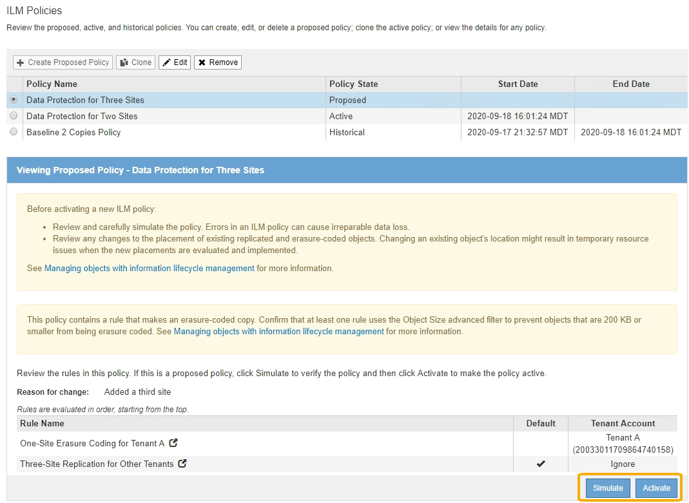

= Creare una policy ILM proposta
:allow-uri-read: 
:icons: font
:imagesdir: ../media/

[role="lead"]
È possibile creare un criterio ILM proposto da zero oppure clonare il criterio attivo corrente se si desidera iniziare con lo stesso insieme di regole.

NOTE: Se è stata attivata l'impostazione globale S3 Object Lock, attenersi alla seguente procedura: xref:creating-ilm-policy-after-s3-object-lock-is-enabled.adoc[Creare un criterio ILM dopo aver attivato il blocco oggetti S3].

.Di cosa hai bisogno
* Hai effettuato l'accesso a Grid Manager utilizzando un xref:../admin/web-browser-requirements.adoc[browser web supportato].
* Si dispone di autorizzazioni di accesso specifiche.
* Sono state create le regole ILM che si desidera aggiungere al criterio proposto. Se necessario, è possibile salvare una policy proposta, creare regole aggiuntive e quindi modificare la policy proposta per aggiungere le nuove regole.
* Lo hai fatto xref:creating-default-ilm-rule.adoc[Creazione di una regola ILM predefinita] per i criteri che non contengono filtri.
* Facoltativamente, hai guardato il video: https://netapp.hosted.panopto.com/Panopto/Pages/Viewer.aspx?id=c929e94e-353a-4375-b112-acc5013c81c7["Video: Policy ILM di StorageGRID"^]
+
[link=https://netapp.hosted.panopto.com/Panopto/Pages/Viewer.aspx?id=c929e94e-353a-4375-b112-acc5013c81c7]
image::../media/video-screenshot-ilm-policies.png[Video: Policy ILM di StorageGRID]

.A proposito di questa attività
I motivi tipici per la creazione di una policy ILM proposta includono:

* È stato aggiunto un nuovo sito ed è necessario utilizzare nuove regole ILM per posizionare gli oggetti in tale sito.
* Si sta smantellando un sito ed è necessario rimuovere tutte le regole che fanno riferimento al sito.
* È stato aggiunto un nuovo tenant con requisiti speciali per la protezione dei dati.
* Hai iniziato a utilizzare un Cloud Storage Pool.

IMPORTANT: Utilizzare la policy integrata del sistema, Baseline 2 Copies Policy, solo nei sistemi di test. La regola Make 2 copies di questo criterio utilizza il pool di storage All Storage Node, che contiene tutti i siti. Se il sistema StorageGRID dispone di più siti, è possibile che due copie di un oggetto vengano posizionate sullo stesso sito.

.Fasi
. Selezionare *ILM* > *Policy*.
+
Viene visualizzata la pagina ILM Policies (Criteri ILM). Da questa pagina, è possibile esaminare l'elenco dei criteri proposti, attivi e storici; creare, modificare, oppure rimuovere una policy proposta, clonare la policy attiva o visualizzare i dettagli di qualsiasi policy.

+
image::../media/ilm_policies_page.gif[Pagina ILM Policies]

. Determinare come si desidera creare il criterio ILM proposto.
+
[cols="1a,2a"]
|===
| Opzione | Fasi 

 a| 
Creare una nuova policy proposta senza regole già selezionate
 a| 
.. Se esiste attualmente un criterio ILM proposto, selezionarlo e selezionare *Rimuovi*.
+
Non è possibile creare una nuova policy proposta se esiste già una policy proposta.

.. Selezionare *Crea policy proposta*.

 a| 
Creare una policy proposta in base alla policy attiva
 a| 
.. Se esiste attualmente un criterio ILM proposto, selezionarlo e selezionare *Rimuovi*.
+
Non è possibile clonare il criterio attivo se esiste già un criterio proposto.

.. Selezionare il criterio attivo dalla tabella.
.. Selezionare *Clone*.

 a| 
Modificare la policy proposta esistente
 a| 
.. Selezionare la policy proposta dalla tabella.
.. Selezionare *Modifica*.

|===
+
Viene visualizzata la finestra di dialogo Configure ILM Policy (Configura policy ILM).

+
Se si sta creando una nuova policy proposta, tutti i campi sono vuoti e non viene selezionata alcuna regola.

+
image::../media/ilm_policies_configure_ilm_policy.png[I criteri ILM configurano il criterio ILM]

+
Se si esegue la clonazione del criterio attivo, il campo *Nome* mostra il nome del criterio attivo, aggiunto da un numero di versione ("`v2`" nell'esempio). Le regole utilizzate nel criterio attivo vengono selezionate e visualizzate nell'ordine corrente.

+
image::../media/ilm_policies_version.gif[Versione policy ILM]

. Immettere un nome univoco per la policy proposta nel campo *Nome*.
+
Immettere almeno 1 e non più di 64 caratteri. Se si clonano i criteri attivi, è possibile utilizzare il nome corrente con il numero di versione aggiunto oppure immettere un nuovo nome.

. Inserire il motivo della creazione di una nuova policy proposta nel campo *motivo della modifica*.
+
Immettere almeno 1 e non più di 128 caratteri.

. Per aggiungere regole al criterio, selezionare *Seleziona regole*.
+
Viene visualizzata la finestra di dialogo Select Rules for Policy (Seleziona regole per policy), con tutte le regole definite elencate. Se si sta clonando un criterio:

+
** Vengono selezionate le regole utilizzate dal criterio che si sta clonando.
** Se il criterio da clonare utilizza regole senza filtri che non erano la regola predefinita, viene richiesto di rimuovere tutte le regole tranne una di queste.
** Se la regola predefinita utilizza un filtro o l'ora di riferimento non corrente, viene richiesto di selezionare una nuova regola predefinita.
** Se la regola predefinita non è l'ultima, un pulsante consente di spostarla alla fine del nuovo criterio.
+
image::../media/ilm_policies_select_rules_for_policy.png[Criteri ILM: Selezionare le regole per il criterio]

. Selezionare il nome di una regola o l'icona ulteriori dettagli image:../media/icon_nms_more_details.gif["ulteriori dettagli"] per visualizzare le impostazioni relative a tale regola.
+
Questo esempio mostra i dettagli di una regola ILM che esegue due copie replicate in due siti.

+
image::../media/ilm_rule_summary_page.png[Pagina di riepilogo delle regole ILM]

. Nella sezione *Select Default Rule* (Seleziona regola predefinita), selezionare una regola predefinita per il criterio proposto.
+
La regola predefinita si applica a tutti gli oggetti che non corrispondono a un'altra regola del criterio. La regola predefinita non può utilizzare alcun filtro e viene sempre valutata per ultima.

+

NOTE: Se nella sezione Select Default Rule (Seleziona regola predefinita) non è elencata alcuna regola, uscire dalla pagina dei criteri ILM e. xref:creating-default-ilm-rule.adoc[Creare una regola ILM predefinita].

+

IMPORTANT: Non utilizzare la regola di creazione di 2 copie come regola predefinita per un criterio. La regola Make 2 copies utilizza un singolo pool di storage, tutti i nodi di storage, che contiene tutti i siti. Se il sistema StorageGRID dispone di più siti, è possibile che due copie di un oggetto vengano posizionate sullo stesso sito.

. Nella sezione *Seleziona altre regole*, selezionare le altre regole che si desidera includere nel criterio.
+
Le altre regole vengono valutate prima della regola predefinita e devono utilizzare almeno un filtro (account tenant, nome bucket, filtro avanzato o tempo di riferimento non corrente).

. Una volta selezionate le regole, selezionare *Apply* (Applica).
+
Vengono elencate le regole selezionate. La regola predefinita è alla fine, con le altre regole sopra di essa.

+
image::../media/ilm_policies_selected_rules.png[Criteri ILM regole selezionate]

+
[NOTE]
====
Viene visualizzato un avviso se la regola predefinita non conserva gli oggetti per sempre. Quando si attiva questo criterio, è necessario confermare che si desidera che StorageGRID elimini gli oggetti quando sono trascorse le istruzioni di posizionamento per la regola predefinita (a meno che un ciclo di vita del bucket non mantenga gli oggetti più a lungo).

image::../media/ilm_policy_default_rule_not_forever.png[La regola di default del criterio ILM non è mai stata così]

====
. Trascinare e rilasciare le righe per le regole non predefinite per determinare l'ordine in cui verranno valutate queste regole.
+
Non è possibile spostare la regola predefinita.

+

IMPORTANT: Verificare che le regole ILM siano nell'ordine corretto. Una volta attivato il criterio, gli oggetti nuovi ed esistenti vengono valutati dalle regole nell'ordine elencato, iniziando dall'inizio.

. Se necessario, selezionare l'icona di eliminazione image:../media/icon_nms_delete_new.gif["icona elimina"] Per eliminare le regole che non si desidera inserire nel criterio, oppure selezionare *Select Rules* (Seleziona regole) per aggiungere altre regole.
. Al termine, selezionare *Salva*.
+
La pagina delle policy ILM viene aggiornata:

+
** Il criterio salvato viene visualizzato come proposto. Le policy proposte non hanno date di inizio e fine.
** I pulsanti *simulate* e *activate* sono abilitati.
+

. Passare a. xref:simulating-ilm-policy.adoc[Simulare un criterio ILM].

.Informazioni correlate
* xref:what-ilm-policy-is.adoc[Che cos'è una policy ILM]
* xref:managing-objects-with-s3-object-lock.adoc[Gestire gli oggetti con S3 Object Lock]

