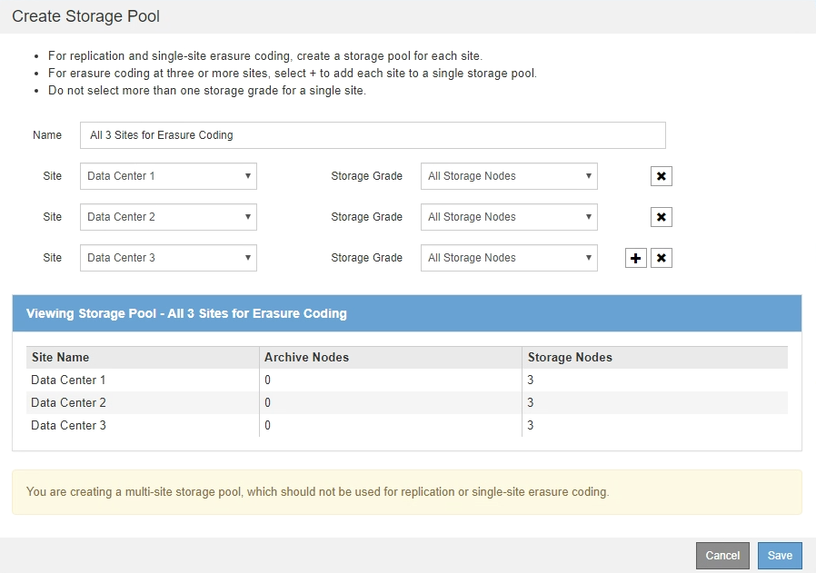

= Creare un pool di storage
:allow-uri-read: 
:icons: font
:imagesdir: ../media/

[role="lead"]
Si creano pool di storage per determinare dove il sistema StorageGRID memorizza i dati a oggetti e il tipo di storage utilizzato. Ogni pool di storage include uno o più siti e uno o più tipi di storage.

.Di cosa hai bisogno
* Hai effettuato l'accesso a Grid Manager utilizzando un xref:../admin/web-browser-requirements.adoc[browser web supportato].
* Si dispone di autorizzazioni di accesso specifiche.
* Hai esaminato le linee guida per la creazione di pool di storage.

.A proposito di questa attività
I pool di storage determinano la posizione in cui vengono memorizzati i dati degli oggetti. Il numero di pool di storage necessari dipende dal numero di siti nella griglia e dal tipo di copie desiderato: Replicate o con codifica di cancellazione.

* Per la replica e l'erasure coding a sito singolo, creare un pool di storage per ciascun sito. Ad esempio, se si desidera memorizzare copie di oggetti replicate in tre siti, creare tre pool di storage.
* Per la cancellazione del codice in tre o più siti, creare un pool di storage che includa una voce per ciascun sito. Ad esempio, se si desidera erasure gli oggetti del codice in tre siti, creare un pool di storage. Selezionare l'icona più image:../media/icon_plus_sign_black_on_white.gif["inserire l'icona"] per aggiungere una voce per ciascun sito.
+

IMPORTANT: Non includere il sito All Sites predefinito in un pool di storage che verrà utilizzato in un profilo di codifica Erasure. Al contrario, aggiungere una voce separata al pool di storage per ogni sito che memorizzerà i dati codificati in cancellazione. Vedere <<entries,questo passo>> ad esempio.

* Se si dispone di più storage di livello, non creare un pool di storage che includa diversi tipi di storage in un singolo sito. Vedere xref:guidelines-for-creating-storage-pools.adoc[Linee guida per la creazione di pool di storage].

.Fasi
. Selezionare *ILM* > *Storage Pools*.
+
Viene visualizzata la pagina Storage Pools (Pool di storage) che elenca tutti i pool di storage definiti.

+
image::../media/storage_pools_page.png[Pagina Storage Pools]

+
L'elenco include il pool di storage predefinito del sistema, tutti i nodi di storage, che utilizza il sito predefinito del sistema, tutti i siti e il livello di storage predefinito, tutti i nodi di storage.

+

IMPORTANT: Poiché il pool di storage All Storage Node viene aggiornato automaticamente ogni volta che si aggiungono nuovi siti del data center, si sconsiglia di utilizzare questo pool di storage nelle regole ILM.

. Per creare un nuovo pool di storage, selezionare *Crea*.
+
Viene visualizzata la finestra di dialogo Create Storage Pool (Crea pool di storage).

+
image::../media/create_storage_pool.png[Creare un pool di storage]

. Immettere un nome univoco per il pool di storage.
+
Utilizzare un nome facilmente identificabile quando si configurano i profili di codifica Erasure e le regole ILM.

. Dall'elenco a discesa *Sito*, selezionare un sito per questo pool di storage.
+
Quando si seleziona un sito, il numero di nodi di storage e di nodi di archiviazione nella tabella viene aggiornato automaticamente.

+
In generale, non utilizzare il sito All Sites predefinito in alcun pool di storage. Le regole ILM che utilizzano un pool di storage All Sites posizionano gli oggetti in qualsiasi sito disponibile, offrendo un minore controllo sul posizionamento degli oggetti. Inoltre, un pool di storage All Sites utilizza immediatamente i nodi di storage in un nuovo sito, il che potrebbe non essere il comportamento previsto.

. Dall'elenco a discesa *Storage Grade*, selezionare il tipo di storage da utilizzare se una regola ILM utilizza questo pool di storage.
+
Il livello di storage predefinito di All Storage Node include tutti i nodi di storage nel sito selezionato. Il livello di storage dei nodi di archiviazione predefinito include tutti i nodi di archiviazione nel sito selezionato. Se sono stati creati altri gradi di storage per i nodi di storage nel grid, questi vengono elencati nell'elenco a discesa.

. [[entry]]se si desidera utilizzare il pool di storage in un profilo di codifica Erasure multi-sito, selezionare image:../media/icon_plus_sign_black_on_white.gif["inserire l'icona"] per aggiungere una voce per ciascun sito al pool di storage.
+

+
[NOTE]
====
Non è possibile creare voci duplicate o creare un pool di storage che includa sia il livello di storage *Archive Node* che qualsiasi livello di storage che contenga i nodi di storage.

Viene visualizzato un avviso se si aggiungono più voci per un sito ma con diversi gradi di storage.

====
+
Per rimuovere una voce, selezionare image:../media/icon_nms_delete_new.gif["icona elimina"].

. Quando si è soddisfatti delle selezioni effettuate, selezionare *Save* (Salva).
+
Il nuovo pool di storage viene aggiunto all'elenco.

