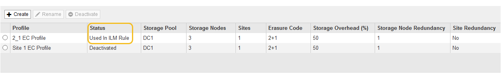

= Disattivare un profilo di codifica Erasure
:allow-uri-read: 
:icons: font
:imagesdir: ../media/

[role="lead"]
Puoi disattivare un profilo di codifica Erasure se non intendi utilizzarlo e se il profilo non è attualmente utilizzato in nessuna regola ILM.

.Di cosa hai bisogno
* Hai effettuato l'accesso a Grid Manager utilizzando un xref:../admin/web-browser-requirements.adoc[browser web supportato].
* Si dispone di autorizzazioni di accesso specifiche.
* Hai confermato che non sono in corso operazioni di riparazione dei dati codificati per la cancellazione o procedure di decommissionamento. Se si tenta di disattivare un profilo di codifica Erasure mentre è in corso una di queste operazioni, viene visualizzato un messaggio di errore.

.A proposito di questa attività
Quando si disattiva un profilo di codifica Erasure, il profilo continua a essere visualizzato nella pagina Erasure Coding Profiles, ma il suo stato è *Disattivato*.

image::../media/deactivated_ec_profile.png[Profilo EC disattivato]

Non è più possibile utilizzare un profilo di codifica Erasure disattivato. Un profilo disattivato non viene visualizzato quando si creano le istruzioni di posizionamento per una regola ILM. Non è possibile riattivare un profilo disattivato.

StorageGRID impedisce di disattivare un profilo di codifica Erasure se si verifica una delle seguenti condizioni:

* Il profilo di codifica Erasure è attualmente utilizzato in una regola ILM.
* Il profilo di codifica Erasure non viene più utilizzato in alcuna regola ILM, ma i dati degli oggetti e i frammenti di parità per il profilo esistono ancora.

.Fasi
. Selezionare *ILM* > *Erasure coding*.
+
Viene visualizzata la pagina Erasure Coding Profiles. I pulsanti *Rinomina* e *Disattiva* sono entrambi disattivati.

. Controllare la colonna *Status* per verificare che il profilo di codifica Erasure che si desidera disattivare non sia utilizzato in alcuna regola ILM.
+
Non è possibile disattivare un profilo di codifica Erasure se utilizzato in qualsiasi regola ILM. Nell'esempio, il profilo *2_1 EC* viene utilizzato in almeno una regola ILM.

+

. Se il profilo viene utilizzato in una regola ILM, attenersi alla seguente procedura:
+
.. Selezionare *ILM* > *regole*.
.. Per ciascuna regola elencata, selezionare il pulsante di opzione e consultare il diagramma di conservazione per determinare se la regola utilizza il profilo di codifica Erasure che si desidera disattivare.
+
Nell'esempio, la regola EC *tre siti per oggetti più grandi* utilizza un pool di storage denominato *tutti e 3 i siti* e il profilo di codifica Erasure *tutti i siti 6-3*. I profili di erasure coding sono rappresentati da questa icona: 

+
image::../media/ilm_rule_ec_profile_used.png[Profilo EC regola ILM utilizzato]

.. Se la regola ILM utilizza il profilo di codifica Erasure che si desidera disattivare, determinare se la regola viene utilizzata nel criterio ILM attivo o in un criterio proposto.
+
Nell'esempio, la regola EC *tre siti per oggetti più grandi* viene utilizzata nel criterio ILM attivo.

.. Completare i passaggi aggiuntivi della tabella, in base alla posizione in cui viene utilizzato il profilo di codifica Erasure.
+
[cols="2a,3a,1a"]
|===
| Dove è stato utilizzato il profilo? | Ulteriori passaggi da eseguire prima di disattivare il profilo | Fare riferimento a queste istruzioni aggiuntive 

 a| 
Mai utilizzato in nessuna regola ILM
 a| 
Non sono necessari passaggi aggiuntivi. Continuare con questa procedura.
 a| 
_Nessuno_

 a| 
In una regola ILM che non è mai stata utilizzata in alcun criterio ILM
 a| 
... Modificare o eliminare tutte le regole ILM interessate. Se si modifica la regola, rimuovere tutte le posizioni che utilizzano il profilo di codifica Erasure.
... Continuare con questa procedura.

 a| 
xref:working-with-ilm-rules-and-ilm-policies.adoc[Utilizzare le regole ILM e i criteri ILM]

 a| 
In una regola ILM attualmente nel criterio ILM attivo
 a| 
... Clonare il criterio attivo.
... Rimuovere la regola ILM che utilizza il profilo di codifica Erasure.
... Aggiungere una o più nuove regole ILM per garantire la protezione degli oggetti.
... Salvare, simulare e attivare la nuova policy.
... Attendere che il nuovo criterio venga applicato e che gli oggetti esistenti vengano spostati in nuove posizioni in base alle nuove regole aggiunte.
+
*Nota:* a seconda del numero di oggetti e delle dimensioni del sistema StorageGRID, potrebbero essere necessarie settimane o addirittura mesi per le operazioni ILM per spostare gli oggetti in nuove posizioni, in base alle nuove regole ILM.

+
Sebbene sia possibile disattivare in modo sicuro un profilo di codifica Erasure mentre è ancora associato ai dati, l'operazione di disattivazione non riesce. Se il profilo non è ancora pronto per la disattivazione, viene visualizzato un messaggio di errore.

... Modificare o eliminare la regola rimossa dal criterio. Se si modifica la regola, rimuovere tutte le posizioni che utilizzano il profilo di codifica Erasure.
... Continuare con questa procedura.

 a| 
*** xref:creating-ilm-policy.adoc[Creare un criterio ILM]
*** xref:working-with-ilm-rules-and-ilm-policies.adoc[Utilizzare le regole ILM e i criteri ILM]

 a| 
In una regola ILM attualmente in un criterio ILM proposto
 a| 
... Modificare la policy proposta.
... Rimuovere la regola ILM che utilizza il profilo di codifica Erasure.
... Aggiungere una o più nuove regole ILM per garantire la protezione di tutti gli oggetti.
... Salvare la policy proposta.
... Modificare o eliminare la regola rimossa dal criterio. Se si modifica la regola, rimuovere tutte le posizioni che utilizzano il profilo di codifica Erasure.
... Continuare con questa procedura.

 a| 
*** xref:creating-ilm-policy.adoc[Creare un criterio ILM]
*** xref:working-with-ilm-rules-and-ilm-policies.adoc[Utilizzare le regole ILM e i criteri ILM]

 a| 
In una regola ILM che si trova in una policy ILM storica
 a| 
... Modificare o eliminare la regola. Se si modifica la regola, rimuovere tutte le posizioni che utilizzano il profilo di codifica Erasure. (La regola verrà ora visualizzata come regola storica nella policy storica).
... Continuare con questa procedura.

 a| 
xref:working-with-ilm-rules-and-ilm-policies.adoc[Utilizzare le regole ILM e i criteri ILM]

|===
.. Aggiornare la pagina Erasure Coding Profiles per assicurarsi che il profilo non venga utilizzato in una regola ILM.

. Se il profilo non viene utilizzato in una regola ILM, selezionare il pulsante di opzione e selezionare *Disattiva*.
+
Viene visualizzata la finestra di dialogo Disattiva profilo EC.

+
image::../media/deactivate_ec_profile_confirmation.png[Disattiva conferma profilo EC]

. Se sei sicuro di voler disattivare il profilo, seleziona *Disattiva*.
+
** Se StorageGRID è in grado di disattivare il profilo di codifica di cancellazione, il suo stato è *Disattivato*. Non è più possibile selezionare questo profilo per nessuna regola ILM.
** Se StorageGRID non è in grado di disattivare il profilo, viene visualizzato un messaggio di errore. Ad esempio, se i dati dell'oggetto sono ancora associati a questo profilo, viene visualizzato un messaggio di errore. Potrebbe essere necessario attendere alcune settimane prima di provare di nuovo il processo di disattivazione.

