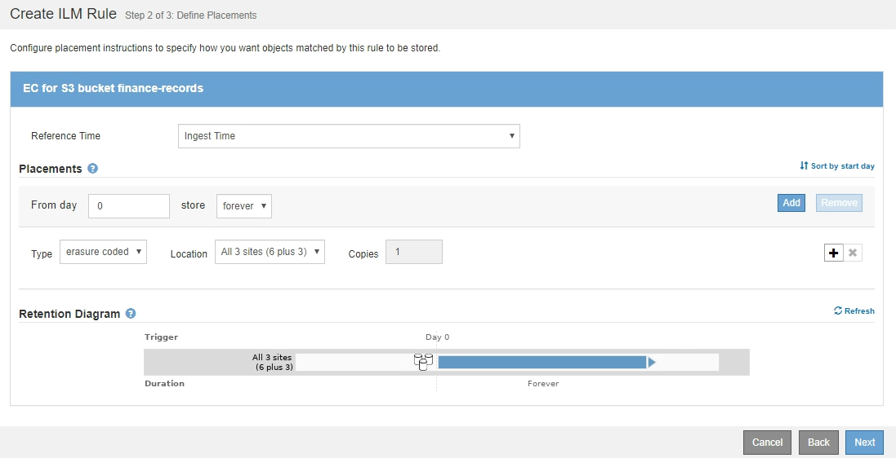

= Esempio 1: Regole ILM e policy per lo storage a oggetti
:allow-uri-read: 
:icons: font
:imagesdir: ../media/

[role="lead"]
È possibile utilizzare le seguenti regole e policy di esempio come punto di partenza per la definizione di un criterio ILM in modo da soddisfare i requisiti di protezione e conservazione degli oggetti.

CAUTION: Le seguenti regole e policy ILM sono solo esempi. Esistono diversi modi per configurare le regole ILM. Prima di attivare una nuova policy, simulare la policy proposta per confermare che funzionerà come previsto per proteggere il contenuto dalla perdita.

== ILM regola 1 per esempio 1: Copia dei dati degli oggetti in due data center

Questa regola ILM di esempio copia i dati degli oggetti in pool di storage in due data center.

[cols="1a,2a"]
|===
| Definizione della regola | Valore di esempio 

 a| 
Pool di storage
 a| 
Due pool di storage, ciascuno in diversi data center, denominati Storage Pool DC1 e Storage Pool DC2.

 a| 
Nome regola
 a| 
Due copie di due data center

 a| 
Tempo di riferimento
 a| 
Tempo di acquisizione

 a| 
Posizionamento dei contenuti
 a| 
Il giorno 0, conserva due copie replicate per sempre, una nello Storage Pool DC1 e una nello Storage Pool DC2.

|===
image::../media/ilm_rule_two_copies_two_data_centers.png[ILM regola 1 per esempio 1: Copia dei dati degli oggetti in due data center]

== ILM regola 2 per esempio 1: Erasure coding profile with bucket matching

Questa regola ILM di esempio utilizza un profilo di codifica Erasure e un bucket S3 per determinare dove e per quanto tempo l'oggetto viene memorizzato.

[cols="1a,2a"]
|===
| Definizione della regola | Valore di esempio 

 a| 
Erasure Coding Profile (erasure Coding Profile
 a| 
* Un pool di storage in tre data center (tutti e 3 i siti)
* Utilizzare uno schema di erasure coding 6+3

 a| 
Nome regola
 a| 
EC per i record finanziari del bucket S3

 a| 
Tempo di riferimento
 a| 
Tempo di acquisizione

 a| 
Posizionamento dei contenuti
 a| 
Per gli oggetti nel bucket S3 denominati finance-records, creare una copia con codice di cancellazione nel pool specificato dal profilo di codifica Erasure. Conserva questa copia per sempre.

|===

== Policy ILM per esempio 1

Il sistema StorageGRID consente di progettare policy ILM sofisticate e complesse; tuttavia, in pratica, la maggior parte delle policy ILM è semplice.

Un tipico criterio ILM per una topologia multi-sito potrebbe includere regole ILM come le seguenti:

* Al momento dell'acquisizione, utilizzare la codifica di cancellazione 6+3 per memorizzare tutti gli oggetti appartenenti al bucket S3 denominato `finance-records` in tre data center.
* Se un oggetto non corrisponde alla prima regola ILM, utilizzare la regola ILM predefinita del criterio, due copie due data center, per memorizzare una copia di tale oggetto in due data center, DC1 e DC2.
+
image::../media/policy_1_configured_policy.png[Policy ILM per esempio 1]

