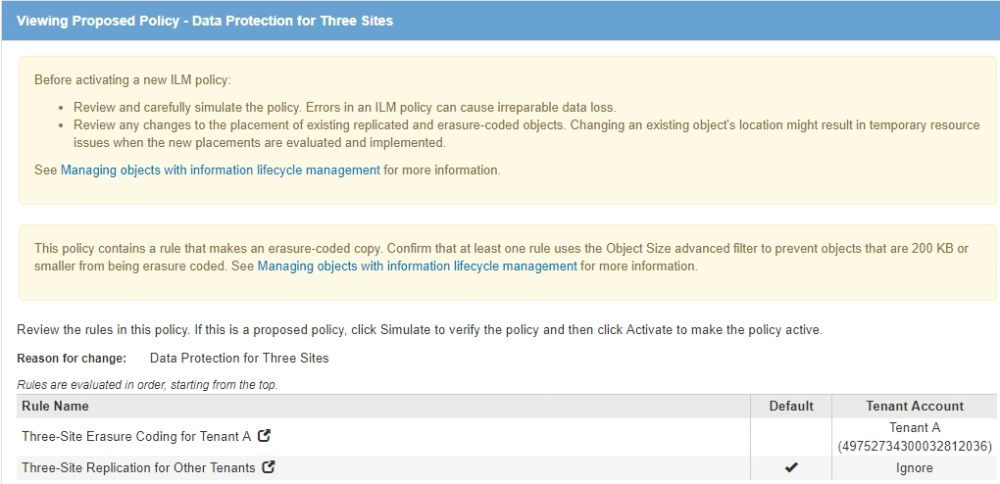

= Esempio 6: Modifica di un criterio ILM
:allow-uri-read: 
:icons: font
:imagesdir: ../media/

[role="lead"]
Potrebbe essere necessario creare e attivare una nuova policy ILM se la protezione dei dati deve cambiare o se si aggiungono nuovi siti.

Prima di modificare una policy, è necessario comprendere in che modo le modifiche apportate ai posizionamenti ILM possono influire temporaneamente sulle prestazioni generali di un sistema StorageGRID.

In questo esempio, è stato aggiunto un nuovo sito StorageGRID in un'espansione e il criterio ILM attivo deve essere rivisto per memorizzare i dati nel nuovo sito.

CAUTION: Le seguenti regole e policy ILM sono solo esempi. Esistono diversi modi per configurare le regole ILM. Prima di attivare una nuova policy, simulare la policy proposta per confermare che funzionerà come previsto per proteggere il contenuto dalla perdita.

== In che modo la modifica di un criterio ILM influisce sulle performance

Quando si attiva un nuovo criterio ILM, le prestazioni del sistema StorageGRID potrebbero risentirne temporaneamente, soprattutto se le istruzioni di posizionamento nel nuovo criterio richiedono lo spostamento di molti oggetti esistenti in nuove posizioni.

CAUTION: Quando si attiva un nuovo criterio ILM, StorageGRID lo utilizza per gestire tutti gli oggetti, inclusi quelli esistenti e quelli acquisiti di recente. Prima di attivare un nuovo criterio ILM, esaminare le eventuali modifiche apportate al posizionamento degli oggetti replicati e codificati in cancellazione esistenti. La modifica della posizione di un oggetto esistente potrebbe causare problemi di risorse temporanee quando i nuovi posizionamenti vengono valutati e implementati.

I tipi di modifiche ai criteri ILM che possono influire temporaneamente sulle prestazioni di StorageGRID includono:

* Applicazione di un profilo di codifica Erasure diverso agli oggetti con codifica erasure esistenti.
+

NOTE: StorageGRID considera ogni profilo di codifica Erasure unico e non riutilizza i frammenti di codifica Erasure quando viene utilizzato un nuovo profilo.

* Modifica del tipo di copie richieste per gli oggetti esistenti; ad esempio, conversione di una grande percentuale di oggetti replicati in oggetti con codifica per la cancellazione.
* Spostamento di copie di oggetti esistenti in una posizione completamente diversa; ad esempio, spostamento di un numero elevato di oggetti da o verso un Cloud Storage Pool o da o verso un sito remoto.

.Informazioni correlate
xref:creating-ilm-policy.adoc[Creare un criterio ILM]

== Policy ILM attiva ad esempio 6: Protezione dei dati in due siti

In questo esempio, la policy ILM attiva è stata inizialmente progettata per un sistema StorageGRID a due siti e utilizza due regole ILM.

image::../media/policy_6_active_policy.png[Esempio di criterio ILM 6 Active Policy]

In questa policy ILM, gli oggetti appartenenti al tenant A sono protetti da una codifica di cancellazione 2+1 in un singolo sito, mentre gli oggetti appartenenti a tutti gli altri tenant sono protetti in due siti utilizzando la replica a 2 copie.

NOTE: La prima regola di questo esempio utilizza un filtro avanzato per garantire che la codifica erasure non venga utilizzata per oggetti di piccole dimensioni. Qualsiasi oggetto del tenant A di dimensioni inferiori a 1 MB sarà protetto dalla seconda regola, che utilizza la replica.

=== Regola 1: Erasure coding per un sito per il tenant A.

[cols="1a,2a"]
|===
| Definizione della regola | Valore di esempio 

 a| 
Nome regola
 a| 
Codifica di cancellazione one-site per il tenant A.

 a| 
Account tenant
 a| 
Tenant A.

 a| 
Pool di storage
 a| 
Data center 1

 a| 
Posizionamento dei contenuti
 a| 
2+1 erasure coding in Data Center 1 dal giorno 0 a per sempre

|===

=== Regola 2: Replica a due siti per altri tenant

[cols="1a,2a"]
|===
| Definizione della regola | Valore di esempio 

 a| 
Nome regola
 a| 
Replica a due siti per altri tenant

 a| 
Account tenant
 a| 
Ignorare

 a| 
Pool di storage
 a| 
Data Center 1 e Data Center 2

 a| 
Posizionamento dei contenuti
 a| 
Due copie replicate dal giorno 0 all'infinito: Una copia nel data center 1 e una copia nel data center 2.

|===

== Policy ILM proposta per esempio 6: Protezione dei dati in tre siti

In questo esempio, il criterio ILM viene aggiornato per un sistema StorageGRID a tre siti.

Dopo aver eseguito un'espansione per aggiungere il nuovo sito, l'amministratore del grid ha creato due nuovi pool di storage: Un pool di storage per Data Center 3 e un pool di storage contenente tutti e tre i siti (non lo stesso del pool di storage predefinito di tutti i nodi di storage). Quindi, l'amministratore ha creato due nuove regole ILM e una nuova policy ILM proposta, progettata per proteggere i dati in tutti e tre i siti.

Quando viene attivata questa nuova policy ILM, gli oggetti appartenenti al tenant A saranno protetti da una cancellazione 2+1 in tre siti, mentre gli oggetti appartenenti ad altri tenant (e gli oggetti più piccoli appartenenti al tenant A) saranno protetti in tre siti utilizzando la replica a 3 copie.

=== Regola 1: Erasure coding a tre siti per il tenant A.

[cols="1a,2a"]
|===
| Definizione della regola | Valore di esempio 

 a| 
Nome regola
 a| 
Codifica di cancellazione a tre siti per il tenant A.

 a| 
Account tenant
 a| 
Tenant A.

 a| 
Pool di storage
 a| 
Tutti e 3 i data center (inclusi data center 1, data center 2 e data center 3)

 a| 
Posizionamento dei contenuti
 a| 
2+1 erasure coding in tutti e 3 i data center, dal giorno 0 fino all'eterno

|===

=== Regola 2: Replica a tre siti per altri tenant

[cols="1a,2a"]
|===
| Definizione della regola | Valore di esempio 

 a| 
Nome regola
 a| 
Replica a tre siti per altri tenant

 a| 
Account tenant
 a| 
Ignorare

 a| 
Pool di storage
 a| 
Data Center 1, Data Center 2 e Data Center 3

 a| 
Posizionamento dei contenuti
 a| 
Tre copie replicate dal giorno 0 a sempre: Una copia presso il data center 1, una copia presso il data center 2 e una copia presso il data center 3.

|===

== Attivazione della policy ILM proposta, ad esempio 6

Quando si attiva un nuovo criterio ILM proposto, gli oggetti esistenti potrebbero essere spostati in nuove posizioni oppure potrebbero essere create nuove copie degli oggetti per gli oggetti esistenti, in base alle istruzioni di posizionamento in qualsiasi regola nuova o aggiornata.

CAUTION: Gli errori in un criterio ILM possono causare una perdita di dati irrecuperabile. Esaminare attentamente e simulare la policy prima di attivarla per confermare che funzionerà come previsto.

CAUTION: Quando si attiva un nuovo criterio ILM, StorageGRID lo utilizza per gestire tutti gli oggetti, inclusi quelli esistenti e quelli acquisiti di recente. Prima di attivare un nuovo criterio ILM, esaminare le eventuali modifiche apportate al posizionamento degli oggetti replicati e codificati in cancellazione esistenti. La modifica della posizione di un oggetto esistente potrebbe causare problemi di risorse temporanee quando i nuovi posizionamenti vengono valutati e implementati.

=== Cosa succede quando cambiano le istruzioni di erasure coding

Nella policy ILM attualmente attiva, per questo esempio, gli oggetti appartenenti al tenant A sono protetti utilizzando la codifica di cancellazione 2+1 nel data center 1. Nella nuova policy ILM proposta, gli oggetti appartenenti al tenant A verranno protetti utilizzando la codifica di cancellazione 2+1 nei data center 1, 2 e 3.

Quando viene attivato il nuovo criterio ILM, si verificano le seguenti operazioni ILM:

* I nuovi oggetti acquisiti dal tenant A vengono suddivisi in due frammenti di dati e viene aggiunto un frammento di parità. Quindi, ciascuno dei tre frammenti viene memorizzato in un data center diverso.
* Gli oggetti esistenti appartenenti al tenant A vengono rivalutati durante il processo di scansione ILM in corso. Poiché le istruzioni di posizionamento di ILM utilizzano un nuovo profilo di codifica Erasure, vengono creati e distribuiti frammenti completamente nuovi con codifica erasure nei tre data center.
+

NOTE: I frammenti 2+1 esistenti nel data center 1 non vengono riutilizzati. StorageGRID considera ogni profilo di codifica Erasure unico e non riutilizza i frammenti di codifica Erasure quando viene utilizzato un nuovo profilo.

=== Cosa succede quando cambiano le istruzioni di replica

Nel criterio ILM attualmente attivo per questo esempio, gli oggetti appartenenti ad altri tenant vengono protetti utilizzando due copie replicate nei pool di storage dei data center 1 e 2. Nella nuova policy ILM proposta, gli oggetti appartenenti ad altri tenant verranno protetti utilizzando tre copie replicate nei pool di storage dei data center 1, 2 e 3.

Quando viene attivato il nuovo criterio ILM, si verificano le seguenti operazioni ILM:

* Quando un tenant diverso dal tenant A acquisisce un nuovo oggetto, StorageGRID crea tre copie e salva una copia in ogni data center.
* Gli oggetti esistenti appartenenti a questi altri tenant vengono rivalutati durante il processo di scansione ILM in corso. Poiché le copie di oggetti esistenti nel data center 1 e nel data center 2 continuano a soddisfare i requisiti di replica della nuova regola ILM, StorageGRID deve creare solo una nuova copia dell'oggetto per il data center 3.

=== Impatto delle performance dell'attivazione di questa policy

Quando viene attivata la policy ILM proposta in questo esempio, le prestazioni generali di questo sistema StorageGRID saranno temporaneamente compromesse. Per creare nuovi frammenti erasure-coded per gli oggetti esistenti del tenant A e nuove copie replicate nel data center 3 per gli oggetti esistenti degli altri tenant saranno necessari livelli di risorse grid superiori al normale.

Come conseguenza della modifica del criterio ILM, le richieste di lettura e scrittura del client potrebbero temporaneamente riscontrare latenze superiori al normale. Le latenze torneranno ai livelli normali dopo che le istruzioni di posizionamento sono state completamente implementate nella griglia.

Per evitare problemi di risorse quando si attiva un nuovo criterio ILM, è possibile utilizzare il filtro avanzato Ingest Time in qualsiasi regola che potrebbe modificare la posizione di un gran numero di oggetti esistenti. Impostare Ingest Time (tempo di acquisizione) su un valore maggiore o uguale al tempo approssimativo in cui il nuovo criterio verrà applicato per garantire che gli oggetti esistenti non vengano spostati inutilmente.

NOTE: Contattare il supporto tecnico se è necessario rallentare o aumentare la velocità di elaborazione degli oggetti dopo una modifica della policy ILM.
