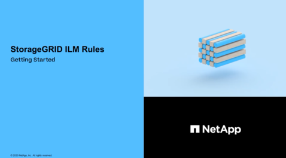

= Gestire gli oggetti con ILM: Panoramica
:allow-uri-read: 
:icons: font
:imagesdir: ../media/

[role="lead"]
È possibile gestire gli oggetti in un sistema StorageGRID configurando le regole e le policy di Information Lifecycle Management (ILM). Le regole e i criteri ILM spiegano a StorageGRID come creare e distribuire copie di dati a oggetti e come gestirle nel tempo.

== A proposito di queste istruzioni

La progettazione e l'implementazione delle regole ILM e della policy ILM richiede un'attenta pianificazione. È necessario comprendere i requisiti operativi, la topologia del sistema StorageGRID, le esigenze di protezione degli oggetti e i tipi di storage disponibili. Quindi, è necessario determinare come si desidera copiare, distribuire e memorizzare diversi tipi di oggetti.

Seguire queste istruzioni per:

* Scopri di più su ILM di StorageGRID, tra cui il funzionamento di ILM per tutta la vita di un oggetto e quali sono le policy e le regole ILM.
* Scopri come configurare i pool di storage, i profili di codifica Erasure e le regole ILM.
* Scopri come creare e attivare una policy ILM che proteggerà i dati degli oggetti in uno o più siti.
* Scopri come gestire gli oggetti con S3 Object Lock, che aiuta a garantire che gli oggetti in specifici bucket S3 non vengano cancellati o sovrascritti per un determinato periodo di tempo.

== Scopri di più

Per ulteriori informazioni, consulta questi video:

* https://netapp.hosted.panopto.com/Panopto/Pages/Viewer.aspx?id=beffbe9b-e95e-4a90-9560-acc5013c93d8["Video: Regole ILM di StorageGRID: Per iniziare"^]
+
[link=https://netapp.hosted.panopto.com/Panopto/Pages/Viewer.aspx?id=beffbe9b-e95e-4a90-9560-acc5013c93d8]

* https://netapp.hosted.panopto.com/Panopto/Pages/Viewer.aspx?id=c929e94e-353a-4375-b112-acc5013c81c7["Video: Policy ILM di StorageGRID"^]
+
[link=https://netapp.hosted.panopto.com/Panopto/Pages/Viewer.aspx?id=c929e94e-353a-4375-b112-acc5013c81c7]
image::../media/video-screenshot-ilm-policies.png[Video: Policy ILM di StorageGRID]

