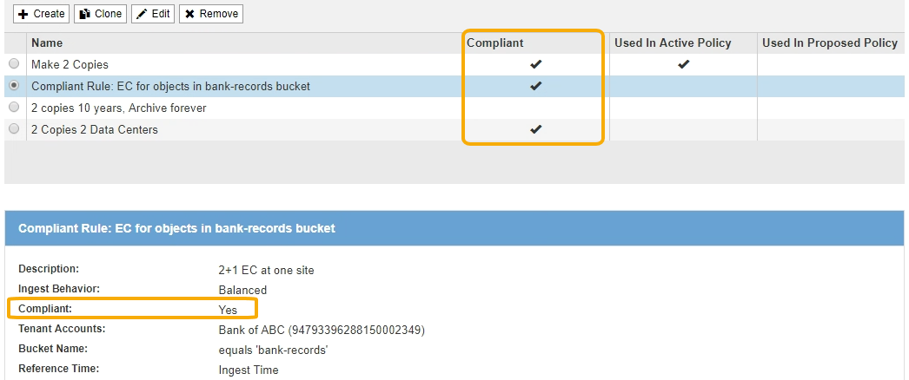

= Requisiti per il blocco oggetti S3
:allow-uri-read: 
:icons: font
:imagesdir: ../media/

[role="lead"]
È necessario esaminare i requisiti per l'attivazione dell'impostazione globale di blocco oggetti S3, i requisiti per la creazione di regole ILM e criteri ILM conformi e le restrizioni applicate da StorageGRID ai bucket e agli oggetti che utilizzano il blocco oggetti S3.

== Requisiti per l'utilizzo dell'impostazione globale S3 Object Lock

* È necessario attivare l'impostazione globale S3 Object Lock utilizzando Grid Manager o l'API Grid Management prima che qualsiasi tenant S3 possa creare un bucket con S3 Object Lock attivato.
* L'attivazione dell'impostazione globale S3 Object Lock consente a tutti gli account tenant S3 di creare bucket con S3 Object Lock attivato.
* Dopo aver attivato l'impostazione globale S3 Object Lock (blocco oggetto S3), non è possibile disattivare l'impostazione.
* Non è possibile attivare il blocco oggetti S3 globale a meno che la regola predefinita nel criterio ILM attivo non sia _compliant_ (ovvero, la regola predefinita deve essere conforme ai requisiti dei bucket con blocco oggetti S3 attivato).
* Quando l'impostazione blocco oggetto S3 globale è attivata, non è possibile creare un nuovo criterio ILM proposto o attivare un criterio ILM proposto esistente a meno che la regola predefinita del criterio non sia conforme. Una volta attivata l'impostazione globale S3 Object Lock, le pagine ILM Rules (regole ILM) e ILM Policies (Criteri ILM) indicano quali regole ILM sono conformi.
+
Nell'esempio seguente, la pagina ILM Rules (regole ILM) elenca tre regole che sono conformi ai bucket con S3 Object Lock abilitato.

+

== Requisiti per le regole ILM conformi

Se si desidera attivare l'impostazione blocco oggetti S3 globale, assicurarsi che la regola predefinita nel criterio ILM attivo sia conforme. Una regola conforme soddisfa i requisiti di entrambi i bucket con blocco oggetti S3 attivato e di tutti i bucket esistenti con conformità legacy attivata:

* Deve creare almeno due copie di oggetti replicate o una copia con codice di cancellazione.
* Queste copie devono esistere nei nodi di storage per l'intera durata di ciascuna riga nelle istruzioni di posizionamento.
* Impossibile salvare le copie degli oggetti in un pool di storage cloud.
* Impossibile salvare le copie degli oggetti nei nodi di archiviazione.
* Almeno una riga delle istruzioni di posizionamento deve iniziare al giorno 0, utilizzando *Ingest Time* come ora di riferimento.
* Almeno una riga delle istruzioni di posizionamento deve essere "`forever`".

Ad esempio, questa regola soddisfa i requisiti dei bucket con blocco oggetti S3 attivato. Memorizza due copie di oggetti replicate dall'ora di inizio (giorno 0) a "`forever`". Gli oggetti verranno memorizzati nei nodi di storage di due data center.

image::../media/compliant_rule_two_copies_forever.png[Esempio di copie conformi alla regola due per sempre]

== Requisiti per le policy ILM attive e proposte

Quando l'impostazione blocco oggetto S3 globale è attivata, i criteri ILM attivi e proposti possono includere regole conformi e non conformi.

* La regola predefinita del criterio ILM attivo o proposto deve essere conforme.
* Le regole non conformi si applicano solo agli oggetti nei bucket che non hanno attivato il blocco oggetti S3 o che non hanno la funzione Compliance legacy attivata.
* Le regole conformi possono essere applicate agli oggetti in qualsiasi bucket; non è necessario attivare il blocco oggetti S3 o la conformità legacy per il bucket.

Un criterio ILM conforme potrebbe includere le seguenti tre regole:

. Regola conforme che crea copie con codifica in cancellazione degli oggetti in un bucket specifico con blocco oggetti S3 attivato. Le copie EC vengono memorizzate nei nodi di storage dal giorno 0 a sempre.
. Una regola non conforme che crea due copie di oggetti replicate sui nodi di storage per un anno, quindi sposta una copia di oggetti nei nodi di archivio e memorizza la copia per sempre. Questa regola si applica solo ai bucket che non hanno attivato il blocco oggetti S3 o la compliance legacy perché memorizza una sola copia dell'oggetto per sempre e utilizza i nodi di archiviazione.
. Una regola predefinita e conforme che crea due copie di oggetti replicate sui nodi di storage dal giorno 0 a sempre. Questa regola si applica a qualsiasi oggetto in qualsiasi bucket che non è stato filtrato dalle prime due regole.

== Requisiti per i bucket con S3 Object Lock attivato

* Se l'impostazione blocco oggetto S3 globale è attivata per il sistema StorageGRID, è possibile utilizzare Gestione tenant, API di gestione tenant o API REST S3 per creare bucket con blocco oggetto S3 attivato.
+
Questo esempio di Tenant Manager mostra un bucket con blocco oggetti S3 attivato.

+
image::../media/compliant_bucket.png[Esempio di bucket conforme]

* Se si intende utilizzare il blocco oggetti S3, è necessario attivare il blocco oggetti S3 quando si crea il bucket. Non è possibile attivare il blocco oggetti S3 per un bucket esistente.
* La versione del bucket è richiesta con S3 Object Lock. Quando il blocco oggetti S3 è attivato per un bucket, StorageGRID attiva automaticamente il controllo delle versioni per quel bucket.
* Dopo aver creato un bucket con S3 Object Lock attivato, non è possibile disattivare S3 Object Lock o sospendere il controllo delle versioni per quel bucket.
* Facoltativamente, è possibile configurare la conservazione predefinita per un bucket. Quando viene caricata una versione dell'oggetto, la conservazione predefinita viene applicata alla versione dell'oggetto. È possibile eseguire l'override del valore predefinito del bucket specificando una modalità di conservazione e conservarla fino a data nella richiesta di caricare una versione dell'oggetto.
* La configurazione del ciclo di vita del bucket è supportata per i bucket S3 Object Lifecycle.
* La replica di CloudMirror non è supportata per i bucket con blocco oggetti S3 attivato.

== Requisiti per gli oggetti nei bucket con S3 Object Lock attivato

* Per proteggere una versione a oggetti, l'applicazione client S3 deve configurare la conservazione predefinita del bucket o specificare le impostazioni di conservazione in ogni richiesta di caricamento.
* È possibile aumentare la data di conservazione per una versione a oggetti, ma non è mai possibile diminuire questo valore.
* Se si riceve la notifica di un'azione legale o di un'indagine normativa in sospeso, è possibile conservare le informazioni pertinenti ponendo un blocco legale su una versione dell'oggetto. Quando una versione dell'oggetto è sottoposta a un blocco legale, non è possibile eliminare tale oggetto da StorageGRID, anche se ha raggiunto la data di conservazione. Non appena la conservazione legale viene revocata, la versione dell'oggetto può essere eliminata se è stata raggiunta la data di conservazione.
* S3 Object Lock richiede l'utilizzo di bucket con versione. Le impostazioni di conservazione si applicano alle singole versioni di oggetti. Una versione a oggetti può avere un'impostazione di conservazione fino alla data e un'impostazione di conservazione legale, una ma non l'altra o nessuna delle due. La specifica di un'impostazione di conservazione fino a data o di conservazione legale per un oggetto protegge solo la versione specificata nella richiesta. È possibile creare nuove versioni dell'oggetto, mentre la versione precedente rimane bloccata.

== Ciclo di vita degli oggetti nei bucket con S3 Object Lock attivato

Ogni oggetto salvato in un bucket con S3 Object Lock attivato passa attraverso tre fasi:

. *Acquisizione oggetto*
+
** Quando si aggiunge una versione dell'oggetto a un bucket con S3 Object Lock attivato, l'applicazione client S3 può utilizzare le impostazioni predefinite di conservazione del bucket o, facoltativamente, specificare le impostazioni di conservazione per l'oggetto (conservazione fino alla data, conservazione legale o entrambe). StorageGRID genera quindi metadati per l'oggetto, che includono un UUID (Unique Object Identifier) e la data e l'ora di acquisizione.
** Dopo l'acquisizione di una versione a oggetti con impostazioni di conservazione, i relativi dati e i metadati S3 definiti dall'utente non possono essere modificati.
** StorageGRID memorizza i metadati dell'oggetto indipendentemente dai dati dell'oggetto. Conserva tre copie di tutti i metadati degli oggetti in ogni sito.

. *Conservazione degli oggetti*
+
** StorageGRID memorizza più copie dell'oggetto. Il numero e il tipo esatti di copie e le posizioni di storage sono determinati dalle regole conformi nel criterio ILM attivo.

. *Eliminazione di oggetti*
+
** È possibile eliminare un oggetto una volta raggiunta la data di conservazione.
** Non è possibile eliminare un oggetto sottoposto a conservazione a fini giudiziari.

.Informazioni correlate
* xref:../tenant/index.adoc[Utilizzare un account tenant]
* xref:../s3/index.adoc[Utilizzare S3]
* xref:managing-objects-with-s3-object-lock.adoc#comparing-s3-object-lock-to-legacy-compliance[Confronto tra blocco oggetti S3 e conformità legacy]
* xref:example-7-compliant-ilm-policy-for-s3-object-lock.adoc[Esempio 7: Policy ILM conforme per il blocco oggetti S3]
* xref:../audit/index.adoc[Esaminare i registri di audit]
* xref:../s3/operations-on-buckets.adoc#using-s3-object-lock-default-bucket-retention[USA la conservazione predefinita del bucket S3 Object Lock].

