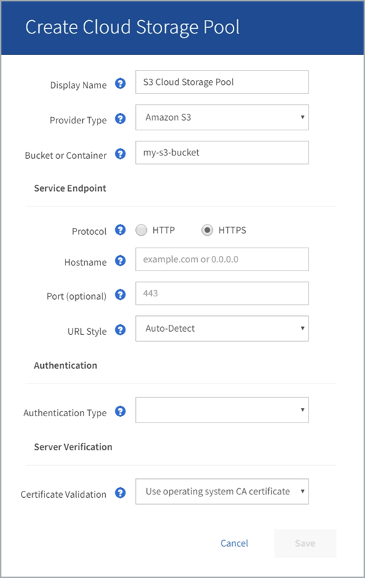

= S3: Specifica dei dettagli di autenticazione per un Cloud Storage Pool
:allow-uri-read: 
:icons: font
:imagesdir: ../media/

[role="lead"]
Quando si crea un Cloud Storage Pool per S3, è necessario selezionare il tipo di autenticazione richiesto per l'endpoint del Cloud Storage Pool. È possibile specificare Anonymous o immettere un ID della chiave di accesso e una chiave di accesso segreta.

.Di cosa hai bisogno
* Hai inserito le informazioni di base per il Cloud Storage Pool e hai specificato *Amazon S3* come tipo di provider.
+

* Se si utilizza l'autenticazione della chiave di accesso, si conoscono l'ID della chiave di accesso e la chiave di accesso segreta per il bucket S3 esterno.

.Fasi
. Nella sezione *Service Endpoint*, fornire le seguenti informazioni:
+
.. Selezionare il protocollo da utilizzare per la connessione al Cloud Storage Pool.
+
Il protocollo predefinito è HTTPS.

.. Inserire il nome host del server o l'indirizzo IP del Cloud Storage Pool.
+
Ad esempio:

+
`s3-_aws-region_.amazonaws.com`

+

NOTE: Non includere il nome del bucket in questo campo. Il nome del bucket viene incluso nel campo *bucket o container*.

.. Facoltativamente, specificare la porta da utilizzare per la connessione al Cloud Storage Pool.
+
Lasciare vuoto questo campo per utilizzare la porta predefinita: Porta 443 per HTTPS o porta 80 per HTTP.

.. Seleziona lo stile URL per il bucket Cloud Storage Pool:
+
[cols="1a,2a"]
|===
| Opzione | Descrizione 

 a| 
Virtual Hosted-style
 a| 
Utilizza un URL virtuale in stile host per accedere al bucket. Gli URL virtuali in stile host includono, ad esempio, il nome del bucket come parte del nome di dominio `+https://bucket-name.s3.company.com/key-name+`.

 a| 
Stile di percorso
 a| 
Utilizzare un URL stile percorso per accedere al bucket. Ad esempio, gli URL di tipo path includono il nome del bucket alla fine `+https://s3.company.com/bucket-name/key-name+`.

*Nota:* l'URL stile percorso è obsoleto.

 a| 
Rilevamento automatico
 a| 
Tentare di rilevare automaticamente lo stile URL da utilizzare, in base alle informazioni fornite. Ad esempio, se si specifica un indirizzo IP, StorageGRID utilizzerà un URL di tipo path. Selezionare questa opzione solo se non si conosce lo stile specifico da utilizzare.

|===

. Nella sezione *Authentication*, selezionare il tipo di autenticazione richiesto per l'endpoint Cloud Storage Pool.
+
[cols="1a,2a"]
|===
| Opzione | Descrizione 

 a| 
Chiave di accesso
 a| 
Per accedere al bucket Cloud Storage Pool sono necessari un ID della chiave di accesso e una chiave di accesso segreta.

 a| 
Anonimo
 a| 
Tutti hanno accesso al bucket Cloud Storage Pool. Non sono richiesti un ID della chiave di accesso e una chiave di accesso segreta.

 a| 
CAP (portale di accesso C2S)
 a| 
Utilizzato solo per C2S S3. Passare a. xref:c2s-s3-authentication-details-for-cloud-storage-pool.adoc[C2S S3: Specifica dei dettagli di autenticazione per un Cloud Storage Pool].

|===
. Se si seleziona Access Key (chiave di accesso), immettere le seguenti informazioni:
+
[cols="1a,2a"]
|===
| Opzione | Descrizione 

 a| 
ID chiave di accesso
 a| 
L'ID della chiave di accesso per l'account proprietario del bucket esterno.

 a| 
Chiave di accesso segreta
 a| 
La chiave di accesso segreta associata.

|===
. Nella sezione verifica server, selezionare il metodo da utilizzare per convalidare il certificato per le connessioni TLS al Cloud Storage Pool:
+
[cols="1a,2a"]
|===
| Opzione | Descrizione 

 a| 
Utilizzare il certificato CA del sistema operativo
 a| 
Utilizzare i certificati Grid CA predefiniti installati nel sistema operativo per proteggere le connessioni.

 a| 
USA certificato CA personalizzato
 a| 
Utilizzare un certificato CA personalizzato. Selezionare *Select New* (Seleziona nuovo) e caricare il certificato CA con codifica PEM.

 a| 
Non verificare il certificato
 a| 
Il certificato utilizzato per la connessione TLS non viene verificato.

|===
. Selezionare *Salva*.

Quando si salva un pool di storage cloud, StorageGRID esegue le seguenti operazioni:

* Convalida l'esistenza del bucket e dell'endpoint del servizio e la possibilità di raggiungerli utilizzando le credenziali specificate.
* Scrive un file di marker nel bucket per identificare il bucket come un Cloud Storage Pool. Non rimuovere mai questo file, denominato `x-ntap-sgws-cloud-pool-uuid`.

Se la convalida del Cloud Storage Pool non riesce, viene visualizzato un messaggio di errore che spiega perché la convalida non è riuscita. Ad esempio, se si verifica un errore nel certificato o se il bucket specificato non esiste già, potrebbe essere visualizzato un errore.

image::../media/cloud_storage_pool_create_error.gif[Errore di creazione del pool di storage cloud]

Consultare le istruzioni per xref:troubleshooting-cloud-storage-pools.adoc[Risoluzione dei problemi relativi ai pool di storage cloud], Risolvere il problema, quindi provare a salvare nuovamente il Cloud Storage Pool.
