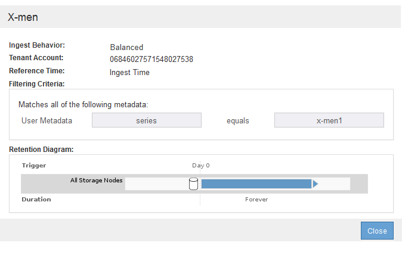

= Simulare un criterio ILM
:allow-uri-read: 
:icons: font
:imagesdir: ../media/

[role="lead"]
È necessario simulare una policy proposta sugli oggetti di test prima di attivare la policy e applicarla ai dati di produzione. La finestra di simulazione offre un ambiente standalone sicuro per le policy di test prima che vengano attivate e applicate ai dati nell'ambiente di produzione.

.Di cosa hai bisogno
* Hai effettuato l'accesso a Grid Manager utilizzando un xref:../admin/web-browser-requirements.adoc[browser web supportato].
* Si dispone di autorizzazioni di accesso specifiche.
* Si conosce il bucket S3/object-key o il container Swift/object-name per ogni oggetto che si desidera sottoporre a test e si sono già acquisiti tali oggetti.

.A proposito di questa attività
È necessario selezionare attentamente gli oggetti per i quali si desidera sottoporre a test il criterio proposto. Per simulare un criterio in maniera approfondita, è necessario testare almeno un oggetto per ciascun filtro in ogni regola.

Ad esempio, se un criterio include una regola per la corrispondenza degli oggetti nel bucket A e un'altra regola per la corrispondenza degli oggetti nel bucket B, è necessario selezionare almeno un oggetto dal bucket A e un oggetto dal bucket B per eseguire un test completo del criterio. Per verificare la regola predefinita, è inoltre necessario selezionare almeno un oggetto da un altro bucket.

Quando si simula un criterio, si applicano le seguenti considerazioni:

* Dopo aver apportato modifiche a un criterio, salvare il criterio proposto. Quindi, simulare il comportamento della policy proposta salvata.
* Quando si simula un criterio, le regole ILM del criterio filtrano gli oggetti di test, in modo da poter vedere quale regola è stata applicata a ciascun oggetto. Tuttavia, non vengono create copie di oggetti e non vengono posizionati oggetti. L'esecuzione di una simulazione non modifica in alcun modo i dati, le regole o i criteri.
* La pagina Simulation conserva gli oggetti testati fino alla chiusura, all'allontanamento o all'aggiornamento della pagina ILM Policies.
* Simulation restituisce il nome della regola corrispondente. Per determinare quale pool di storage o profilo di codifica Erasure è in vigore, è possibile visualizzare il diagramma di conservazione selezionando il nome della regola o l'icona ulteriori dettagli image:../media/icon_nms_more_details.gif["ulteriori dettagli"].
* Se è attivata la versione S3, il criterio viene simulato solo rispetto alla versione corrente dell'oggetto.

.Fasi
. Selezionare e organizzare le regole e salvare la policy proposta.
+
La policy in questo esempio ha tre regole:

+
[cols="1a,1a,1a,1a"]
|===
| Nome regola | Filtro | Tipo di copie | Conservazione 

 a| 
X-men
 a| 
** Tenant A.
** Metadati dell'utente (serie=x-men)

 a| 
2 copie in due data center
 a| 
2 anni

 a| 
PNG
 a| 
La chiave termina con .png
 a| 
2 copie in due data center
 a| 
5 anni

 a| 
Due copie di due data center
 a| 
_Nessuno_
 a| 
2 copie in due data center
 a| 
Per sempre

|===
+
image::../media/ilm_policies_viewing_proposed.png[Proposta di visualizzazione delle policy ILM]

. Utilizzando un client S3 o Swift o il xref:../tenant/use-s3-console.adoc[Console S3 sperimentale], Disponibile in Tenant Manager per ogni tenant, acquisire gli oggetti necessari per testare ogni regola.
. Selezionare *simulate*.
+
Viene visualizzata la finestra di dialogo Simulation ILM Policy (Criteri ILM di Simulation).

. Nel campo *oggetto*, immettere il bucket S3/object-key o il container Swift/object-name per un oggetto di test e selezionare *simulate*.
+
[NOTE]
====
Se si specifica un oggetto non acquisito, viene visualizzato un messaggio.

image::../media/object_not_available_for_simulation.gif[Se si specifica l'oggetto mancante]

====
. In *risultati di simulazione*, confermare che ogni oggetto è stato associato dalla regola corretta.
+
Nell'esempio, il `Havok.png` e. `Warpath.jpg` Gli oggetti sono stati associati correttamente dalla regola X-MEN. Il `Fullsteam.png` oggetto, che non include `series=x-men` Metadati dell'utente, non corrispondenti alla regola X-MEN ma corrispondenti correttamente alla regola PNG. La regola predefinita non è stata utilizzata perché tutti e tre gli oggetti erano associati da altre regole.

+
image::../media/ilm_policy_simulation_results.gif[Risultati della simulazione]

== Esempio 1: Verificare le regole quando si simula un criterio ILM proposto

Questo esempio mostra come verificare le regole quando si simula un criterio proposto.

In questo esempio, la *policy ILM di esempio* viene simulata rispetto agli oggetti acquisiti in due bucket. La policy include tre regole, come segue:

* La prima regola, *due copie, due anni per bucket-a*, si applica solo agli oggetti nel bucket-a.
* La seconda regola, *EC objects > 1 MB*, si applica a tutti i bucket, ma ai filtri sugli oggetti superiori a 1 MB.
* La terza regola, *due copie, due data center*, è la regola predefinita. Non include filtri e non utilizza il tempo di riferimento non corrente.

image::../media/saved_policy_for_simulation.png[Policy salvata per Simulation]

.Fasi
. Dopo aver aggiunto le regole e salvato il criterio, selezionare *simulate*.
+
Viene visualizzata la finestra di dialogo Simula policy ILM.

. Nel campo *oggetto*, immettere il bucket S3/object-key o il container Swift/object-name per un oggetto di test e selezionare *simulate*.
+
Vengono visualizzati i risultati di Simulation, che mostrano quale regola del criterio corrisponde a ciascun oggetto testato.

+
image::../media/simulate_policy_screen.png[Schermata Simula policy]

. Verificare che ogni oggetto sia stato associato alla regola corretta.
+
In questo esempio:

+
.. `bucket-a/bucket-a object.pdf` corrisponde correttamente alla prima regola, che filtra sugli oggetti in `bucket-a`.
.. `bucket-b/test object greater than 1 MB.pdf` è in `bucket-b`, quindi non corrisponde alla prima regola. Al contrario, è stata associata correttamente dalla seconda regola, che filtra su oggetti superiori a 1 MB.
.. `bucket-b/test object less than 1 MB.pdf` i filtri non corrispondono alle prime due regole, quindi verranno posizionati in base alla regola predefinita, che non include filtri.

== Esempio 2: Riordinare le regole quando si simula una policy ILM proposta

Questo esempio mostra come è possibile riordinare le regole per modificare i risultati durante la simulazione di un criterio.

In questo esempio, viene simulata la policy *Demo*. Questo criterio, che ha lo scopo di trovare oggetti con metadati utente series=x-men, include tre regole, come segue:

* La prima regola, *PNG*, filtra i nomi delle chiavi che terminano `.png`.
* La seconda regola, *X-MEN*, si applica solo agli oggetti per il tenant A e ai filtri per `series=x-men` metadati dell'utente.
* L'ultima regola, *due copie due data center*, è la regola predefinita, che corrisponde a tutti gli oggetti che non corrispondono alle prime due regole.

image::../media/simulate_reorder_rules_pngs_rule.png[Esempio 2: Riordinamento delle regole durante la simulazione di una policy ILM proposta]

.Fasi
. Dopo aver aggiunto le regole e salvato il criterio, selezionare *simulate*.
. Nel campo *oggetto*, immettere il bucket S3/object-key o il container Swift/object-name per un oggetto di test e selezionare *simulate*.
+
Vengono visualizzati i risultati di Simulation, che indicano che il `Havok.png` L'oggetto è stato associato dalla regola *PNG*.

+
image::../media/simulate_reorder_rules_pngs_result.gif[Esempio 2: Riordinamento delle regole durante la simulazione di una policy ILM proposta]

+
Tuttavia, la regola che il `Havok.png` L'oggetto doveva essere testato come la regola *X-MEN*.

. Per risolvere il problema, riordinare le regole.
+
.. Selezionare *fine* per chiudere la pagina Simula policy ILM.
.. Selezionare *Edit* (Modifica) per modificare la policy.
.. Trascinare la regola *X-MEN* all'inizio dell'elenco.
+
image::../media/simulate_reorder_rules_correct_rule.png[Simulare - Riordinare le regole - regola corretta]

.. Selezionare *Salva*.

. Selezionare *simulate*.
+
Gli oggetti precedentemente testati vengono rivalutati in base alla policy aggiornata e vengono visualizzati i risultati della nuova simulazione. Nell'esempio, la colonna Rule Matched mostra che il `Havok.png` L'oggetto ora corrisponde alla regola dei metadati X-MEN, come previsto. La colonna Previous Match (confronto precedente) mostra che la regola PNG ha trovato corrispondenza con l'oggetto nella simulazione precedente.

+
image::../media/simulate_reorder_rules_correct_result.gif[Esempio 2: Riordinamento delle regole durante la simulazione di una policy ILM proposta]

+

NOTE: Se si rimane nella pagina Configura criteri, è possibile simulare nuovamente un criterio dopo aver apportato modifiche senza dover immettere nuovamente i nomi degli oggetti di test.

== Esempio 3: Correggere una regola durante la simulazione di una policy ILM proposta

Questo esempio mostra come simulare una policy, correggere una regola nella policy e continuare la simulazione.

In questo esempio, viene simulata la policy *Demo*. Questo criterio è destinato a trovare gli oggetti che hanno `series=x-men` metadati dell'utente. Tuttavia, si sono verificati risultati imprevisti durante la simulazione di questa policy rispetto a. `Beast.jpg` oggetto. Invece di corrispondere alla regola dei metadati X-MEN, l'oggetto corrisponde alla regola predefinita, due copie di due data center.

image::../media/simulate_results_for_object_wrong_metadata.png[Esempio 3: Correzione di una regola durante la simulazione di una policy ILM proposta]

Quando un oggetto di test non corrisponde alla regola prevista nel criterio, è necessario esaminare ciascuna regola del criterio e correggere eventuali errori.

.Fasi
. Per ogni regola del criterio, visualizzare le impostazioni selezionando il nome della regola o l'icona ulteriori dettagli image:../media/icon_nms_more_details.gif["ulteriori dettagli"] in qualsiasi finestra di dialogo in cui viene visualizzata la regola.
. Esaminare l'account tenant della regola, il tempo di riferimento e i criteri di filtraggio.
+
In questo esempio, i metadati per la regola X-MEN includono un errore. Il valore dei metadati è stato immesso come "`x-men1`" invece di "`x-men`".

+

. Per risolvere l'errore, correggere la regola come segue:
+
** Se la regola fa parte del criterio proposto, è possibile clonarla o rimuoverla dal criterio e modificarla.
** Se la regola fa parte del criterio attivo, è necessario clonarla. Non è possibile modificare o rimuovere una regola dal criterio attivo.
+
[cols="1a,3a"]
|===
| Opzione | Descrizione 

 a| 
Clonare la regola
 a| 
... Selezionare *ILM* > *regole*.
... Selezionare la regola errata e selezionare *Clone*.
... Modificare le informazioni non corrette e selezionare *Salva*.
... Selezionare *ILM* > *Policy*.
... Selezionare la policy proposta e selezionare *Modifica*.
... Selezionare *Select Rules* (Seleziona regole).
... Selezionare la casella di controllo per la nuova regola, deselezionare la casella di controllo per la regola originale e selezionare *Applica*.
... Selezionare *Salva*.

 a| 
Modificare la regola
 a| 
... Selezionare la policy proposta e selezionare *Modifica*.
... Selezionare l'icona di eliminazione image:../media/icon_nms_delete_new.gif["icona elimina"] Per rimuovere la regola errata, quindi selezionare *Salva*.
... Selezionare *ILM* > *regole*.
... Selezionare la regola errata e selezionare *Modifica*.
... Modificare le informazioni non corrette e selezionare *Salva*.
... Selezionare *ILM* > *Policy*.
... Selezionare la policy proposta e selezionare *Modifica*.
... Selezionare la regola corretta, selezionare *Applica* e selezionare *Salva*.

|===

. Eseguire nuovamente la simulazione.
+

NOTE: Poiché si è allontanati dalla pagina ILM Policies per modificare la regola, gli oggetti precedentemente immessi per la simulazione non vengono più visualizzati. È necessario immettere nuovamente i nomi degli oggetti.

+
In questo esempio, la regola corretta X-men corrisponde ora a. `Beast.jpg` oggetto basato su `series=x-men` metadati dell'utente, come previsto.

+
image::../media/simulate_results_for_object_corrected_metadata.gif[Esempio 3: Correzione di una regola durante la simulazione di una policy ILM proposta]

