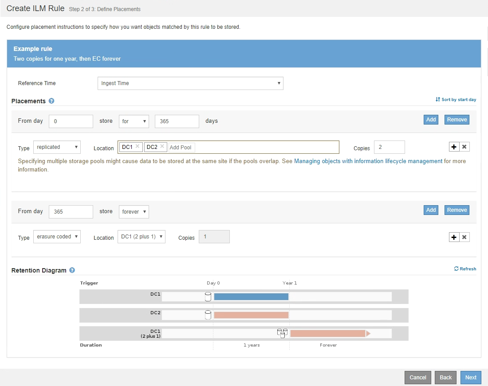
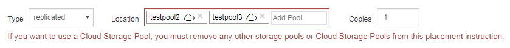

= Fase 2 di 3: Definizione delle posizioni
:allow-uri-read: 
:icons: font
:imagesdir: ../media/

[role="lead"]
Il passaggio 2 (definizione delle posizioni) della procedura guidata Crea regola ILM consente di definire le istruzioni di posizionamento che determinano la durata della memorizzazione degli oggetti, il tipo di copie (replicate o codificate per la cancellazione), la posizione di archiviazione e il numero di copie.

.A proposito di questa attività
Una regola ILM può includere una o più istruzioni di posizionamento. Ogni istruzione di posizionamento si applica a un singolo periodo di tempo. Quando si utilizzano più istruzioni, i periodi di tempo devono essere contigui e almeno un'istruzione deve iniziare il giorno 0. Le istruzioni possono continuare per sempre o fino a quando non sono più necessarie copie di oggetti.

Ogni istruzione di posizionamento può avere più righe se si desidera creare diversi tipi di copie o utilizzare posizioni diverse durante tale periodo di tempo.

Questa regola ILM di esempio crea due copie replicate per il primo anno. Ogni copia viene salvata in un pool di storage in un sito diverso. Dopo un anno, viene creata una copia 2+1 con codice di cancellazione e salvata in un solo sito.

.Fasi
. Per *Reference Time* (tempo di riferimento), selezionare il tipo di tempo da utilizzare per il calcolo dell'ora di inizio di un'istruzione di posizionamento.
+
[cols="1a,2a"]
|===
| Opzione | Descrizione 

 a| 
Tempo di acquisizione
 a| 
L'ora in cui l'oggetto è stato acquisito.

 a| 
Ora ultimo accesso
 a| 
L'ora in cui l'oggetto è stato recuperato per l'ultima volta (letto o visualizzato).

*Nota:* per utilizzare questa opzione, è necessario attivare gli aggiornamenti dell'ultimo tempo di accesso per il bucket S3 o il container Swift. Vedere xref:using-last-access-time-in-ilm-rules.adoc[USA l'ultimo tempo di accesso nelle regole ILM].

 a| 
Ora non corrente
 a| 
Il tempo in cui una versione dell'oggetto è diventata non aggiornata a causa dell'acquisizione di una nuova versione e della sua sostituzione come versione corrente.

*Nota:* l'ora non corrente si applica solo agli oggetti S3 nei bucket abilitati per il controllo delle versioni.

È possibile utilizzare questa opzione per ridurre l'impatto dello storage degli oggetti con versione filtrando le versioni degli oggetti non correnti. Vedere xref:example-4-ilm-rules-and-policy-for-s3-versioned-objects.adoc[Esempio 4: Regole ILM e policy per gli oggetti con versione S3].

 a| 
Tempo di creazione definito dall'utente
 a| 
Tempo specificato nei metadati definiti dall'utente.

|===
+

NOTE: Se si desidera creare una regola conforme, selezionare *Ingest Time*.

. Nella sezione *posizionamenti*, selezionare un'ora di inizio e una durata per il primo periodo di tempo.
+
Ad esempio, è possibile specificare dove memorizzare gli oggetti per il primo anno ("Ay 0 for 365 days `d`"). Almeno un'istruzione deve iniziare al giorno 0.

. Se si desidera creare copie replicate:
+
.. Dall'elenco a discesa *tipo*, selezionare *replicato*.
.. Nel campo *Location*, selezionare *Add Pool* per ciascun pool di storage che si desidera aggiungere.
+
*Se si specifica un solo pool di storage*, tenere presente che StorageGRID può memorizzare solo una copia replicata di un oggetto su un nodo di storage specifico. Se la griglia include tre nodi di storage e si seleziona 4 come numero di copie, verranno eseguite solo tre copie: Una copia per ciascun nodo di storage.

+

NOTE: Viene attivato l'avviso *ILM placement unachievable* per indicare che la regola ILM non può essere applicata completamente.

+
*Se si specificano più pool di storage*, tenere presenti le seguenti regole:

+
*** Il numero di copie non può essere superiore al numero di pool di storage.
*** Se il numero di copie corrisponde al numero di pool di storage, viene memorizzata una copia dell'oggetto in ciascun pool di storage.
*** Se il numero di copie è inferiore al numero di pool di storage, una copia viene memorizzata nel sito di acquisizione e il sistema distribuisce le copie rimanenti per mantenere bilanciato l'utilizzo del disco tra i pool, garantendo che nessun sito riceva più di una copia di un oggetto.
*** Se i pool di storage si sovrappongono (contengono gli stessi nodi di storage), tutte le copie dell'oggetto potrebbero essere salvate in un solo sito. Per questo motivo, non specificare il pool di storage predefinito di tutti i nodi di storage e di un altro pool di storage.
+
image::../media/ilm_rule_with_multiple_storage_pools.png[Istruzioni per il posizionamento di più pool di storage]

.. Selezionare il numero di copie che si desidera eseguire.
+
Se si modifica il numero di copie in 1, viene visualizzato un avviso. Una regola ILM che crea una sola copia replicata per qualsiasi periodo di tempo mette i dati a rischio di perdita permanente. Vedere xref:why-you-should-not-use-single-copy-replication.adoc[Perché non utilizzare la replica a copia singola].

+
image::../media/ilm_create_ilm_rule_warning_for_1_copy.png[Crea pagina regola ILM 2 Avviso per 1 copia]

+
Per evitare questi rischi, effettuare una o più delle seguenti operazioni:

+
*** Aumentare il numero di copie per il periodo di tempo.
*** Selezionare l'icona del segno più image:../media/icon_plus_sign_black_on_white.gif["segno più nero su bianco"] per creare copie aggiuntive durante il periodo di tempo. Quindi, selezionare un pool di storage diverso o un pool di storage cloud.
*** Selezionare *erasure coded* per tipo, invece di *Replicated*. È possibile ignorare questo avviso se questa regola crea già più copie per tutti i periodi di tempo.

.. Se è stato specificato un solo pool di storage, ignorare il campo *posizione temporanea*.
+

NOTE: Le posizioni temporanee sono obsolete e verranno rimosse in una release futura. Vedere xref:using-storage-pool-as-temporary-location-deprecated.adoc[Utilizzo di un pool di storage come posizione temporanea (obsoleto)].

. Se si desidera creare una copia con codice di cancellazione:
+
.. Dall'elenco a discesa *tipo*, selezionare *erasure coded*.
+
Il numero di copie viene modificato in 1. Viene visualizzato un avviso se la regola non dispone di un filtro avanzato per ignorare oggetti di dimensioni pari o inferiori a 200 KB.

+
image::../media/ilm_rule_warning_for_ec_size.png[Avviso regola ILM per dimensione EC]

+

IMPORTANT: L'erasure coding è più adatto per oggetti superiori a 1 MB. Non utilizzare la codifica erasure per oggetti di dimensioni inferiori a 200 KB per evitare l'overhead di gestione di frammenti con codifica erasure molto piccoli.

.. Se viene visualizzato l'avviso relativo alle dimensioni dell'oggetto, selezionare *Indietro* per tornare al passaggio 1. Quindi, selezionare *Advanced Filtering* e impostare il filtro Object Size (MB) su un valore superiore a 0.2.
.. Selezionare la posizione di storage.
+
La posizione di storage per una copia con codice di cancellazione include il nome del pool di storage, seguito dal nome del profilo di codifica Erasure.

+
image::../media/storage_pool_and_erasure_coding_profile.png[Pool di storage e nome del profilo EC]

. Facoltativamente, aggiungere periodi di tempo diversi o creare copie aggiuntive in posizioni diverse:
+
** Selezionare l'icona più per creare copie aggiuntive in una posizione diversa durante lo stesso periodo di tempo.
** Selezionare *Aggiungi* per aggiungere un periodo di tempo diverso alle istruzioni di posizionamento.
+

NOTE: Gli oggetti vengono eliminati automaticamente alla fine del periodo di tempo finale, a meno che il periodo di tempo finale non termini con *forever*.

. Se si desidera memorizzare oggetti in un pool di storage cloud:
+
.. Dall'elenco a discesa *tipo*, selezionare *replicato*.
.. Nel campo *Location*, selezionare *Add Pool* (Aggiungi pool). Quindi, selezionare un pool di storage cloud.
+
image::../media/ilm_cloud_storage_pool.gif[Aggiunta di un pool di storage cloud a un'istruzione di posizionamento]

+
Quando si utilizzano i Cloud Storage Pool, tenere presenti le seguenti regole:

+
*** Non è possibile selezionare più di un Cloud Storage Pool in una singola istruzione di posizionamento. Allo stesso modo, non è possibile selezionare un Cloud Storage Pool e un pool di storage nelle stesse istruzioni di posizionamento.
+

*** È possibile memorizzare solo una copia di un oggetto in un determinato pool di storage cloud. Se si imposta *copie* su 2 o più, viene visualizzato un messaggio di errore.
+
image::../media/ilm_cloud_storage_pool_error_one_copy.gif[Regola ILM: Errore del pool di storage cloud se sono presenti più copie]

*** Non è possibile memorizzare più copie di un oggetto contemporaneamente in un pool di storage cloud. Viene visualizzato un messaggio di errore se più posizioni che utilizzano un pool di storage cloud presentano date sovrapposte o se più righe nello stesso posizionamento utilizzano un pool di storage cloud.
+
image::../media/ilm_rule_cloud_storage_pool_error_overlapping_dates.png[Errore ILM Rule Cloud Storage Pool Date sovrapposte]

*** È possibile memorizzare un oggetto in un pool di storage cloud nello stesso momento in cui l'oggetto viene memorizzato come copie replicate o erasure coded in StorageGRID. Tuttavia, come mostra questo esempio, è necessario includere più di una riga nelle istruzioni di posizionamento per il periodo di tempo, in modo da poter specificare il numero e i tipi di copie per ciascuna posizione.
+
image::../media/ilm_cloud_storage_pool_multiple_locations.png[Regola ILM > Pool di storage cloud e altra posizione]

. Selezionare *Aggiorna* per aggiornare il diagramma di conservazione e confermare le istruzioni per il posizionamento.
+
Ogni riga del diagramma indica dove e quando verranno collocate le copie degli oggetti. Il tipo di copia è rappresentato da una delle seguenti icone:

+
[cols="1a,2a"]
|===

 a| 
image:../media/icon_nms_replicated.gif["Per le copie replicate"]
 a| 
Copia replicata

 a| 
image:../media/icon_nms_erasure_coded.gif["Icona per la copia codificata in cancellazione"]
 a| 
Copia con codifica erasure

 a| 
image:../media/icon_cloud_storage_pool.gif["Icona Cloud Storage Pool"]
 a| 
Copia del pool di cloud storage

|===
+
In questo esempio, due copie replicate verranno salvate in due pool di storage (DC1 e DC2) per un anno. Quindi, una copia con codice di cancellazione verrà salvata per altri 10 anni, utilizzando uno schema di erasure coding 6+3 presso tre siti. Dopo 11 anni, gli oggetti verranno cancellati da StorageGRID.

+
image::../media/ilm_rule_retention_diagram.png[Diagramma di conservazione delle regole ILM]

. Selezionare *Avanti*.
+
Viene visualizzato il punto 3 (definire il comportamento di Ingest).

.Informazioni correlate
* xref:what-ilm-rule-is.adoc[Che cos'è una regola ILM]
* xref:managing-objects-with-s3-object-lock.adoc[Gestire gli oggetti con S3 Object Lock]
* xref:step-3-of-3-define-ingest-behavior.adoc[Fase 3 di 3: Definizione del comportamento di acquisizione]

