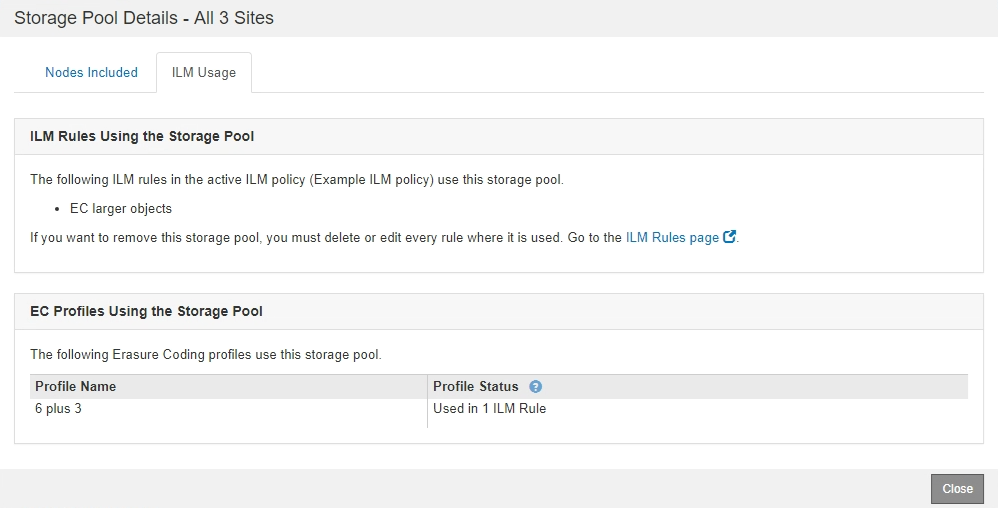

= Visualizzare i dettagli del pool di storage
:allow-uri-read: 
:icons: font
:imagesdir: ../media/

[role="lead"]
È possibile visualizzare i dettagli di un pool di storage per determinare dove viene utilizzato il pool di storage e per vedere quali nodi e gradi di storage sono inclusi.

.Di cosa hai bisogno
* Hai effettuato l'accesso a Grid Manager utilizzando un xref:../admin/web-browser-requirements.adoc[browser web supportato].
* Si dispone di autorizzazioni di accesso specifiche.

.Fasi
. Selezionare *ILM* > *Storage Pools*.
+
Viene visualizzata la pagina Storage Pools. In questa pagina sono elencati tutti i pool di storage definiti.

+
image::../media/storage_pools_page_with_pools.png[Pagina dei pool di storage con Pools.png]

+
La tabella include le seguenti informazioni per ogni pool di storage che include i nodi di storage:

+
** *Name*: Il nome univoco del pool di storage.
** *Spazio utilizzato*: La quantità di spazio attualmente utilizzata per memorizzare gli oggetti nel pool di storage.
** *Spazio libero*: La quantità di spazio disponibile per memorizzare gli oggetti nel pool di storage.
** *Capacità totale*: La dimensione del pool di storage, che equivale alla quantità totale di spazio utilizzabile per i dati oggetto per tutti i nodi nel pool di storage .
** *ILM Usage*: Modalità di utilizzo del pool di storage. Un pool di storage potrebbe essere inutilizzato o utilizzato in una o più regole ILM, profili di codifica Erasure o entrambi.
+

NOTE: Non è possibile rimuovere un pool di storage se è in uso.

. Per visualizzare i dettagli relativi a uno specifico pool di storage, selezionare il relativo pulsante di opzione e selezionare *Visualizza dettagli*.
+
Viene visualizzato il modale Storage Pool Details (Dettagli pool di storage

. Visualizzare la scheda *nodi inclusi* per informazioni sui nodi di storage o di archivio inclusi nel pool di storage.
+
image::../media/storage_pools_details_nodes.png[Pool di storage Dettagli dei nodi]

+
La tabella include le seguenti informazioni per ciascun nodo:

+
** Nome del nodo
** Nome del sito
** Utilizzato (%): Per i nodi di storage, la percentuale dello spazio utilizzabile totale per i dati dell'oggetto che è stato utilizzato. Questo valore non include i metadati degli oggetti.
+

NOTE: Lo stesso valore utilizzato (%) viene mostrato anche nel grafico Storage Used - Object Data per ciascun nodo di storage (selezionare *NODES* > *_Storage Node_* > *Storage*).

. Selezionare la scheda *utilizzo ILM* per determinare se il pool di storage è attualmente utilizzato in qualsiasi regola ILM o profilo di codifica Erasure.
+
In questo esempio, il pool di storage DC1 viene utilizzato in tre regole ILM: Due regole che si trovano nel criterio ILM attivo e una regola che non si trova nel criterio attivo.

+
image::../media/storage_pools_details_ilm.png[Pool di storage Dettagli ILM]

+

NOTE: Non è possibile rimuovere un pool di storage se utilizzato in una regola ILM.

+
In questo esempio, il pool di storage di tutti e 3 i siti viene utilizzato in un profilo di codifica Erasure. A sua volta, il profilo di codifica Erasure viene utilizzato da una regola ILM nel criterio ILM attivo.

+

+

NOTE: Non è possibile rimuovere un pool di storage se utilizzato in un profilo di codifica Erasure.

. Se si desidera, accedere alla pagina *ILM Rules* per informazioni e gestione delle regole che utilizzano il pool di storage.
+
Consultare le istruzioni per l'utilizzo delle regole ILM.

. Una volta visualizzati i dettagli del pool di storage, selezionare *Chiudi*.

.Informazioni correlate
xref:working-with-ilm-rules-and-ilm-policies.adoc[Utilizzare le regole ILM e i criteri ILM]
