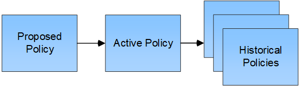

= Che cos'è una policy ILM
:allow-uri-read: 
:icons: font
:imagesdir: ../media/

[role="lead"]
Un criterio ILM (Information Lifecycle Management) è un insieme ordinato di regole ILM che determina il modo in cui il sistema StorageGRID gestisce i dati degli oggetti nel tempo.

== In che modo un criterio ILM valuta gli oggetti?

Il criterio ILM attivo per il sistema StorageGRID controlla il posizionamento, la durata e la protezione dei dati di tutti gli oggetti.

Quando i client salvano gli oggetti in StorageGRID, gli oggetti vengono valutati in base all'insieme ordinato di regole ILM nel criterio attivo, come segue:

. Se i filtri per la prima regola del criterio corrispondono a un oggetto, l'oggetto viene acquisito in base al comportamento di acquisizione di tale regola e memorizzato in base alle istruzioni di posizionamento di tale regola.
. Se i filtri per la prima regola non corrispondono all'oggetto, l'oggetto viene valutato in base a ogni regola successiva nel criterio fino a quando non viene effettuata una corrispondenza.
. Se nessuna regola corrisponde a un oggetto, vengono applicate le istruzioni di inserimento e posizionamento della regola predefinita nel criterio. La regola predefinita è l'ultima regola di un criterio. La regola predefinita deve essere applicata a tutti i tenant, a tutti i bucket e a tutte le versioni degli oggetti e non può utilizzare filtri avanzati.

== Esempio di policy ILM

Questo esempio di policy ILM utilizza tre regole ILM.

image::../media/policy_for_two_tenants.png[Esempio di policy per due tenant]

In questo esempio, la regola 1 corrisponde a tutti gli oggetti appartenenti al tenant A. Questi oggetti vengono memorizzati come tre copie replicate in tre siti. Gli oggetti appartenenti ad altri tenant non corrispondono alla regola 1, quindi vengono valutati in base alla regola 2.

La regola 2 corrisponde a tutti gli oggetti degli altri tenant, ma solo se sono superiori a 1 MB. Questi oggetti più grandi vengono memorizzati utilizzando la codifica di cancellazione 6+3 in tre siti. La regola 2 non corrisponde a oggetti di dimensioni pari o inferiori a 1 MB, pertanto questi oggetti vengono valutati in base alla regola 3.

La regola 3 è l'ultima regola predefinita del criterio e non utilizza filtri. La regola 3 crea due copie replicate di tutti gli oggetti non corrispondenti alla regola 1 o alla regola 2 (oggetti non appartenenti al tenant A di dimensioni pari o inferiori a 1 MB).

image::../media/ilm_policy_and_rules.png[Policy e regole ILM]

== Quali sono le policy proposte, attive e storiche?

Ogni sistema StorageGRID deve disporre di un criterio ILM attivo. Un sistema StorageGRID potrebbe anche disporre di una policy ILM proposta e di un numero qualsiasi di policy storiche.

Quando si crea per la prima volta un criterio ILM, si crea un criterio proposto selezionando una o più regole ILM e ordinandole in un ordine specifico. Una volta simulata la policy proposta per confermarne il comportamento, attivarla per creare la policy attiva.

Quando si attiva un nuovo criterio ILM, StorageGRID utilizza tale criterio per gestire tutti gli oggetti, inclusi quelli esistenti e quelli appena acquisiti. Gli oggetti esistenti potrebbero essere spostati in nuove posizioni quando vengono implementate le regole ILM nel nuovo criterio.

L'attivazione della policy proposta fa sì che la policy precedentemente attiva diventi una policy storica. Impossibile eliminare i criteri ILM storici.

.Informazioni correlate
xref:creating-ilm-policy.adoc[Creare un criterio ILM]
