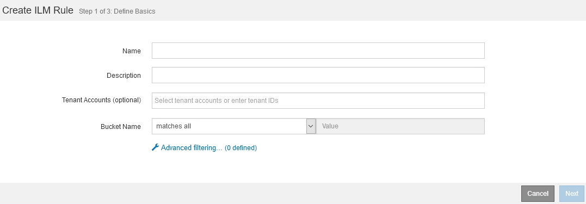

= Che cos'è una regola ILM
:allow-uri-read: 
:icons: font
:imagesdir: ../media/

[role="lead"]
Per gestire gli oggetti, creare un set di regole ILM (Information Lifecycle Management) e organizzarle in un criterio ILM. Ogni oggetto acquisito nel sistema viene valutato in base al criterio attivo. Quando una regola del criterio corrisponde ai metadati di un oggetto, le istruzioni della regola determinano le azioni eseguite da StorageGRID per copiare e memorizzare tale oggetto.

Le regole ILM definiscono:

* Quali oggetti devono essere memorizzati. Una regola può essere applicata a tutti gli oggetti oppure è possibile specificare filtri per identificare gli oggetti a cui si applica una regola. Ad esempio, una regola può essere applicata solo agli oggetti associati a determinati account tenant, a specifici bucket S3 o a contenitori Swift o a specifici valori di metadati.
* Il tipo e la posizione di storage. Gli oggetti possono essere memorizzati nei nodi di storage, nei pool di storage cloud o nei nodi di archiviazione.
* Il tipo di copie a oggetti eseguite. Le copie possono essere replicate o codificate per la cancellazione.
* Per le copie replicate, il numero di copie eseguite.
* Per le copie codificate erasure, viene utilizzato lo schema di erasure coding.
* Il cambia nel tempo nella posizione di storage di un oggetto e nel tipo di copie.
* Modalità di protezione dei dati degli oggetti durante l'acquisizione degli oggetti nella griglia (posizionamento sincrono o doppio commit).

Si noti che i metadati degli oggetti non sono gestiti dalle regole ILM. I metadati degli oggetti vengono invece memorizzati in un database Cassandra in un archivio di metadati. Tre copie dei metadati degli oggetti vengono gestite automaticamente in ogni sito per proteggere i dati dalla perdita. Le copie sono distribuite uniformemente in tutti i nodi di storage.

== Elementi di una regola ILM

Una regola ILM ha tre elementi:

* *Filtering Criteria*: I filtri di base e avanzati di una regola definiscono a quali oggetti si applica la regola. Se un oggetto corrisponde a tutti i filtri, StorageGRID applica la regola e crea le copie dell'oggetto specificate nelle istruzioni di posizionamento della regola.
* *Istruzioni di posizionamento*: Le istruzioni di posizionamento di una regola definiscono il numero, il tipo e la posizione delle copie degli oggetti. Ciascuna regola può includere una sequenza di istruzioni di posizionamento per modificare il numero, il tipo e la posizione delle copie degli oggetti nel tempo. Quando scade il periodo di tempo per un posizionamento, le istruzioni nel posizionamento successivo vengono applicate automaticamente dalla valutazione ILM successiva.
* *Ingest Behavior*: Il comportamento di acquisizione di una regola definisce ciò che accade quando un client S3 o Swift salva un oggetto nella griglia. Il comportamento di acquisizione controlla se le copie degli oggetti vengono posizionate immediatamente in base alle istruzioni della regola o se vengono eseguite copie temporanee e le istruzioni di posizionamento vengono applicate in un secondo momento.

== Che cos'è il filtraggio delle regole ILM

Quando si crea una regola ILM, si specificano i filtri per identificare gli oggetti a cui si applica la regola.

Nel caso più semplice, una regola potrebbe non utilizzare alcun filtro. Qualsiasi regola che non utilizza filtri si applica a tutti gli oggetti, quindi deve essere l'ultima regola (predefinita) in un criterio ILM. La regola predefinita fornisce istruzioni di archiviazione per gli oggetti che non corrispondono ai filtri di un'altra regola.

I filtri di base consentono di applicare regole diverse a gruppi di oggetti distinti e di grandi dimensioni. I filtri di base nella pagina Define Basics della procedura guidata Create ILM Rule consentono di applicare una regola a specifici account tenant, bucket S3 specifici o container Swift o entrambi.

Questi filtri di base offrono un modo semplice per applicare regole diverse a un numero elevato di oggetti. Ad esempio, potrebbe essere necessario memorizzare i record finanziari della tua azienda per soddisfare i requisiti normativi, mentre potrebbe essere necessario memorizzare i dati del reparto di marketing per facilitare le operazioni quotidiane. Dopo aver creato account tenant separati per ciascun reparto o aver separato i dati dai diversi reparti in bucket S3 separati, è possibile creare facilmente una regola che si applica a tutti i record finanziari e una seconda regola che si applica a tutti i dati di marketing.

La pagina *Advanced Filtering* della procedura guidata Create ILM Rule offre un controllo granulare. È possibile creare filtri per selezionare gli oggetti in base alle seguenti proprietà dell'oggetto:

* Tempo di acquisizione
* Ora dell'ultimo accesso
* Nome completo o parziale dell'oggetto (Key)
* Regione bucket S3 (vincolo di posizione)
* Dimensione dell'oggetto
* Metadati dell'utente
* Tag oggetti S3

È possibile filtrare gli oggetti in base a criteri molto specifici. Ad esempio, gli oggetti memorizzati dal reparto di imaging di un ospedale potrebbero essere utilizzati frequentemente quando hanno meno di 30 giorni e poco tempo dopo, mentre gli oggetti che contengono informazioni sulle visite dei pazienti potrebbero dover essere copiati nel reparto di fatturazione della sede centrale della rete sanitaria. È possibile creare filtri che identifichino ciascun tipo di oggetto in base al nome dell'oggetto, alle dimensioni, ai tag di oggetto S3 o a qualsiasi altro criterio pertinente, quindi creare regole separate per memorizzare ciascun set di oggetti in modo appropriato.

È inoltre possibile combinare filtri di base e avanzati in base alle esigenze in una singola regola. Ad esempio, il reparto marketing potrebbe voler memorizzare file di immagini di grandi dimensioni in modo diverso dai record dei vendor, mentre il reparto risorse umane potrebbe dover memorizzare i record del personale in un'area geografica specifica e le informazioni sulle policy a livello centrale. In questo caso, è possibile creare regole che filtrino in base all'account tenant per separare i record da ciascun reparto, utilizzando filtri avanzati in ciascuna regola per identificare il tipo specifico di oggetti a cui si applica la regola.

== Quali sono le istruzioni per il posizionamento delle regole ILM

Le istruzioni di posizionamento determinano dove, quando e come vengono memorizzati i dati degli oggetti. Una regola ILM può includere una o più istruzioni di posizionamento. Ogni istruzione di posizionamento si applica a un singolo periodo di tempo.

Quando si creano le istruzioni per il posizionamento:

* Si inizia specificando l'ora di riferimento, che determina quando iniziano le istruzioni di posizionamento. Il tempo di riferimento potrebbe essere quando un oggetto viene acquisito, quando si accede a un oggetto, quando un oggetto con versione diventa non corrente o un tempo definito dall'utente.
* Quindi, specificare quando applicare il posizionamento rispetto al tempo di riferimento. Ad esempio, un posizionamento potrebbe iniziare il giorno 0 e continuare per 365 giorni, rispetto a quando l'oggetto è stato acquisito.
* Infine, specificare il tipo di copie (replica o erasure coding) e la posizione in cui sono memorizzate le copie. Ad esempio, è possibile memorizzare due copie replicate in due siti diversi.

Ciascuna regola può definire più posizioni per un singolo periodo di tempo e posizioni diverse per periodi di tempo diversi.

* Per posizionare oggetti in più posizioni durante un singolo periodo di tempo, selezionare l'icona del segno più image:../media/icon_plus_sign_black_on_white.gif["Icona segno più nero su bianco"] per aggiungere più di una riga per quel periodo di tempo.
* Per posizionare oggetti in posizioni diverse in periodi di tempo diversi, selezionare il pulsante *Aggiungi* per aggiungere il periodo di tempo successivo. Quindi, specificare una o più righe entro il periodo di tempo.

L'esempio mostra la pagina Definisci posizioni della procedura guidata Crea regola ILM.

image::../media/ilm_rule_multiple_placements_in_single_time_period.png[Schermata ILM placements (posizionamenti ILM) di Grid Manager]

[cols="1a,3a"]
|===

 a| 
image:../media/icon_number_1.png["icona numero 1"]
 a| 
La prima istruzione di posizionamento ha due righe per il primo anno:

. La prima riga crea due copie di oggetti replicate in due siti del data center.
. La seconda riga crea una copia 6+3 con codifica di cancellazione utilizzando tre siti del data center.

 a| 
image:../media/icon_number_2.png["icona numero 2"]
 a| 
La seconda istruzione di posizionamento crea due copie archiviate dopo un anno e le conserva per sempre.

|===
Quando si definisce il set di istruzioni di posizionamento per una regola, è necessario assicurarsi che almeno un'istruzione di posizionamento inizi al giorno 0, che non vi siano intervalli tra i periodi di tempo definiti, e che l'istruzione finale di posizionamento continui per sempre o fino a quando non si richiede più alcuna copia oggetto.

Alla scadenza di ogni periodo di tempo previsto dalla regola, vengono applicate le istruzioni per il posizionamento dei contenuti per il periodo di tempo successivo. Vengono create nuove copie di oggetti e tutte le copie non necessarie vengono eliminate.

== Esempio di regola ILM

Questo esempio di regola ILM si applica agli oggetti appartenenti al tenant A. Esegue due copie replicate di tali oggetti e memorizza ciascuna copia in un sito diverso. Le due copie vengono conservate "`forever,`", il che significa che StorageGRID non le eliminerà automaticamente. Al contrario, StorageGRID conserverà questi oggetti fino a quando non saranno cancellati da una richiesta di eliminazione del client o dalla scadenza di un ciclo di vita del bucket.

Questa regola utilizza l'opzione bilanciata per il comportamento di acquisizione: L'istruzione di posizionamento a due siti viene applicata non appena il tenant A salva un oggetto in StorageGRID, a meno che non sia possibile eseguire immediatamente entrambe le copie richieste. Ad esempio, se il sito 2 non è raggiungibile quando il tenant A salva un oggetto, StorageGRID eseguirà due copie intermedie sui nodi di storage nel sito 1. Non appena il sito 2 sarà disponibile, StorageGRID effettuerà la copia richiesta presso il sito.

image::../media/ilm_example_rule_2_copies_tenant_a.png[La regola ILM 2 di esempio copia il tenant A.]

.Informazioni correlate
* xref:data-protection-options-for-ingest.adoc[Opzioni di protezione dei dati per l'acquisizione]
* xref:what-storage-pool-is.adoc[Che cos'è un pool di storage]
* xref:what-cloud-storage-pool-is.adoc[Cos'è un pool di storage cloud]

