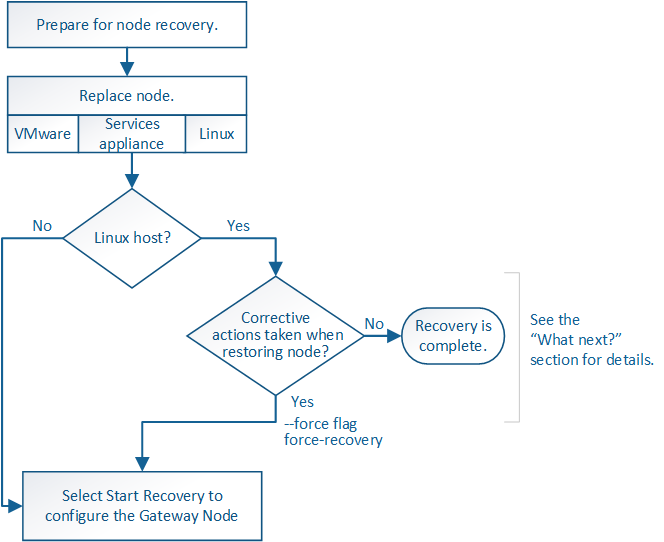

= Ripristino da guasti del nodo gateway
:allow-uri-read: 
:icons: font
:imagesdir: ../media/

[role="lead"]
È necessario completare una sequenza di attività nell'ordine esatto per eseguire il ripristino in caso di guasto di un nodo gateway.

.Informazioni correlate
xref:../sg100-1000/index.adoc[Appliance di servizi SG100 e SG1000]
