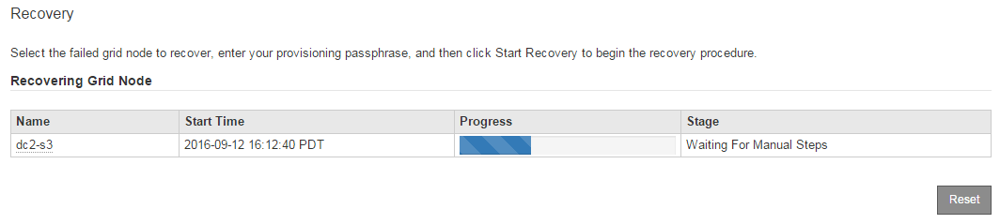

= Selezionare Avvia ripristino per configurare il nodo di storage
:allow-uri-read: 
:icons: font
:imagesdir: ../media/

[role="lead"]
Dopo aver sostituito un nodo di storage, selezionare Avvia ripristino in Grid Manager per configurare il nuovo nodo come sostituzione del nodo guasto.

.Di cosa hai bisogno
* È necessario accedere a Grid Manager utilizzando un xref:../admin/web-browser-requirements.adoc[browser web supportato].
* È necessario disporre dell'autorizzazione Maintenance (manutenzione) o Root Access (accesso root).
* È necessario disporre della passphrase di provisioning.
* È necessario aver implementato e configurato il nodo sostitutivo.
* È necessario conoscere la data di inizio di qualsiasi intervento di riparazione per i dati codificati per la cancellazione.
* È necessario verificare che il nodo di storage non sia stato ricostruito negli ultimi 15 giorni.

.A proposito di questa attività
Se Storage Node è installato come container su un host Linux, eseguire questa operazione solo se si verifica una delle seguenti condizioni:

* È stato necessario utilizzare `--force` contrassegno per importare il nodo o emesso `storagegrid node force-recovery _node-name_`
* Era necessario eseguire una reinstallazione completa del nodo oppure ripristinare /var/local.

.Fasi
. In Grid Manager, selezionare *MANUTENZIONE* *attività* *Recovery*.
. Selezionare il nodo della griglia che si desidera ripristinare nell'elenco Pending Nodes (nodi in sospeso).
+
I nodi vengono visualizzati nell'elenco dopo un errore, ma non è possibile selezionare un nodo fino a quando non è stato reinstallato e pronto per il ripristino.

. Immettere la *Provisioning Passphrase*.
. Fare clic su *Start Recovery* (Avvia ripristino).
+
image::../media/4b_select_recovery_node.png[Schermata che mostra la pagina Maintenance Recovery]

. Monitorare l'avanzamento del ripristino nella tabella Recovery Grid Node (nodo griglia di ripristino).
+

NOTE: Durante l'esecuzione della procedura di ripristino, fare clic su *Reset* (Ripristina) per avviare un nuovo ripristino. Viene visualizzata una finestra di dialogo Info, che indica che il nodo viene lasciato in uno stato indeterminato se si ripristina la procedura.

+
image::../media/recovery_reset_warning.gif[schermata che mostra la finestra di dialogo di avviso di ripristino]

+
Se si desidera riprovare il ripristino dopo aver reimpostato la procedura, è necessario ripristinare il nodo a uno stato preinstallato, come segue:

+
** *VMware*: Eliminare il nodo virtual grid implementato. Quindi, quando si è pronti per riavviare il ripristino, ridistribuire il nodo.
** *Linux*: Riavviare il nodo eseguendo questo comando sull'host Linux: `storagegrid node force-recovery _node-name_`

. Quando il nodo di storage raggiunge la fase "`Waiting for Manual Steps`", passare all'attività successiva della procedura di recovery per il remount e la riformattazione dei volumi di storage.
+

.Informazioni correlate
xref:preparing-appliance-for-reinstallation-platform-replacement-only.adoc[Preparazione dell'appliance per la reinstallazione (solo sostituzione della piattaforma)]
