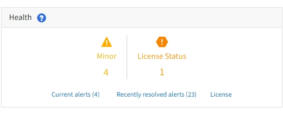

= Monitorare lo stato del sistema
:allow-uri-read: 
:icons: font
:imagesdir: ../media/

[role="lead"]
È necessario monitorare quotidianamente lo stato di salute generale del sistema StorageGRID.

.A proposito di questa attività
Il sistema StorageGRID è a tolleranza di errore e può continuare a funzionare anche quando parti della griglia non sono disponibili. Il primo segno di un potenziale problema con il sistema StorageGRID è probabilmente un avviso o un allarme (sistema legacy) e non necessariamente un problema con le operazioni del sistema. Prestare attenzione allo stato di salute del sistema può aiutare a rilevare problemi minori prima che influiscano sulle operazioni o sull'efficienza della rete.

Il pannello Health (Salute) del pannello Grid Manager (Gestione griglia) fornisce un riepilogo dei problemi che potrebbero interessare il sistema. È necessario esaminare tutti i problemi visualizzati nella dashboard.

NOTE: Per ricevere una notifica degli avvisi non appena vengono attivati, è possibile impostare le notifiche e-mail per gli avvisi o configurare i trap SNMP.

.Fasi
. Accedi a Grid Manager per visualizzare la dashboard.
. Esaminare le informazioni nel pannello Health (Salute).
+

+
In caso di problemi, vengono visualizzati collegamenti che consentono di visualizzare ulteriori dettagli:

+
[cols="1a,2a"]
|===
| Collegamento | Indica 

 a| 
Dettagli della griglia
 a| 
Viene visualizzato se i nodi sono disconnessi (stato connessione sconosciuto o amministrativamente inattivo). Fare clic sul collegamento o sull'icona blu o grigia per determinare quale nodo o nodi sono interessati.

 a| 
Avvisi correnti
 a| 
Viene visualizzato se sono attivi avvisi. Fare clic sul collegamento oppure fare clic su *critico*, *maggiore* o *minore* per visualizzare i dettagli nella pagina *AVVISI* *corrente*.

 a| 
Avvisi risolti di recente
 a| 
Viene visualizzato se gli avvisi attivati nell'ultima settimana sono stati risolti. Fare clic sul collegamento per visualizzare i dettagli nella pagina *ALERTS* *resolved*.

 a| 
Licenza
 a| 
Viene visualizzato se si verifica un problema con la licenza software per questo sistema StorageGRID. Fare clic sul collegamento per visualizzare i dettagli nella pagina *MANUTENZIONE* *sistema* *licenza*.

|===

.Informazioni correlate
* xref:../admin/index.adoc[Amministrare StorageGRID]
* xref:email-alert-notifications.adoc[Imposta le notifiche via email per gli avvisi]
* xref:using-snmp-monitoring.adoc[Utilizzare il monitoraggio SNMP]

