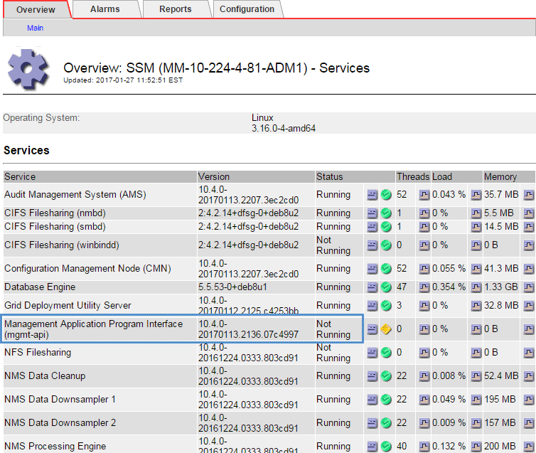

= Risolvere i problemi relativi al nodo di amministrazione e all'interfaccia utente
:allow-uri-read: 
:experimental: 
:icons: font
:imagesdir: ../media/

[role="lead"]
È possibile eseguire diverse attività per determinare l'origine dei problemi relativi ai nodi di amministrazione e all'interfaccia utente di StorageGRID.

== Risoluzione dei problemi relativi agli errori di accesso

Se si verifica un errore durante l'accesso a un nodo amministrativo StorageGRID, il sistema potrebbe avere un problema con la configurazione della federazione delle identità, un problema di rete o hardware, un problema con i servizi del nodo amministrativo o un problema con il database Cassandra sui nodi di storage connessi.

.Di cosa hai bisogno
* È necessario disporre di `Passwords.txt` file.
* È necessario disporre di autorizzazioni di accesso specifiche.

.A proposito di questa attività
Utilizzare queste linee guida per la risoluzione dei problemi se viene visualizzato uno dei seguenti messaggi di errore quando si tenta di accedere a un nodo amministratore:

* `Your credentials for this account were invalid. Please try again.`
* `Waiting for services to start...`
* `Internal server error. The server encountered an error and could not complete your request. Please try again. If the problem persists, contact Technical Support.`
* `Unable to communicate with server. Reloading page...`

.Fasi
. Attendere 10 minuti e riprovare a effettuare l'accesso.
+
Se l'errore non viene risolto automaticamente, passare alla fase successiva.

. Se il sistema StorageGRID dispone di più di un nodo amministratore, provare ad accedere al gestore della griglia da un altro nodo amministratore.
+
** Se sei in grado di effettuare l'accesso, puoi utilizzare le opzioni *Dashboard*, *NODES*, *Alerts* e *SUPPORT* per determinare la causa dell'errore.
** Se si dispone di un solo nodo di amministrazione o non si riesce ancora ad accedere, passare alla fase successiva.

. Determinare se l'hardware del nodo non è in linea.
. Se il sistema StorageGRID è abilitato per l'accesso singolo (SSO), fare riferimento alla procedura per la configurazione dell'accesso singolo nelle istruzioni per l'amministrazione di StorageGRID.
+
Potrebbe essere necessario disattivare temporaneamente e riattivare SSO per un singolo nodo di amministrazione per risolvere eventuali problemi.

+

NOTE: Se SSO è attivato, non è possibile accedere utilizzando una porta con restrizioni. È necessario utilizzare la porta 443.

. Determinare se l'account in uso appartiene a un utente federato.
+
Se l'account utente federated non funziona, provare ad accedere a Grid Manager come utente locale, ad esempio root.

+
** Se l'utente locale può effettuare l'accesso:
+
... Esaminare gli eventuali allarmi visualizzati.
... Selezionare *CONFIGURATION* *Access Control* *Identity Federation*.
... Fare clic su *Test Connection* (verifica connessione) per convalidare le impostazioni di connessione per il server LDAP.
... Se il test non riesce, risolvere eventuali errori di configurazione.

** Se l'utente locale non riesce ad accedere e si è certi che le credenziali siano corrette, passare alla fase successiva.

. Utilizzare Secure Shell (ssh) per accedere al nodo di amministrazione:
+
.. Immettere il seguente comando: `ssh admin@Admin_Node_IP`
.. Immettere la password elencata in `Passwords.txt` file.
.. Immettere il seguente comando per passare a root: `su -`
.. Immettere la password elencata in `Passwords.txt` file.
+
Una volta effettuato l'accesso come root, il prompt cambia da `$` a. `#`.

. Visualizzare lo stato di tutti i servizi in esecuzione sul nodo grid: `storagegrid-status`
+
Assicurarsi che i servizi api nms, mi, nginx e mgmt siano tutti in esecuzione.

+
L'output viene aggiornato immediatamente se lo stato di un servizio cambia.

+
....
$ storagegrid-status
Host Name                      99-211
IP Address                     10.96.99.211
Operating System Kernel        4.19.0         Verified
Operating System Environment   Debian 10.1    Verified
StorageGRID Webscale Release   11.4.0         Verified
Networking                                    Verified
Storage Subsystem                             Verified
Database Engine                5.5.9999+default Running
Network Monitoring             11.4.0         Running
Time Synchronization           1:4.2.8p10+dfsg Running
ams                            11.4.0         Running
cmn                            11.4.0         Running
nms                            11.4.0         Running
ssm                            11.4.0         Running
mi                             11.4.0         Running
dynip                          11.4.0         Running
nginx                          1.10.3         Running
tomcat                         9.0.27         Running
grafana                        6.4.3          Running
mgmt api                       11.4.0         Running
prometheus                     11.4.0         Running
persistence                    11.4.0         Running
ade exporter                   11.4.0         Running
alertmanager                   11.4.0         Running
attrDownPurge                  11.4.0         Running
attrDownSamp1                  11.4.0         Running
attrDownSamp2                  11.4.0         Running
node exporter                  0.17.0+ds      Running
sg snmp agent                  11.4.0         Running
....
. Verificare che il servizio nginx-gw sia in esecuzione `# service nginx-gw status`
. [[use_Lumberjack_to_Collect_logs, start=9]]Usa Lumberjack per raccogliere i log: `# /usr/local/sbin/lumberjack.rb`
+
Se l'autenticazione non è riuscita in passato, è possibile utilizzare le opzioni di script --start e --end Lumberjack per specificare l'intervallo di tempo appropriato. Utilizzare lumberjack -h per i dettagli su queste opzioni.

+
L'output sul terminale indica dove è stato copiato l'archivio di log.

. [[review_logs, start=10]]Rivedi i seguenti log:
+
** `/var/local/log/bycast.log`
** `/var/local/log/bycast-err.log`
** `/var/local/log/nms.log`
** `**/*commands.txt`

. Se non si riesce a identificare alcun problema con il nodo di amministrazione, eseguire uno dei seguenti comandi per determinare gli indirizzi IP dei tre nodi di storage che eseguono il servizio ADC presso la propria sede. In genere, si tratta dei primi tre nodi di storage installati nel sito.
+
[listing]
----
# cat /etc/hosts
----
+
[listing]
----
# vi /var/local/gpt-data/specs/grid.xml
----
+
I nodi di amministrazione utilizzano il servizio ADC durante il processo di autenticazione.

. Dal nodo di amministrazione, accedere a ciascuno dei nodi di storage ADC, utilizzando gli indirizzi IP identificati.
+
.. Immettere il seguente comando: `ssh admin@grid_node_IP`
.. Immettere la password elencata in `Passwords.txt` file.
.. Immettere il seguente comando per passare a root: `su -`
.. Immettere la password elencata in `Passwords.txt` file.
+
Una volta effettuato l'accesso come root, il prompt cambia da `$` a. `#`.

. Visualizzare lo stato di tutti i servizi in esecuzione sul nodo grid: `storagegrid-status`
+
Assicurarsi che i servizi idnt, acct, nginx e cassandra siano tutti in esecuzione.

. Ripetere i passaggi <<use_Lumberjack_to_collect_logs,Utilizzare Lumberjack per raccogliere i registri>> e. <<review_logs,Esaminare i registri>> Per rivedere i log sui nodi di storage.
. Se non si riesce a risolvere il problema, contattare il supporto tecnico.
+
Fornire al supporto tecnico i registri raccolti. Vedere anche xref:logs-files-reference.adoc[Riferimenti ai file di log].

== Risolvere i problemi dell'interfaccia utente

Dopo l'aggiornamento a una nuova versione del software StorageGRID, potrebbero verificarsi problemi con Grid Manager o con il tenant manager.

=== L'interfaccia Web non risponde come previsto

Dopo l'aggiornamento del software StorageGRID, il gestore di rete o il tenant manager potrebbero non rispondere come previsto.

In caso di problemi con l'interfaccia Web:

* Assicurarsi di utilizzare un xref:../admin/web-browser-requirements.adoc[browser web supportato].
+

NOTE: Il supporto del browser è cambiato per StorageGRID 11.5. Confermare che si sta utilizzando una versione supportata.

* Cancellare la cache del browser Web.
+
La cancellazione della cache rimuove le risorse obsolete utilizzate dalla versione precedente del software StorageGRID e consente all'interfaccia utente di funzionare nuovamente correttamente. Per istruzioni, consultare la documentazione del browser Web.

== Controllare lo stato di un nodo amministratore non disponibile

Se il sistema StorageGRID include più nodi di amministrazione, è possibile utilizzare un altro nodo di amministrazione per controllare lo stato di un nodo di amministrazione non disponibile.

.Di cosa hai bisogno
È necessario disporre di autorizzazioni di accesso specifiche.

.Fasi
. Da un nodo Admin disponibile, accedere a Grid Manager utilizzando un xref:../admin/web-browser-requirements.adoc[browser web supportato].
. Selezionare *SUPPORT* > *Tools* > *Grid topology*.
. Selezionare *_Site* *non disponibile Admin Node_* *SSM* *servizi* *Panoramica* *principale*.
. Cercare i servizi con stato non in esecuzione e che potrebbero essere visualizzati anche in blu.
+

. Determinare se gli allarmi sono stati attivati.
. Intraprendere le azioni appropriate per risolvere il problema.

.Informazioni correlate
xref:../admin/index.adoc[Amministrare StorageGRID]
