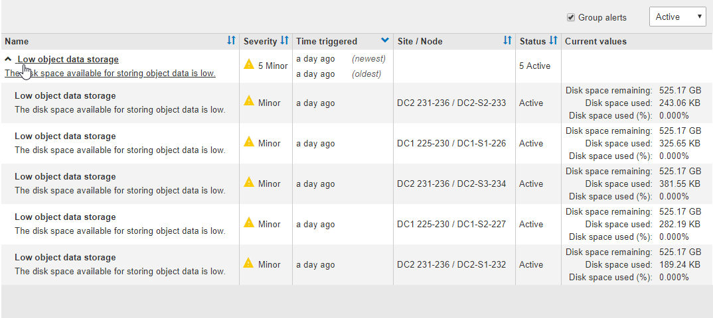

= Visualizzare gli avvisi correnti
:allow-uri-read: 
:icons: font
:imagesdir: ../media/

[role="lead"]
Quando viene attivato un avviso, viene visualizzata un'icona di avviso nella dashboard. Nella pagina nodi viene visualizzata anche un'icona di avviso per il nodo. Potrebbe essere inviata anche una notifica via email, a meno che l'avviso non sia stato tacitato.

.Di cosa hai bisogno
* È necessario accedere a Grid Manager utilizzando un xref:../admin/web-browser-requirements.adoc[browser web supportato].
* Facoltativamente, hai guardato il video: https://netapp.hosted.panopto.com/Panopto/Pages/Viewer.aspx?id=2680a74f-070c-41c2-bcd3-acc5013c9cdd["Video: Panoramica degli avvisi"^].
+
[link=https://netapp.hosted.panopto.com/Panopto/Pages/Viewer.aspx?id=2680a74f-070c-41c2-bcd3-acc5013c9cdd]
image::../media/video-screenshot-alert-overview.png[Video: Panoramica degli avvisi]

.Fasi
. Se sono attivi uno o più avvisi, effettuare una delle seguenti operazioni:
+
** Dal pannello Health (Salute) della dashboard, fare clic sull'icona di avviso o fare clic su *Current alerts* (Avvisi correnti). (Un'icona di avviso e il collegamento *Current alerts* (Avvisi correnti) vengono visualizzati solo se almeno un avviso è attivo).
** Selezionare *ALERTS* *current*.
+
Viene visualizzata la pagina Avvisi correnti. Elenca tutti gli avvisi che attualmente interessano il sistema StorageGRID.

+
image::../media/alerts_current_page.png[Pagina Avvisi correnti]

+
Per impostazione predefinita, gli avvisi vengono visualizzati come segue:

** Vengono visualizzati per primi gli avvisi attivati più di recente.
** Più avvisi dello stesso tipo vengono visualizzati come gruppo.
** Gli avvisi che sono stati tacitati non vengono visualizzati.
** Per un avviso specifico su un nodo specifico, se le soglie vengono raggiunte per più di una severità, viene visualizzato solo l'allarme più grave. Ovvero, se vengono raggiunte soglie di allarme per i livelli di severità minori, maggiori e critici, viene visualizzato solo l'avviso critico.

+
La pagina Current Alerts (Avvisi correnti) viene aggiornata ogni due minuti.

. Esaminare le informazioni contenute nella tabella.
+
[cols="1a,3a"]
|===
| Intestazione di colonna | Descrizione 

 a| 
Nome
 a| 
Il nome dell'avviso e la relativa descrizione.

 a| 
Severità
 a| 
La severità dell'avviso. Se vengono raggruppati più avvisi, la riga del titolo mostra il numero di istanze di tale avviso che si verificano a ogni livello di gravità.

** *Critico* image:../media/icon_alert_red_critical.png["Icona Avviso rosso critico"]: Si verifica una condizione anomala che ha interrotto le normali operazioni di un nodo o servizio StorageGRID. È necessario risolvere immediatamente il problema sottostante. Se il problema non viene risolto, potrebbero verificarsi interruzioni del servizio e perdita di dati.
** *Maggiore* image:../media/icon_alert_orange_major.png["Icona Alert arancione maggiore"]: Si verifica una condizione anomala che influisce sulle operazioni correnti o si avvicina alla soglia per un avviso critico. È necessario analizzare gli avvisi principali e risolvere eventuali problemi sottostanti per assicurarsi che le condizioni anomale non interrompano il normale funzionamento di un nodo o servizio StorageGRID.
** *Minore* image:../media/icon_alert_yellow_minor.png["Icona Avviso giallo minore"]: Il sistema funziona normalmente, ma si verifica una condizione anomala che potrebbe influire sulla capacità di funzionamento del sistema se continua a funzionare. È necessario monitorare e risolvere gli avvisi minori che non vengono risolti da soli per assicurarsi che non causino problemi più gravi.

 a| 
Tempo di attivazione
 a| 
Quanto tempo fa è stato attivato l'avviso. Se vengono raggruppati più avvisi, la riga del titolo mostra l'ora dell'istanza più recente dell'avviso (_NEST_) e l'istanza più vecchia dell'avviso (_OLDEST_).

 a| 
Sito/nodo
 a| 
Il nome del sito e del nodo in cui si verifica l'avviso. Se vengono raggruppati più avvisi, i nomi del sito e del nodo non vengono visualizzati nella riga del titolo.

 a| 
Stato
 a| 
Se l'avviso è attivo o è stato tacitato. Se vengono raggruppati più avvisi e nell'elenco a discesa viene selezionato *tutti gli avvisi*, la riga del titolo mostra quante istanze di tale avviso sono attive e quante istanze sono state tacitati.

 a| 
Valori correnti
 a| 
Il valore corrente della metrica che ha causato l'attivazione dell'avviso. Per alcuni avvisi, vengono visualizzati valori aggiuntivi che consentono di comprendere e analizzare l'avviso. Ad esempio, i valori visualizzati per un avviso *Low Object Data Storage* includono la percentuale di spazio su disco utilizzato, la quantità totale di spazio su disco e la quantità di spazio su disco utilizzata.

*Nota:* se vengono raggruppati più avvisi, i valori correnti non vengono visualizzati nella riga del titolo.

|===
. Per espandere e comprimere gruppi di avvisi:
+
** Per visualizzare i singoli avvisi in un gruppo, fare clic sul pulsante freccia giù  nell'intestazione o fare clic sul nome del gruppo.
** Per nascondere i singoli avvisi in un gruppo, fare clic sull'icona a forma di accento circonflesso image:../media/icon_alert_caret_up.png["Icona freccia su"] nell'intestazione o fare clic sul nome del gruppo.
+

. Per visualizzare singoli avvisi invece di gruppi di avvisi, deselezionare la casella di controllo *Group alerts* (Avvisi di gruppo) nella parte superiore della tabella.
+
image::../media/alerts_page_group_alerts_button.png[Pulsante Group alerts]

. Per ordinare gli avvisi o i gruppi di avvisi, fare clic sulle frecce su/giù image:../media/icon_alert_sort_column.png["Icona delle frecce di ordinamento"] in ogni intestazione di colonna.
+
** Quando si seleziona *Group alerts* (Avvisi di gruppo), vengono ordinati sia i gruppi di avvisi che i singoli avvisi all'interno di ciascun gruppo. Ad esempio, è possibile ordinare gli avvisi in un gruppo in base all'ora * attivata per trovare l'istanza più recente di un avviso specifico.
** Se l'opzione *Group alerts* (Avvisi di gruppo) non è selezionata, viene ordinato l'intero elenco di avvisi. Ad esempio, è possibile ordinare tutti gli avvisi in base a *nodo/sito* per visualizzare tutti gli avvisi relativi a un nodo specifico.

. Per filtrare gli avvisi in base allo stato, utilizzare il menu a discesa nella parte superiore della tabella.
+
image::../media/alerts_page_active_drop_down.png[Menu a discesa Alert status (Stato avviso]

+
** Selezionare *All alerts* (tutti gli avvisi) per visualizzare tutti gli avvisi correnti (sia attivi che tacitati).
** Selezionare *Active* per visualizzare solo gli avvisi correnti attivi.
** Selezionare *silenziato* per visualizzare solo gli avvisi attualmente tacitati. Vedere xref:silencing-alert-notifications.adoc[Tacitare le notifiche di avviso].

. Per visualizzare i dettagli di un avviso specifico, selezionarlo dalla tabella.
+
Viene visualizzata una finestra di dialogo per l'avviso. Vedere xref:viewing-specific-alert.adoc[Visualizzare un avviso specifico].

