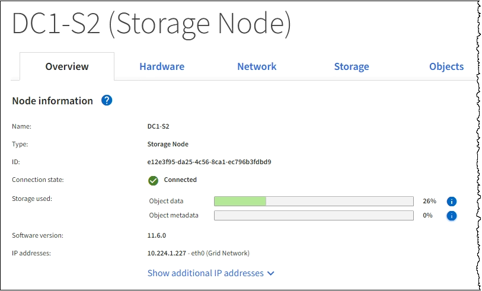
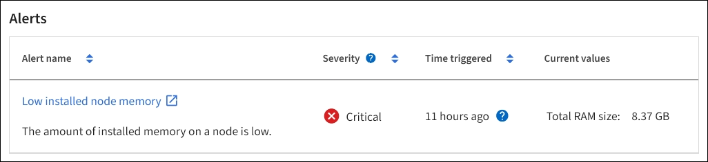

= Visualizzare la scheda Panoramica
:allow-uri-read: 
:icons: font
:imagesdir: ../media/

[role="lead"]
La scheda Panoramica fornisce informazioni di base su ciascun nodo. Inoltre, vengono visualizzati tutti gli avvisi che attualmente influiscono sul nodo.

Viene visualizzata la scheda Overview (Panoramica) per tutti i nodi.

== Informazioni sul nodo

La sezione Node Information (informazioni nodo) della scheda Overview (Panoramica) elenca le informazioni di base sul nodo Grid (griglia).

Le informazioni generali per un nodo includono quanto segue:

* *Name*: Nome host assegnato al nodo e visualizzato in Grid Manager.
* *Type*: Il tipo di nodo -- Admin Node, Primary Admin Node, Storage Node, Gateway Node o Archive Node.
* *ID*: Identificatore univoco del nodo, chiamato anche UUID.
* *Stato connessione*: Uno dei tre stati. Viene visualizzata l'icona dello stato più grave.
+
** *Sconosciuto* image:../media/icon_alarm_blue_unknown.png["icona del punto interrogativo blu"]: Il nodo non è connesso alla rete per un motivo sconosciuto. Ad esempio, la connessione di rete tra i nodi è stata persa o l'alimentazione è inattiva. Potrebbe essere attivato anche l'avviso *Impossibile comunicare con il nodo*. Potrebbero essere attivi anche altri avvisi. Questa situazione richiede un'attenzione immediata.
+

NOTE: Un nodo potrebbe apparire come sconosciuto durante le operazioni di shutdown gestite. In questi casi, è possibile ignorare lo stato Unknown (Sconosciuto).

** *Amministrativamente inattivo* image:../media/icon_alarm_gray_administratively_down.png["icona del punto interrogativo grigio"]: Il nodo non è connesso alla rete per un motivo previsto. Ad esempio, il nodo o i servizi sul nodo sono stati normalmente spenti, il nodo è in fase di riavvio o il software è in fase di aggiornamento. Potrebbero essere attivi anche uno o più avvisi.
** *Connesso* image:../media/icon_alert_green_checkmark.png["icona di avviso segno di spunta verde"]: Il nodo è collegato alla rete.

* *Storage utilizzato*: Solo per nodi di storage.
+
** *Dati oggetto*: Percentuale dello spazio utilizzabile totale per i dati oggetto che è stato utilizzato nel nodo di storage.
** *Metadati oggetto*: Percentuale dello spazio totale consentito per i metadati oggetto utilizzati nel nodo di storage.

* *Versione software*: La versione di StorageGRID installata sul nodo.
* *Gruppi ha*: Solo per nodi Admin Node e Gateway. Viene visualizzato se un'interfaccia di rete sul nodo è inclusa in un gruppo ad alta disponibilità e se tale interfaccia è l'interfaccia primaria.
* *Indirizzi IP*: Gli indirizzi IP del nodo. Fare clic su *Show additional IP addresses* (Mostra indirizzi IP aggiuntivi) per visualizzare gli indirizzi IPv4 e IPv6 e le mappature dell'interfaccia del nodo.

== Avvisi

La sezione Avvisi della scheda Panoramica elenca gli avvisi che attualmente interessano questo nodo e che non sono stati tacitati. Fare clic sul nome dell'avviso per visualizzare ulteriori dettagli e azioni consigliate.

.Informazioni correlate
xref:monitoring-node-connection-states.adoc[Monitorare gli stati di connessione del nodo]

xref:viewing-current-alerts.adoc[Visualizzare gli avvisi correnti]

xref:viewing-specific-alert.adoc[Visualizzare un avviso specifico]
