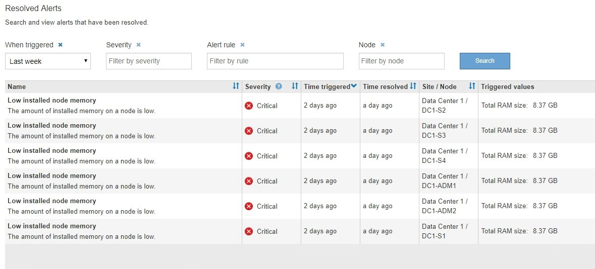

= Visualizzare gli avvisi risolti
:allow-uri-read: 
:icons: font
:imagesdir: ../media/

[role="lead"]
È possibile cercare e visualizzare una cronologia degli avvisi risolti.

.Di cosa hai bisogno
* È necessario accedere a Grid Manager utilizzando un xref:../admin/web-browser-requirements.adoc[browser web supportato].

.Fasi
. Per visualizzare gli avvisi risolti, effettuare una delle seguenti operazioni:
+
** Dal pannello Health (Stato) della dashboard, fare clic su *Recently Resolved alerts* (Avvisi risolti di recente)
+
Il collegamento *Recently Resolved alerts* (Avvisi risolti di recente) viene visualizzato solo se uno o più avvisi sono stati attivati nell'ultima settimana e sono stati risolti.

** Selezionare *ALERTS* *resolved*. Viene visualizzata la pagina Avvisi risolti. Per impostazione predefinita, vengono visualizzati gli avvisi risolti che sono stati attivati nell'ultima settimana, con gli avvisi attivati più di recente. Gli avvisi presenti in questa pagina sono stati precedentemente visualizzati nella pagina Avvisi correnti o in una notifica via email.
+

. Esaminare le informazioni contenute nella tabella.
+
|===
| Intestazione di colonna | Descrizione 

 a| 
Nome
 a| 
Il nome dell'avviso e la relativa descrizione.

 a| 
Severità
 a| 
La severità dell'avviso.

** *Critico* image:../media/icon_alert_red_critical.png["Icona Avviso rosso critico"]: Si verifica una condizione anomala che ha interrotto le normali operazioni di un nodo o servizio StorageGRID. È necessario risolvere immediatamente il problema sottostante. Se il problema non viene risolto, potrebbero verificarsi interruzioni del servizio e perdita di dati.
** *Maggiore* image:../media/icon_alert_orange_major.png["Icona Alert arancione maggiore"]: Si verifica una condizione anomala che influisce sulle operazioni correnti o si avvicina alla soglia per un avviso critico. È necessario analizzare gli avvisi principali e risolvere eventuali problemi sottostanti per assicurarsi che le condizioni anomale non interrompano il normale funzionamento di un nodo o servizio StorageGRID.
** *Minore* image:../media/icon_alert_yellow_minor.png["Icona Avviso giallo minore"]: Il sistema funziona normalmente, ma si verifica una condizione anomala che potrebbe influire sulla capacità di funzionamento del sistema se continua a funzionare. È necessario monitorare e risolvere gli avvisi minori che non vengono risolti da soli per assicurarsi che non causino problemi più gravi.

 a| 
Tempo di attivazione
 a| 
Quanto tempo fa è stato attivato l'avviso.

 a| 
Tempo risolto
 a| 
Quanto tempo fa l'avviso è stato risolto.

 a| 
Sito/nodo
 a| 
Il nome del sito e del nodo in cui si è verificato l'avviso.

 a| 
Valori attivati
 a| 
Il valore della metrica che ha causato l'attivazione dell'avviso. Per alcuni avvisi, vengono visualizzati valori aggiuntivi che consentono di comprendere e analizzare l'avviso. Ad esempio, i valori visualizzati per un avviso *Low Object Data Storage* includono la percentuale di spazio su disco utilizzato, la quantità totale di spazio su disco e la quantità di spazio su disco utilizzata.

|===
. Per ordinare l'intero elenco degli avvisi risolti, fare clic sulle frecce su/giù image:../media/icon_alert_sort_column.png["Icona delle frecce di ordinamento"] in ogni intestazione di colonna.
+
Ad esempio, è possibile ordinare gli avvisi risolti in base a *Sito/nodo* per visualizzare gli avvisi che hanno interessato un nodo specifico.

. In alternativa, filtrare l'elenco degli avvisi risolti utilizzando i menu a discesa nella parte superiore della tabella.
+
.. Selezionare un periodo di tempo dal menu a discesa *quando attivato* per visualizzare gli avvisi risolti in base al tempo trascorso dall'attivazione.
+
È possibile cercare gli avvisi attivati nei seguenti periodi di tempo:

+
*** Ultima ora
*** Ultimo giorno
*** Ultima settimana (vista predefinita)
*** Il mese scorso
*** In qualsiasi periodo di tempo
*** Custom (personalizzata): Consente di specificare la data di inizio e la data di fine del periodo di tempo.

.. Selezionare una o più severità dal menu a discesa *severità* per filtrare gli avvisi risolti con una severità specifica.
.. Selezionare una o più regole di avviso predefinite o personalizzate dal menu a discesa *regola di avviso* per filtrare gli avvisi risolti correlati a una regola di avviso specifica.
.. Selezionare uno o più nodi dal menu a discesa *nodo* per filtrare gli avvisi risolti relativi a un nodo specifico.
.. Fare clic su *Cerca*.

. Per visualizzare i dettagli di uno specifico avviso risolto, selezionarlo dalla tabella.
+
Viene visualizzata una finestra di dialogo per l'avviso. Vedere xref:viewing-specific-alert.adoc[Visualizzare un avviso specifico].

