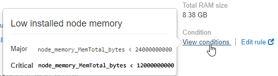

= Visualizzare un avviso specifico
:allow-uri-read: 
:icons: font
:imagesdir: ../media/

[role="lead"]
È possibile visualizzare informazioni dettagliate su un avviso che sta interessando il sistema StorageGRID o un avviso che è stato risolto. I dettagli includono le azioni correttive consigliate, l'ora di attivazione dell'avviso e il valore corrente delle metriche correlate all'avviso.

Se lo si desidera, è possibile xref:silencing-alert-notifications.adoc[tacitare un avviso corrente] oppure xref:editing-alert-rules.adoc[aggiornare la regola di avviso].

.Di cosa hai bisogno
* Hai effettuato l'accesso a Grid Manager utilizzando un xref:../admin/web-browser-requirements.adoc[browser web supportato].

.Fasi
. Eseguire una delle seguenti operazioni, a seconda che si desideri visualizzare un avviso corrente o risolto:
+
[cols="1a,2a"]
|===
| Intestazione di colonna | Descrizione 

 a| 
Avviso corrente
 a| 
** Dal pannello Health (Salute) della dashboard, fare clic sul collegamento *Current alerts* (Avvisi correnti). Questo collegamento viene visualizzato solo se è attivo almeno un avviso. Questo collegamento è nascosto se non sono presenti avvisi correnti o se tutti gli avvisi correnti sono stati tacitati.
** Selezionare *ALERTS* *current*.
** Dalla pagina *NODI*, selezionare la scheda *Panoramica* per un nodo con un'icona di avviso. Quindi, nella sezione Avvisi, fare clic sul nome dell'avviso.

 a| 
Avviso risolto
 a| 
** Dal pannello Health (Stato) della dashboard, fare clic sul collegamento *Recently Resolved alerts* (Avvisi risolti di recente). (Questo collegamento viene visualizzato solo se uno o più avvisi sono stati attivati nella settimana precedente e sono stati risolti. Questo collegamento è nascosto se non sono stati attivati e risolti avvisi nell'ultima settimana).
** Selezionare *ALERTS* *resolved*.

|===
. Se necessario, espandere un gruppo di avvisi e selezionare l'avviso da visualizzare.
+

NOTE: Selezionare l'avviso, non l'intestazione di un gruppo di avvisi.

+
image::../media/alerts_page_select_alert.png[Pagina Avvisi selezionare Avviso]

+
Viene visualizzata una finestra di dialogo con i dettagli dell'avviso selezionato.

+
image::../media/alerts_page_details_modal.png[Dettagli pagina avvisi Modal]

. Esaminare i dettagli dell'avviso.
+
[cols="1a,2a"]
|===
| Informazioni | Descrizione 

 a| 
_titolo_
 a| 
Il nome dell'avviso.

 a| 
_primo paragrafo_
 a| 
La descrizione dell'avviso.

 a| 
Azioni consigliate
 a| 
Le azioni consigliate per questo avviso.

 a| 
Tempo di attivazione
 a| 
La data e l'ora in cui l'avviso è stato attivato nell'ora locale e in UTC.

 a| 
Tempo risolto
 a| 
Solo per gli avvisi risolti, la data e l'ora in cui l'avviso è stato risolto nell'ora locale e in UTC.

 a| 
Stato
 a| 
Lo stato dell'avviso: Attivo, tacitato o risolto.

 a| 
Sito/nodo
 a| 
Il nome del sito e del nodo interessati dall'avviso.

 a| 
Severità
 a| 
La severità dell'avviso.

** *Critico* image:../media/icon_alert_red_critical.png["Icona Avviso rosso critico"]: Si verifica una condizione anomala che ha interrotto le normali operazioni di un nodo o servizio StorageGRID. È necessario risolvere immediatamente il problema sottostante. Se il problema non viene risolto, potrebbero verificarsi interruzioni del servizio e perdita di dati.
** *Maggiore* image:../media/icon_alert_orange_major.png["Icona Alert arancione maggiore"]: Si verifica una condizione anomala che influisce sulle operazioni correnti o si avvicina alla soglia per un avviso critico. È necessario analizzare gli avvisi principali e risolvere eventuali problemi sottostanti per assicurarsi che le condizioni anomale non interrompano il normale funzionamento di un nodo o servizio StorageGRID.
** *Minore* image:../media/icon_alert_yellow_minor.png["Icona Avviso giallo minore"]: Il sistema funziona normalmente, ma si verifica una condizione anomala che potrebbe influire sulla capacità di funzionamento del sistema se continua a funzionare. È necessario monitorare e risolvere gli avvisi minori che non vengono risolti da soli per assicurarsi che non causino problemi più gravi.

 a| 
_valori dei dati_
 a| 
Il valore corrente della metrica per questo avviso. Per alcuni avvisi, vengono visualizzati valori aggiuntivi che consentono di comprendere e analizzare l'avviso. Ad esempio, i valori visualizzati per un avviso *Low metadata storage* includono la percentuale di spazio su disco utilizzato, la quantità totale di spazio su disco e la quantità di spazio su disco utilizzata.

|===
. Facoltativamente, fare clic su *Silence this alert* (tacita questo avviso) per disattivare la regola di avviso che ha causato l'attivazione dell'avviso.
+
Per tacitare una regola di avviso, è necessario disporre dell'autorizzazione di accesso Gestisci avvisi o root.

+

IMPORTANT: Prestare attenzione quando si decide di tacitare una regola di avviso. Se una regola di avviso viene tacitata, è possibile che non si rilevi un problema sottostante fino a quando non si impedisce il completamento di un'operazione critica.

. Per visualizzare le condizioni correnti della regola di avviso:
+
.. Dai dettagli dell'avviso, fare clic su *View conditions* (Visualizza condizioni).
+
Viene visualizzata una finestra a comparsa che elenca l'espressione Prometheus per ogni severità definita.

+

.. Per chiudere la finestra a comparsa, fare clic in un punto qualsiasi all'esterno della finestra a comparsa.

. Facoltativamente, fare clic su *Edit rule* (Modifica regola) per modificare la regola di avviso che ha causato l'attivazione dell'avviso:
+
Per modificare una regola di avviso, è necessario disporre dell'autorizzazione di accesso Gestisci avvisi o root.

+

IMPORTANT: Prestare attenzione quando si decide di modificare una regola di avviso. Se si modificano i valori di attivazione, potrebbe non essere rilevato un problema sottostante fino a quando non viene impedita l'esecuzione di un'operazione critica.

. Per chiudere i dettagli dell'avviso, fare clic su *Chiudi*.

