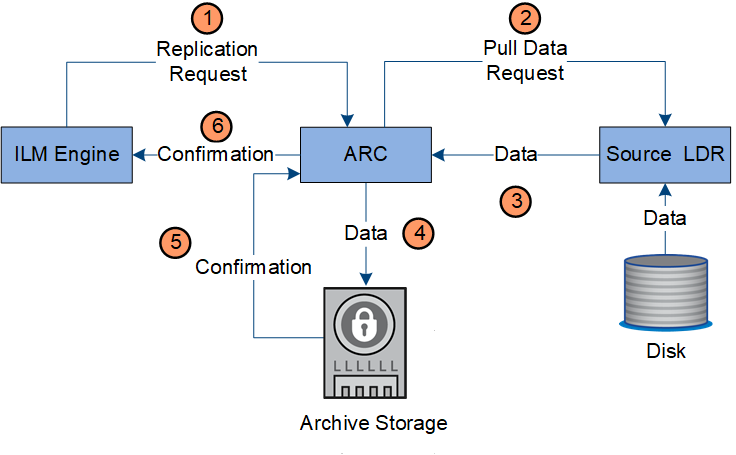

= Gestione delle copie
:allow-uri-read: 
:icons: font
:imagesdir: ../media/

[role="lead"]
I dati degli oggetti vengono gestiti dal criterio ILM attivo e dalle relative regole ILM. Le regole ILM effettuano copie replicate o erasure coded per proteggere i dati degli oggetti dalla perdita.

Potrebbero essere necessari diversi tipi o posizioni di copie di oggetti in momenti diversi della vita dell'oggetto. Le regole ILM vengono periodicamente valutate per garantire che gli oggetti vengano posizionati come richiesto.

I dati degli oggetti vengono gestiti dal servizio LDR.

== Protezione del contenuto: Replica

Se le istruzioni di posizionamento del contenuto di una regola ILM richiedono copie replicate dei dati dell'oggetto, le copie vengono eseguite e memorizzate su disco dai nodi di storage che compongono il pool di storage configurato.

=== Flusso di dati

Il motore ILM nel servizio LDR controlla la replica e garantisce che il numero corretto di copie venga memorizzato nelle posizioni corrette e per il tempo corretto.

image::../media/replication_data_flow.png[diagramma che mostra il processo descritto nel testo circostante]

. Il motore ILM interroga il servizio ADC per determinare il servizio LDR di destinazione migliore all'interno del pool di storage specificato dalla regola ILM. Quindi, invia al servizio LDR un comando per avviare la replica.
. Il servizio LDR di destinazione interroga il servizio ADC per la migliore posizione di origine. Quindi, invia una richiesta di replica al servizio LDR di origine.
. Il servizio LDR di origine invia una copia al servizio LDR di destinazione.
. Il servizio LDR di destinazione notifica al motore ILM che i dati dell'oggetto sono stati memorizzati.
. Il motore ILM aggiorna l'archivio di metadati con i metadati della posizione dell'oggetto.

== Protezione del contenuto: Erasure coding

Se una regola ILM include istruzioni per eseguire copie codificate di cancellazione dei dati dell'oggetto, lo schema di erasure coding applicabile suddivide i dati dell'oggetto in dati e frammenti di parità e distribuisce tali frammenti tra i nodi di storage configurati nel profilo di codifica Erasure.

=== Flusso di dati

Il motore ILM, che è un componente del servizio LDR, controlla la codifica di cancellazione e garantisce che il profilo di codifica Erasure venga applicato ai dati dell'oggetto.

image::../media/erasure_coding_data_flow.png[Erasure coding Data Flow (Erasure Coding Data Flow]

. Il motore ILM interroga il servizio ADC per determinare quale servizio DDS può eseguire al meglio l'operazione di erasure coding. Una volta stabilito, il motore ILM invia una richiesta di "inizializzazione" a tale servizio.
. Il servizio DDS richiede a un LDR di eseguire la cancellazione del codice dei dati dell'oggetto.
. Il servizio LDR di origine invia una copia al servizio LDR selezionato per la cancellazione del codice.
. Una volta suddiviso nel numero appropriato di parità e frammenti di dati, il servizio LDR distribuisce questi frammenti tra i nodi di storage (servizi Chunk) che costituiscono il pool di storage del profilo di codifica Erasure.
. Il servizio LDR notifica al motore ILM, confermando che i dati dell'oggetto sono stati distribuiti correttamente.
. Il motore ILM aggiorna l'archivio di metadati con i metadati della posizione dell'oggetto.

== Protezione dei contenuti: Pool di storage cloud

Se le istruzioni di posizionamento del contenuto di una regola ILM richiedono che una copia replicata dei dati dell'oggetto venga memorizzata in un Cloud Storage Pool, i dati dell'oggetto vengono duplicati nel bucket S3 esterno o nel container di storage Azure Blob specificato per il Cloud Storage Pool.

=== Flusso di dati

Il motore ILM, che è un componente del servizio LDR, e il servizio Data Mover controllano lo spostamento degli oggetti nel Cloud Storage Pool.

image::../media/cloud_storage_pool_data_flow.png[Flusso di dati del pool di cloud storage]

. Il motore ILM seleziona un servizio Data Mover da replicare nel Cloud Storage Pool.
. Il servizio Data Mover invia i dati dell'oggetto al Cloud Storage Pool.
. Il servizio Data Mover notifica al motore ILM che i dati dell'oggetto sono stati memorizzati.
. Il motore ILM aggiorna l'archivio di metadati con i metadati della posizione dell'oggetto.

== Protezione del contenuto: Archivio

Un'operazione di archiviazione consiste in un flusso di dati definito tra il sistema StorageGRID e il client.

Se il criterio ILM richiede l'archiviazione di una copia dei dati dell'oggetto, il motore ILM, che è un componente del servizio LDR, invia una richiesta al nodo di archiviazione, che a sua volta invia una copia dei dati dell'oggetto al sistema di archiviazione di destinazione.

. Il motore ILM invia una richiesta al servizio ARC per memorizzare una copia su un supporto di archiviazione.
. Il servizio ARC interroga il servizio ADC per la migliore posizione di origine e invia una richiesta al servizio LDR di origine.
. Il servizio ARC recupera i dati degli oggetti dal servizio LDR.
. Il servizio ARC invia i dati dell'oggetto alla destinazione del supporto di archiviazione.
. Il supporto di archiviazione notifica al servizio ARC che i dati dell'oggetto sono stati memorizzati.
. Il servizio ARC notifica al motore ILM che i dati dell'oggetto sono stati memorizzati.

