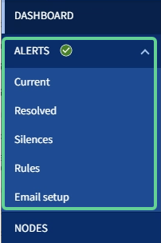
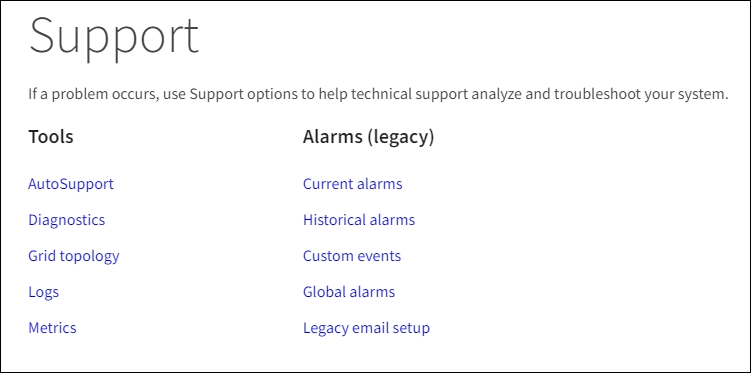

= Esplora Grid Manager
:allow-uri-read: 
:icons: font
:imagesdir: ../media/

[role="lead"]
Grid Manager è l'interfaccia grafica basata su browser che consente di configurare, gestire e monitorare il sistema StorageGRID.

Quando si accede a Grid Manager, si sta effettuando la connessione a un nodo amministratore. Ogni sistema StorageGRID include un nodo di amministrazione primario e un numero qualsiasi di nodi di amministrazione non primari. È possibile connettersi a qualsiasi nodo amministratore e ciascun nodo amministratore visualizza una vista simile del sistema StorageGRID.

È possibile accedere a Grid Manager utilizzando un xref:../admin/web-browser-requirements.adoc[browser web supportato].

== Dashboard di Grid Manager

Quando accedi per la prima volta a Grid Manager, puoi utilizzare la dashboard per monitorare le attività del sistema in un colpo d'occhio.

La dashboard include informazioni riepilogative sullo stato di salute del sistema, sull'utilizzo dello storage, sui processi ILM e sulle operazioni S3 e Swift.

image::../media/grid_manager_dashboard.png[Dashboard in Grid Manager]

Per una spiegazione delle informazioni su ciascun pannello, fare clic sull'icona della guida image:../media/icon_nms_question.png["icona del punto interrogativo"] per quel pannello.

.Scopri di più
* xref:../monitor/index.adoc[Monitorare e risolvere i problemi]

== Campo di ricerca

Il campo *Search* nella barra di intestazione consente di accedere rapidamente a una pagina specifica all'interno di Grid Manager. Ad esempio, è possibile immettere *km* per accedere alla pagina Key Management Server (KMS). È possibile utilizzare *Cerca* per trovare le voci nella barra laterale di Grid Manager e nei menu Configurazione, manutenzione e supporto.

== Menu Avvisi

Il menu Avvisi fornisce un'interfaccia di facile utilizzo per rilevare, valutare e risolvere i problemi che potrebbero verificarsi durante il funzionamento di StorageGRID.

Dal menu Alerts (Avvisi), è possibile effettuare le seguenti operazioni:

* Rivedere gli avvisi correnti
* Esaminare gli avvisi risolti
* Configurare i silenzi per eliminare le notifiche di avviso
* Definire le regole di avviso per le condizioni che attivano gli avvisi
* Configurare il server di posta elettronica per le notifiche degli avvisi

.Scopri di più
* xref:monitoring-and-managing-alerts.adoc[Monitorare e gestire gli avvisi]
* xref:../monitor/index.adoc[Monitorare e risolvere i problemi]

== Pagina nodi

La pagina Nodes (nodi) visualizza informazioni sull'intera griglia, su ciascun sito della griglia e su ciascun nodo di un sito.

La home page dei nodi visualizza le metriche combinate per l'intera griglia. Per visualizzare le informazioni relative a un determinato sito o nodo, selezionare il sito o nodo.

image::../media/nodes_menu.png[pagina principale nodi]

.Scopri di più
* xref:viewing-nodes-page.adoc[Visualizzare la pagina nodi]
* xref:../monitor/index.adoc[Monitorare e risolvere i problemi]

== Pagina tenant

La pagina tenant consente di creare e monitorare gli account tenant di storage per il sistema StorageGRID. È necessario creare almeno un account tenant per specificare chi può memorizzare e recuperare gli oggetti e quali funzionalità sono disponibili.

La pagina tenant fornisce inoltre dettagli sull'utilizzo di ciascun tenant, tra cui la quantità di storage utilizzato e il numero di oggetti. Se si imposta una quota al momento della creazione del tenant, è possibile visualizzare la quantità di tale quota utilizzata.

image::../media/tenants_menu_and_page.png[Menu e pagina dei tenant]

.Scopri di più
* xref:managing-tenants-and-client-connections.adoc[Gestire tenant e connessioni client]
* xref:../admin/index.adoc[Amministrare StorageGRID]
* xref:../tenant/index.adoc[Utilizzare un account tenant]

== Menu ILM

Il menu ILM consente di configurare le regole e le policy ILM (Information Lifecycle Management) che regolano la durata e la disponibilità dei dati. È inoltre possibile inserire un identificatore di oggetto per visualizzare i metadati relativi a tale oggetto.

image::../media/ilm_menu_and_page.png[Menu e pagina ILM]

.Scopri di più
* xref:using-information-lifecycle-management.adoc[Utilizza la gestione del ciclo di vita delle informazioni]
* xref:../ilm/index.adoc[Gestire gli oggetti con ILM]

== Menu di configurazione

Il menu Configurazione consente di specificare le impostazioni di rete, di sicurezza, di sistema, di monitoraggio e di controllo degli accessi.

image::../media/configuration_menu.png[Menu Configuration (Configurazione)]

.Scopri di più
* xref:configuring-network-settings.adoc[Configurare le impostazioni di rete]
* xref:managing-tenants-and-client-connections.adoc[Gestire tenant e connessioni client]
* xref:reviewing-audit-messages.adoc[Esaminare i messaggi di audit]
* xref:controlling-storagegrid-access.adoc[Controllare l'accesso a StorageGRID]
* xref:../admin/index.adoc[Amministrare StorageGRID]
* xref:../monitor/index.adoc[Monitorare e risolvere i problemi]
* xref:../audit/index.adoc[Esaminare i registri di audit]

== Menu di manutenzione

Il menu Maintenance (manutenzione) consente di eseguire attività di manutenzione, manutenzione del sistema e manutenzione della rete.

image::../media/maintenance_menu.png[Pagina e menu di manutenzione]

=== Attività

Le attività di manutenzione includono:

* Decommissionare le operazioni per rimuovere i nodi e i siti grid inutilizzati.
* Operazioni di espansione per aggiungere nuovi nodi e siti grid.
* Operazioni di recovery per sostituire un nodo guasto e ripristinare i dati.
* Controllo dell'esistenza di oggetti per verificare l'esistenza (anche se non la correttezza) dei dati dell'oggetto.

=== Sistema

Le attività di manutenzione del sistema che è possibile eseguire includono:

* Revisione dei dettagli della licenza StorageGRID corrente o caricamento di una nuova licenza.
* Generazione di un pacchetto di ripristino.
* Esecuzione di aggiornamenti software StorageGRID, inclusi aggiornamenti software, hotfix e aggiornamenti del software SANtricity OS su alcune appliance.

=== Rete

Le attività di manutenzione della rete che è possibile eseguire includono:

* Modifica delle informazioni sui server DNS.
* Configurazione delle subnet utilizzate nella rete Grid.
* Modifica delle informazioni sui server NTP.

.Scopri di più
* xref:performing-maintenance-procedures.adoc[Eseguire la manutenzione]
* xref:downloading-recovery-package.adoc[Scaricare il pacchetto di ripristino]
* xref:../expand/index.adoc[Espandi il tuo grid]
* xref:../upgrade/index.adoc[Aggiornare il software]
* xref:../maintain/index.adoc[Ripristino e manutenzione]
* xref:../sg6000/index.adoc[Appliance di storage SG6000]
* xref:../sg5700/index.adoc[Appliance di storage SG5700]
* xref:../sg5600/index.adoc[Appliance di storage SG5600]

== Menu Support (supporto)

Il menu Support (supporto) fornisce opzioni che consentono al supporto tecnico di analizzare e risolvere i problemi del sistema. Il menu Support (supporto) comprende due parti: Tools (Strumenti) e Alarms (Allarmi) (legacy).

=== Strumenti

Dalla sezione Tools (Strumenti) del menu Support (supporto), è possibile:

* Abilitare AutoSupport.
* Eseguire una serie di controlli diagnostici sullo stato corrente della griglia.
* Accedere alla struttura della topologia della griglia per visualizzare informazioni dettagliate su nodi, servizi e attributi della griglia.
* Recuperare i file di log e i dati di sistema.
* Esamina metriche e grafici dettagliati.
+

IMPORTANT: I tool disponibili nell'opzione *metriche* sono destinati all'utilizzo da parte del supporto tecnico. Alcune funzioni e voci di menu di questi strumenti sono intenzionalmente non funzionali.

=== Allarmi (legacy)

Dalla sezione Allarmi (legacy) del menu supporto, è possibile rivedere gli allarmi correnti, storici e globali, impostare eventi personalizzati e impostare notifiche e-mail per allarmi legacy e AutoSupport.

NOTE: Mentre il sistema di allarme legacy continua a essere supportato, il sistema di allarme offre vantaggi significativi ed è più facile da utilizzare.

.Scopri di più
* xref:storagegrid-architecture-and-network-topology.adoc[Architettura StorageGRID e topologia di rete]
* xref:viewing-nodes-page.adoc[Attributi StorageGRID]
* xref:using-storagegrid-support-options.adoc[Utilizzare le opzioni di supporto di StorageGRID]
* xref:../admin/index.adoc[Amministrare StorageGRID]
* xref:../monitor/index.adoc[Monitorare e risolvere i problemi]

== Menu Guida

L'opzione Guida consente di accedere al Centro documentazione StorageGRID per la release corrente e alla documentazione API. È inoltre possibile determinare quale versione di StorageGRID è attualmente installata.

image::../media/help_menu.png[Menu Help (Guida)]

.Scopri di più
* xref:../admin/index.adoc[Amministrare StorageGRID]

