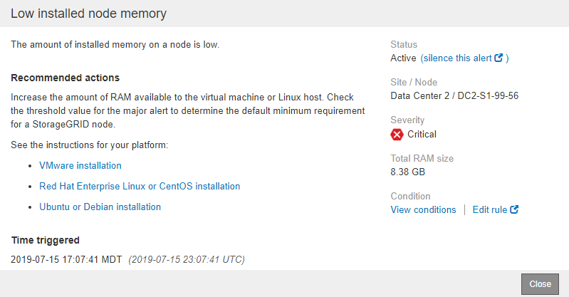

= Monitorare e gestire gli avvisi
:allow-uri-read: 
:icons: font
:imagesdir: ../media/

[role="lead"]
Il sistema di avviso fornisce un'interfaccia di facile utilizzo per rilevare, valutare e risolvere i problemi che possono verificarsi durante il funzionamento di StorageGRID.

Il sistema di allerta è progettato per essere lo strumento principale per il monitoraggio di eventuali problemi che potrebbero verificarsi nel sistema StorageGRID.

* Il sistema di allerta si concentra su problemi pratici nel sistema. Gli avvisi vengono attivati per gli eventi che richiedono l'attenzione immediata dell'utente, non per gli eventi che possono essere ignorati in modo sicuro.
* Le pagine Avvisi correnti e Avvisi risolti forniscono un'interfaccia intuitiva per la visualizzazione dei problemi correnti e storici. È possibile ordinare l'elenco in base a singoli avvisi e gruppi di avvisi. Ad esempio, è possibile ordinare tutti gli avvisi per nodo/sito per visualizzare gli avvisi che interessano un nodo specifico. In alternativa, è possibile ordinare gli avvisi in un gruppo in base all'ora attivata per trovare l'istanza più recente di un avviso specifico.
* Più avvisi dello stesso tipo sono raggruppati in un'e-mail per ridurre il numero di notifiche. Inoltre, nelle pagine Avvisi correnti e Avvisi risolti vengono visualizzati più avvisi dello stesso tipo come gruppo. È possibile espandere e comprimere i gruppi di avvisi per mostrare o nascondere i singoli avvisi. Ad esempio, se diversi nodi segnalano l'avviso *Impossibile comunicare con il nodo*, viene inviata una sola e-mail e l'avviso viene visualizzato come gruppo nella pagina Avvisi correnti.
+
image::../media/alerts_current_page.png[Pagina Avvisi]

* Gli avvisi utilizzano nomi e descrizioni intuitivi per comprendere più rapidamente il problema. Le notifiche di avviso includono dettagli sul nodo e sul sito interessati, la severità dell'avviso, l'ora in cui è stata attivata la regola di avviso e il valore corrente delle metriche correlate all'avviso.
* Le notifiche e-mail degli avvisi e gli elenchi degli avvisi presenti nelle pagine Avvisi correnti e Avvisi risolti forniscono le azioni consigliate per la risoluzione di un avviso. Queste azioni consigliate spesso includono collegamenti diretti alla documentazione di StorageGRID per semplificare la ricerca e l'accesso a procedure di risoluzione dei problemi più dettagliate.
+

NOTE: Il sistema di allarme legacy è obsoleto. L'interfaccia utente e le API per il sistema di allarme legacy verranno rimosse in una release futura. Il sistema di allerta offre vantaggi significativi ed è più semplice da utilizzare.

== Gestire gli avvisi

Tutti gli utenti di StorageGRID possono visualizzare gli avvisi. Se si dispone dell'autorizzazione Root Access o Manage Alerts (Gestisci avvisi), è possibile gestire gli avvisi anche come segue:

* Se è necessario sospendere temporaneamente le notifiche per un avviso a uno o più livelli di severità, è possibile disattivare facilmente una regola di avviso specifica per un periodo di tempo specificato. È possibile tacitare una regola di avviso per l'intera griglia, un singolo sito o un singolo nodo.
* È possibile modificare le regole di avviso predefinite in base alle esigenze. È possibile disattivare completamente una regola di avviso o modificarne le condizioni di attivazione e la durata.
* È possibile creare regole di avviso personalizzate per definire le condizioni specifiche pertinenti alla situazione e per fornire le azioni consigliate. Per definire le condizioni per un avviso personalizzato, creare espressioni utilizzando le metriche Prometheus disponibili nella sezione metriche dell'API Grid Management.
+
Ad esempio, questa espressione attiva un avviso se la quantità di RAM installata per un nodo è inferiore a 24,000,000,000 byte (24 GB).

+
[listing]
----
node_memory_MemTotal < 24000000000
----

.Informazioni correlate
xref:../monitor/index.adoc[Monitorare e risolvere i problemi]
