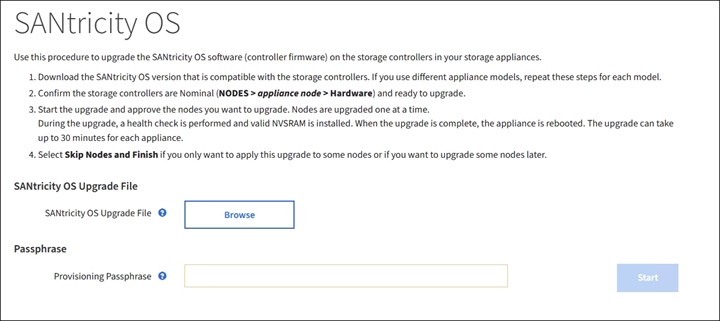

= Eseguire la manutenzione
:allow-uri-read: 
:icons: font
:imagesdir: ../media/

[role="lead"]
È possibile eseguire diverse procedure di manutenzione per mantenere aggiornato il sistema StorageGRID e garantirne l'efficienza. Grid Manager offre strumenti e opzioni per facilitare il processo di esecuzione delle attività di manutenzione.

== Aggiornamenti software

È possibile eseguire tre tipi di aggiornamenti software dalla pagina Software Update in Grid Manager:

* Aggiornamento del software StorageGRID
* Hotfix StorageGRID
* Aggiornamento del sistema operativo SANtricity

== Aggiornamenti del software StorageGRID

Quando è disponibile una nuova versione di StorageGRID Feature, la pagina aggiornamento software guida l'utente attraverso il processo di caricamento del file richiesto e l'aggiornamento del sistema StorageGRID. È necessario aggiornare tutti i nodi grid per tutti i siti del data center dal nodo di amministrazione primario.

Durante un aggiornamento del software StorageGRID, le applicazioni client possono continuare ad acquisire e recuperare i dati degli oggetti.

== Hotfix

Se i problemi relativi al software vengono rilevati e risolti tra una versione e l'altra, potrebbe essere necessario applicare una correzione rapida al sistema StorageGRID.

Le hotfix StorageGRID contengono modifiche software rese disponibili al di fuori di una release di funzionalità o patch. Le stesse modifiche sono incluse in una release futura.

La pagina Hotfix di StorageGRID, illustrata di seguito, consente di caricare un file hotfix.

image::../media/hotfix_choose_file.png[Prima pagina di correzione rapida StorageGRID]

La correzione rapida viene applicata per prima al nodo di amministrazione primario. Quindi, è necessario approvare l'applicazione della correzione rapida ad altri nodi della griglia fino a quando tutti i nodi nel sistema StorageGRID non eseguono la stessa versione software. È possibile personalizzare la sequenza di approvazione selezionando per approvare singoli nodi della griglia, gruppi di nodi della griglia o tutti i nodi della griglia.

NOTE: Mentre tutti i nodi della griglia vengono aggiornati con la nuova versione di hotfix, le modifiche effettive di una hotfix potrebbero interessare solo servizi specifici su tipi specifici di nodi. Ad esempio, una correzione rapida potrebbe influire solo sul servizio LDR sui nodi di storage.

== Aggiornamenti del sistema operativo SANtricity

Se i controller non funzionano in modo ottimale, potrebbe essere necessario aggiornare il software SANtricity OS sui controller storage delle appliance di storage. È possibile caricare il file del sistema operativo SANtricity nel nodo di amministrazione principale del sistema StorageGRID e applicare l'aggiornamento da Gestione griglia.

La pagina SANtricity, illustrata di seguito, consente di caricare il file di aggiornamento del sistema operativo SANtricity.

Dopo aver caricato il file, è possibile approvare l'aggiornamento su singoli nodi di storage o su tutti i nodi. La possibilità di approvare i nodi in modo selettivo semplifica la pianificazione dell'aggiornamento. Dopo aver approvato un nodo per l'aggiornamento, il sistema esegue un controllo dello stato di salute e installa l'aggiornamento, se applicabile al nodo.

== Procedure di espansione

È possibile espandere un sistema StorageGRID aggiungendo volumi di storage ai nodi storage, aggiungendo nuovi nodi grid a un sito esistente o aggiungendo un nuovo sito del data center. Se si dispone di nodi di storage che utilizzano l'appliance di storage SG6060 o SG6060X, è possibile aggiungere uno o due shelf di espansione per raddoppiare o triplicare la capacità di storage del nodo.

È possibile eseguire espansioni senza interrompere il funzionamento del sistema corrente. Quando si aggiungono nodi o un sito, si distribuiscono i nuovi nodi e quindi si esegue la procedura di espansione dalla pagina Grid Expansion.

image::../media/grid_expansion_progress.png[Questa immagine viene spiegata dal testo circostante.]

== Procedure di recovery dei nodi

I nodi Grid possono non funzionare se un guasto hardware, virtualizzazione, sistema operativo o software rende il nodo inutilizzabile o inaffidabile.

I passaggi per il ripristino di un nodo grid dipendono dalla piattaforma in cui è ospitato il nodo grid e dal tipo di nodo grid. Ogni tipo di nodo della griglia dispone di una procedura di ripristino specifica, che è necessario seguire con precisione. In genere, se possibile, si tenta di conservare i dati dal nodo della griglia guasto, riparare o sostituire il nodo guasto, utilizzare la pagina Recovery per configurare il nodo sostitutivo e ripristinare i dati del nodo.

Ad esempio, questo diagramma di flusso mostra la procedura di ripristino in caso di guasto di un nodo amministratore.

image::../media/overview_admin_node_recovery.png[Panoramica: Admin Node Recovery (Ripristino nodo amministratore)]

== Procedure di decommissionamento

Si consiglia di rimuovere in modo permanente i nodi grid o un intero sito del data center dal sistema StorageGRID.

Ad esempio, potrebbe essere necessario decommissionare uno o più nodi di rete nei seguenti casi:

* È stato aggiunto un nodo di storage più grande al sistema e si desidera rimuovere uno o più nodi di storage più piccoli, preservando al contempo gli oggetti.
* Richiede meno storage totale.
* Non è più necessario un nodo gateway o un nodo amministratore non primario.
* La griglia include un nodo disconnesso che non è possibile ripristinare o ripristinare online.

È possibile utilizzare la pagina Decommission Nodes in Grid Manager per rimuovere i seguenti tipi di nodi griglia:

* Nodi di storage, a meno che non resti un numero sufficiente di nodi nel sito per supportare determinati requisiti
* Nodi gateway
* Nodi amministrativi non primari

image::../media/decommission_nodes_page_all_connected.png[Schermata della pagina di decommissionamento]

Per rimuovere un sito, puoi utilizzare la pagina Decommission Site di Grid Manager. La decommissionazione di un sito connesso rimuove un sito operativo e conserva i dati. La decommissionazione di un sito disconnesso rimuove un sito guasto ma non conserva i dati. La procedura guidata Decommission Site guida l'utente nel processo di selezione del sito, visualizzazione dei dettagli del sito, revisione dei criteri ILM, rimozione dei riferimenti del sito dalle regole ILM e risoluzione dei conflitti di nodo.

image::../media/decommission_site_step_select_site.png[Decommissionare il sito fase 1]

== Procedure di manutenzione della rete

Alcune delle procedure di manutenzione della rete che potrebbe essere necessario eseguire includono quanto segue:

* Aggiornamento delle subnet sulla rete Grid
* Utilizzo dello strumento Change IP per modificare la configurazione di rete inizialmente impostata durante l'implementazione della griglia
* Aggiunta, rimozione o aggiornamento dei server DNS (Domain Name System)
* Aggiunta, rimozione o aggiornamento di server NTP (Network Time Protocol) per garantire la sincronizzazione accurata dei dati tra i nodi di rete
* Ripristino della connettività di rete ai nodi che potrebbero essere stati isolati dal resto della griglia

== Procedure middleware e a livello di host

Alcune procedure di manutenzione sono specifiche per i nodi StorageGRID implementati su Linux o VMware oppure sono specifiche di altri componenti della soluzione StorageGRID. Ad esempio, è possibile eseguire la migrazione di un nodo grid a un host Linux diverso o la manutenzione su un nodo di archiviazione connesso a Tivoli Storage Manager (TSM).

== Cloning del nodo dell'appliance

Il cloning dei nodi dell'appliance consente di sostituire facilmente un nodo dell'appliance esistente nel grid con un'appliance dal design più recente o con funzionalità avanzate che fanno parte dello stesso sito StorageGRID logico. Il processo trasferisce tutti i dati alla nuova appliance, mettendola in servizio per sostituire il nodo della vecchia appliance e lasciandola in uno stato pre-installato. La clonazione offre un processo di aggiornamento dell'hardware semplice da eseguire e un metodo alternativo per la sostituzione delle appliance.

== Procedure del nodo di rete

Potrebbe essere necessario eseguire alcune procedure su un nodo della griglia specifico. Ad esempio, potrebbe essere necessario riavviare un nodo di rete o arrestare e riavviare manualmente un servizio di nodo di rete specifico. È possibile eseguire alcune procedure dei nodi della griglia da Grid Manager; altre richiedono l'accesso al nodo della griglia e l'utilizzo della riga di comando del nodo.

.Informazioni correlate
* xref:../admin/index.adoc[Amministrare StorageGRID]
* xref:../upgrade/index.adoc[Aggiornare il software]
* xref:../expand/index.adoc[Espandi il tuo grid]
* xref:../maintain/index.adoc[Ripristino e manutenzione]

