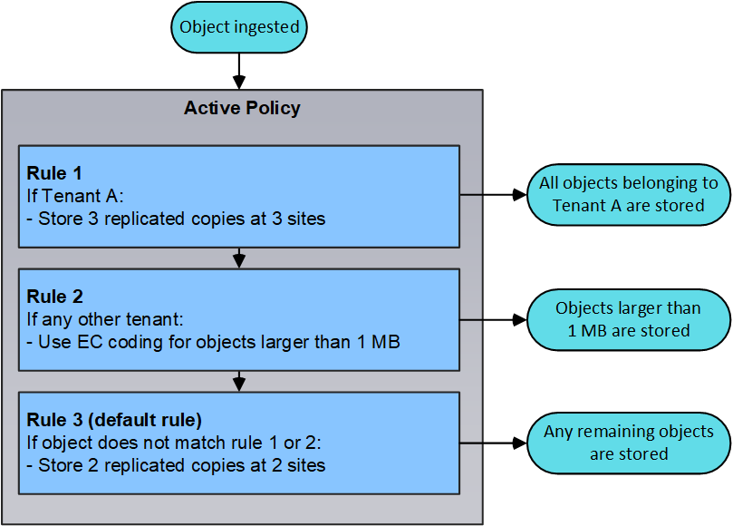

= Utilizza la gestione del ciclo di vita delle informazioni
:allow-uri-read: 
:icons: font
:imagesdir: ../media/

[role="lead"]
Si utilizza la gestione del ciclo di vita delle informazioni (ILM) per controllare il posizionamento, la durata e la protezione dei dati per tutti gli oggetti nel sistema StorageGRID. Le regole ILM determinano il modo in cui StorageGRID memorizza gli oggetti nel tempo. Configurare una o più regole ILM e aggiungerle a un criterio ILM.

Le regole ILM definiscono:

* Quali oggetti devono essere memorizzati. Una regola può essere applicata a tutti gli oggetti oppure è possibile specificare filtri per identificare gli oggetti a cui si applica una regola. Ad esempio, una regola può essere applicata solo agli oggetti associati a determinati account tenant, a specifici bucket S3 o a contenitori Swift o a specifici valori di metadati.
* Il tipo e la posizione di storage. Gli oggetti possono essere memorizzati nei nodi di storage, nei pool di storage cloud o nei nodi di archiviazione.
* Il tipo di copie a oggetti eseguite. Le copie possono essere replicate o codificate per la cancellazione.
* Per le copie replicate, il numero di copie eseguite.
* Per le copie codificate erasure, viene utilizzato lo schema di erasure coding.
* Il cambia nel tempo nella posizione di storage di un oggetto e nel tipo di copie.
* Modalità di protezione dei dati degli oggetti durante l'acquisizione degli oggetti nella griglia (posizionamento sincrono o doppio commit).

Si noti che i metadati degli oggetti non sono gestiti dalle regole ILM. I metadati degli oggetti vengono invece memorizzati in un database Cassandra in un archivio di metadati. Tre copie dei metadati degli oggetti vengono gestite automaticamente in ogni sito per proteggere i dati dalla perdita. Le copie sono distribuite uniformemente in tutti i nodi di storage.

== Esempio di regola ILM

Questo esempio di regola ILM si applica agli oggetti appartenenti al tenant A. Esegue due copie replicate di tali oggetti e memorizza ciascuna copia in un sito diverso. Le due copie vengono conservate "`forever,`", il che significa che StorageGRID non le eliminerà automaticamente. Al contrario, StorageGRID conserverà questi oggetti fino a quando non saranno cancellati da una richiesta di eliminazione del client o dalla scadenza di un ciclo di vita del bucket.

Questa regola utilizza l'opzione bilanciata per il comportamento di acquisizione: L'istruzione di posizionamento a due siti viene applicata non appena il tenant A salva un oggetto in StorageGRID, a meno che non sia possibile eseguire immediatamente entrambe le copie richieste. Ad esempio, se il sito 2 non è raggiungibile quando il tenant A salva un oggetto, StorageGRID eseguirà due copie intermedie sui nodi di storage nel sito 1. Non appena il sito 2 sarà disponibile, StorageGRID effettuerà la copia richiesta presso il sito.

image::../media/ilm_example_rule_2_copies_tenant_a.png[La regola ILM 2 di esempio copia il tenant A.]

== Come un criterio ILM valuta gli oggetti

Il criterio ILM attivo per il sistema StorageGRID controlla il posizionamento, la durata e la protezione dei dati di tutti gli oggetti.

Quando i client salvano gli oggetti in StorageGRID, gli oggetti vengono valutati in base all'insieme ordinato di regole ILM nel criterio attivo, come segue:

. Se i filtri per la prima regola del criterio corrispondono a un oggetto, l'oggetto viene acquisito in base al comportamento di acquisizione di tale regola e memorizzato in base alle istruzioni di posizionamento di tale regola.
. Se i filtri per la prima regola non corrispondono all'oggetto, l'oggetto viene valutato in base a ogni regola successiva nel criterio fino a quando non viene effettuata una corrispondenza.
. Se nessuna regola corrisponde a un oggetto, vengono applicate le istruzioni di inserimento e posizionamento della regola predefinita nel criterio. La regola predefinita è l'ultima regola di un criterio e non può utilizzare alcun filtro. Deve essere applicato a tutti i tenant, a tutti i bucket e a tutte le versioni degli oggetti.

== Esempio di policy ILM

Questo esempio di policy ILM utilizza tre regole ILM.

image::../media/policy_for_two_tenants.png[Esempio di policy per due tenant]

In questo esempio, la regola 1 corrisponde a tutti gli oggetti appartenenti al tenant A. Questi oggetti vengono memorizzati come tre copie replicate in tre siti. Gli oggetti appartenenti ad altri tenant non corrispondono alla regola 1, quindi vengono valutati in base alla regola 2.

La regola 2 corrisponde a tutti gli oggetti degli altri tenant, ma solo se sono superiori a 1 MB. Questi oggetti più grandi vengono memorizzati utilizzando la codifica di cancellazione 6+3 in tre siti. La regola 2 non corrisponde a oggetti di dimensioni pari o inferiori a 1 MB, pertanto questi oggetti vengono valutati in base alla regola 3.

La regola 3 è l'ultima regola predefinita del criterio e non utilizza filtri. La regola 3 crea due copie replicate di tutti gli oggetti non corrispondenti alla regola 1 o alla regola 2 (oggetti non appartenenti al tenant A di dimensioni pari o inferiori a 1 MB).

*Informazioni correlate*

* xref:../ilm/index.adoc[Gestire gli oggetti con ILM]

