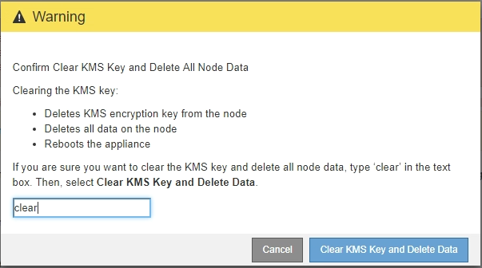

= Cancellare la configurazione del server di gestione delle chiavi
:allow-uri-read: 
:icons: font
:imagesdir: ../media/

[role="lead"]
La cancellazione della configurazione del server di gestione delle chiavi (KMS) disattiva la crittografia dei nodi sull'appliance. Dopo aver cancellato la configurazione KMS, i dati dell'appliance vengono cancellati in modo permanente e non sono più accessibili. Questi dati non sono ripristinabili.

.Di cosa hai bisogno
Se è necessario conservare i dati sull'appliance, è necessario eseguire una procedura di decommissionamento del nodo o clonare il nodo prima di cancellare la configurazione KMS.

IMPORTANT: Una volta cancellato il KMS, i dati dell'appliance verranno cancellati in modo permanente e non più accessibili. Questi dati non sono ripristinabili.

xref:../maintain/grid-node-decommissioning.adoc[Decommissionare il nodo] per spostare i dati in esso contenuti in altri nodi della griglia.

.A proposito di questa attività
La cancellazione della configurazione KMS dell'appliance disattiva la crittografia dei nodi, rimuovendo l'associazione tra il nodo dell'appliance e la configurazione KMS per il sito StorageGRID. I dati sull'appliance vengono quindi cancellati e l'appliance viene lasciata in uno stato pre-installato. Questo processo non può essere invertito.

È necessario cancellare la configurazione KMS:

* Prima di installare l'appliance in un altro sistema StorageGRID, che non utilizza un KMS o che utilizza un KMS diverso.
+

IMPORTANT: Non cancellare la configurazione KMS se si intende reinstallare un nodo appliance in un sistema StorageGRID che utilizza la stessa chiave KMS.

* Prima di poter ripristinare e reinstallare un nodo in cui la configurazione KMS è stata persa e la chiave KMS non è ripristinabile.
* Prima di restituire qualsiasi apparecchio precedentemente in uso presso il sito.
* Dopo la disattivazione di un'appliance con crittografia del nodo attivata.

IMPORTANT: Decommissionare l'appliance prima di eliminare il KMS per spostare i dati in altri nodi del sistema StorageGRID. L'eliminazione di KMS prima dello smantellamento dell'appliance comporta la perdita di dati e potrebbe rendere l'appliance inutilizzabile.

.Fasi
. Aprire un browser e inserire uno degli indirizzi IP del controller di elaborazione dell'appliance.
+
`*https://_Controller_IP_:8443*`

+
`_Controller_IP_` È l'indirizzo IP del controller di calcolo (non dello storage controller) su una qualsiasi delle tre reti StorageGRID.

+
Viene visualizzata la pagina iniziale del programma di installazione dell'appliance StorageGRID.

. Selezionare *Configura hardware* > *crittografia nodo*.
+
image::../media/clear_kms.png[CONFIGURAZIONE chiara DI KMS]

+

IMPORTANT: Se la configurazione KMS viene cancellata, i dati sull'appliance verranno eliminati in modo permanente. Questi dati non sono ripristinabili.

. Nella parte inferiore della finestra, selezionare *Clear KMS Key and Delete Data* (Cancella chiave KMS e Elimina dati).
. Se si è certi di voler cancellare la configurazione KMS, digitare +
`*clear*` + e selezionare *Clear KMS Key (Cancella chiave KMS) e Delete Data (Elimina dati)*.
+

+
La chiave di crittografia KMS e tutti i dati vengono cancellati dal nodo e l'appliance viene riavviata. Questa operazione può richiedere fino a 20 minuti.

. Aprire un browser e inserire uno degli indirizzi IP del controller di elaborazione dell'appliance. +
`*https://_Controller_IP_:8443*`
+
`_Controller_IP_` È l'indirizzo IP del controller di calcolo (non dello storage controller) su una qualsiasi delle tre reti StorageGRID.

+
Viene visualizzata la pagina iniziale del programma di installazione dell'appliance StorageGRID.

. Selezionare *Configura hardware* > *crittografia nodo*.
. Verificare che la crittografia del nodo sia disattivata e che le informazioni relative a chiave e certificato in *Key Management Server Details* e *Clear KMS Key and Delete Data* Control siano rimosse dalla finestra.
+
La crittografia dei nodi non può essere riattivata sull'appliance fino a quando non viene reinstallata in una griglia.

.Al termine
Dopo aver riavviato l'appliance e aver verificato che il sistema KMS è stato cancellato e che l'appliance è in uno stato di preinstallazione, è possibile rimuoverlo fisicamente dal sistema StorageGRID. Vedere xref:../maintain/preparing-appliance-for-reinstallation-platform-replacement-only.adoc[istruzioni per la preparazione dell'apparecchio per la reinstallazione].

.Informazioni correlate
xref:../admin/index.adoc[Amministrare StorageGRID]
