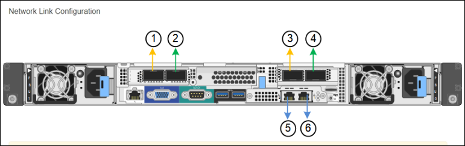

= Configurazione dei collegamenti di rete (SG100 e SG1000)
:allow-uri-read: 
:icons: font
:imagesdir: ../media/

[role="lead"]
È possibile configurare i collegamenti di rete per le porte utilizzate per collegare l'appliance a Grid Network, Client Network e Admin Network. È possibile impostare la velocità di collegamento e le modalità di connessione di rete e porta.

.Di cosa hai bisogno
* Hai ottenuto l'apparecchiatura aggiuntiva necessaria per il tipo di cavo e la velocità di collegamento.
* Le porte di rete sono state collegate a switch che supportano la velocità scelta.

Se si intende utilizzare la modalità aggregate port bond, LACP network bond mode o tagging VLAN:

* Le porte di rete dell'appliance sono state collegate a switch in grado di supportare VLAN e LACP.
* Se nel bond LACP partecipano più switch, questi supportano i gruppi MLAG (Multi-chassis link Aggregation groups) o equivalenti.
* Si comprende come configurare gli switch per l'utilizzo di VLAN, LACP e MLAG o equivalente.
* Si conosce il tag VLAN univoco da utilizzare per ciascuna rete. Questo tag VLAN verrà aggiunto a ciascun pacchetto di rete per garantire che il traffico di rete venga instradato alla rete corretta.

.A proposito di questa attività
Le figure mostrano come le quattro porte di rete sono collegate in modalità Fixed Port Bond (configurazione predefinita).

*SG100 Fixed Port Bond mode*

image::../media/sg100_fixed_port_draft.png[SG100 Fixed Port Bond Mode]

*SG1000 Fixed Port Bond mode*

image::../media/sg1000_fixed_port.png[SG1000 Fixed Port Bond Mode]

|===
| Didascalia | Quali porte sono collegate 

 a| 
C.
 a| 
Le porte 1 e 3 sono collegate tra loro per la rete client, se viene utilizzata questa rete.

 a| 
G
 a| 
Le porte 2 e 4 sono collegate tra loro per la rete Grid.

|===
Questa figura mostra come le quattro porte di rete sono collegate in modalità aggregate port bond.

*SG100 aggregate port bond mode*

image::../media/sg100_aggregate_ports.png[Aggregate Port Bond Mode SG100]

*Modalità aggregata port bond SG1000*

image::../media/sg1000_aggregate_ports.png[Aggregate Port Bond Mode SG1000]

|===
| Didascalia | Quali porte sono collegate 

 a| 
1
 a| 
Tutte e quattro le porte sono raggruppate in un unico collegamento LACP, consentendo l'utilizzo di tutte le porte per il traffico Grid Network e Client Network.

|===
La tabella riassume le opzioni per la configurazione delle quattro porte di rete. Le impostazioni predefinite sono visualizzate in grassetto. Se si desidera utilizzare un'impostazione non predefinita, è necessario configurare le impostazioni nella pagina di configurazione del collegamento.

NOTE: Per impostazione predefinita, il criterio hash di trasmissione LACP passa alla modalità layer2+3. Se necessario, è possibile utilizzare l'API Grid Management per passare alla modalità layer3+4.

* *Modalità port bond fissa (predefinita)*
+
|===
| Network bond mode (modalità bond di | Client Network disabled (rete client disattivata) (impostazione predefinita) | Rete client abilitata 

 a| 
Active-Backup (impostazione predefinita)
 a| 
** Le porte 2 e 4 utilizzano un bond di backup attivo per Grid Network.
** Le porte 1 e 3 non vengono utilizzate.
** Un tag VLAN è opzionale.

 a| 
** Le porte 2 e 4 utilizzano un bond di backup attivo per Grid Network.
** Le porte 1 e 3 utilizzano un bond di backup attivo per la rete client.
** I tag VLAN possono essere specificati per entrambe le reti.

 a| 
LACP (802.3ad)
 a| 
** Le porte 2 e 4 utilizzano un collegamento LACP per la rete Grid.
** Le porte 1 e 3 non vengono utilizzate.
** Un tag VLAN è opzionale.

 a| 
** Le porte 2 e 4 utilizzano un collegamento LACP per la rete Grid.
** Le porte 1 e 3 utilizzano un collegamento LACP per la rete client.
** I tag VLAN possono essere specificati per entrambe le reti.

|===
* *Aggregate port bond mode*
+
|===
| Network bond mode (modalità bond di | Client Network disabled (rete client disattivata) (impostazione predefinita) | Rete client abilitata 

 a| 
Solo LACP (802.3ad)
 a| 
** Le porte 1-4 utilizzano un unico collegamento LACP per la rete Grid.
** Un singolo tag VLAN identifica i pacchetti Grid Network.

 a| 
** Le porte 1-4 utilizzano un unico collegamento LACP per Grid Network e Client Network.
** Due tag VLAN consentono di separare i pacchetti Grid Network dai pacchetti Client Network.

|===

Per ulteriori informazioni, consultare l'articolo relativo alle connessioni delle porte GbE per l'appliance di servizi.

Questa figura mostra come le due porte di gestione 1-GbE su SG100 sono collegate in modalità bond di rete Active-Backup per la rete di amministrazione.

Queste figure mostrano come le due porte di gestione 1-GbE dell'appliance sono collegate in modalità Network Bond Active-Backup per la rete di amministrazione.

*SG100 Admin Network ports bonded*

image::../media/sg100_bonded_management_ports.png[Admin Network Ports Bonded SG100]

*Porte di rete amministrative SG1000 collegate*

image::../media/sg1000_bonded_management_ports.png[Admin Network Ports Bonded SG1000]

.Fasi
. Dalla barra dei menu del programma di installazione dell'appliance StorageGRID, fare clic su *Configura rete* > *Configurazione del collegamento*.
+
La pagina Network link Configuration (Configurazione collegamento di rete) visualizza un diagramma dell'appliance con le porte di rete e di gestione numerate.

+
*Porte SG100*

+
image::../media/sg100_configuring_network_ports.png[Connettori posteriori SG100]

+
*Porte SG1000*

+

+
La tabella link Status (Stato collegamento) elenca lo stato del collegamento e la velocità delle porte numerate (SG1000 visualizzato).

+
image::../media/sg1000_configuring_network_link_status.png[Stato del collegamento SG1000]

+
La prima volta che si accede a questa pagina:

+
** *Velocità di collegamento* impostata su *Auto*.
** *Port bond mode* è impostato su *Fixed*.
** *Network bond mode* è impostato su *Active-Backup* per Grid Network.
** L'opzione *Admin Network* (rete amministrativa) è attivata e la modalità Network bond (bond di rete) è impostata su *Independent* (indipendente).
** La *rete client* è disattivata.
+
image::../media/sg1000_network_link_configuration_fixed.png[Configurazione del collegamento di rete corretta]

. Selezionare la velocità di collegamento per le porte di rete dall'elenco a discesa *velocità di collegamento*.
+
Anche gli switch di rete utilizzati per la rete di rete e la rete client devono supportare ed essere configurati per questa velocità. È necessario utilizzare gli adattatori o i ricetrasmettitori appropriati per la velocità di collegamento configurata. Se possibile, utilizza la velocità di collegamento automatica perché questa opzione negozia sia la velocità di collegamento che la modalità FEC (Forward Error Correction) con il partner di collegamento.

. Attivare o disattivare le reti StorageGRID che si intende utilizzare.
+
La rete grid è obbligatoria. Non è possibile disattivare questa rete.

+
.. Se l'appliance non è connessa alla rete di amministrazione, deselezionare la casella di controllo *Enable network* (attiva rete) per la rete di amministrazione.
+
image::../media/admin_network_disabled.gif[Schermata che mostra la casella di controllo per attivare o disattivare la rete di amministrazione]

.. Se l'appliance è connessa alla rete client, selezionare la casella di controllo *Enable network* (attiva rete) per la rete client.
+
Vengono visualizzate le impostazioni di rete client per le porte NIC dati.

. Fare riferimento alla tabella e configurare la modalità Port bond e la modalità Network bond.
+
Questo esempio mostra:

+
** *Aggregate* e *LACP* selezionati per le reti Grid e Client. È necessario specificare un tag VLAN univoco per ciascuna rete. È possibile selezionare valori compresi tra 0 e 4095.
** *Active-Backup* selezionato per la rete di amministrazione.
+
image::../media/sg1000_network_link_configuration_aggregate.png[Aggregato Network link Configuration]

. Una volta selezionate le opzioni desiderate, fare clic su *Save* (Salva).
+

NOTE: La connessione potrebbe andare persa se sono state apportate modifiche alla rete o al collegamento tramite il quale si è connessi. Se la connessione non viene riconnessa entro 1 minuto, immettere nuovamente l'URL del programma di installazione dell'appliance StorageGRID utilizzando uno degli altri indirizzi IP assegnati all'appliance: +
`*https://_services_appliance_IP_:8443*`

.Informazioni correlate
xref:obtaining-additional-equipment-and-tools-sg100-and-sg1000.adoc[Ottenere apparecchiature e strumenti aggiuntivi (SG100 e SG1000)]
