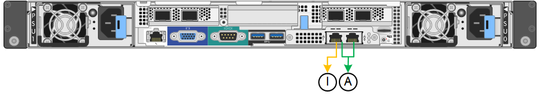

= Network bond mode per le porte di gestione
:allow-uri-read: 
:icons: font
:imagesdir: ../media/

[role="lead"]
Per le due porte di gestione 1-GbE sull'appliance di servizi, è possibile scegliere la modalità Independent network bond o la modalità Active-Backup network bond per connettersi alla rete amministrativa opzionale.

*Porte di gestione della rete SG100*

*Porte di gestione della rete SG1000*

image::../media/sg1000_bonded_management_ports.png[Porte di gestione della rete SG1000]

In modalità indipendente, solo la porta di gestione a sinistra è connessa alla rete di amministrazione. Questa modalità non fornisce un percorso ridondante. La porta di gestione a destra è disconnessa e disponibile per le connessioni locali temporanee (utilizza l'indirizzo IP 169.254.0.1)

In modalità Active-Backup, entrambe le porte di gestione sono collegate alla rete di amministrazione. È attiva una sola porta alla volta. In caso di guasto della porta attiva, la relativa porta di backup fornisce automaticamente una connessione di failover. L'Unione di queste due porte fisiche in una porta di gestione logica fornisce un percorso ridondante alla rete di amministrazione.

NOTE: Se è necessario effettuare una connessione locale temporanea all'appliance di servizi quando le porte di gestione 1-GbE sono configurate per la modalità Active-Backup, rimuovere i cavi da entrambe le porte di gestione, collegare il cavo temporaneo alla porta di gestione a destra e accedere all'appliance utilizzando l'indirizzo IP 169.254.0.1.

|===
| Didascalia | Network bond mode (modalità bond di 

 a| 
R
 a| 
Modalità Active-Backup. Entrambe le porte di gestione sono collegate a una porta di gestione logica collegata alla rete di amministrazione.

 a| 
IO
 a| 
Modalità indipendente. La porta a sinistra è collegata alla rete di amministrazione. La porta a destra è disponibile per le connessioni locali temporanee (indirizzo IP 169.254.0.1).

|===