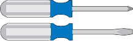

= Ottenere apparecchiature e strumenti aggiuntivi (SG100 e SG1000)
:allow-uri-read: 
:icons: font
:imagesdir: ../media/

[role="lead"]
Prima di installare l'appliance StorageGRID, verificare di disporre di tutte le apparecchiature e gli strumenti aggiuntivi necessari.

Per installare e configurare l'hardware sono necessarie le seguenti apparecchiature aggiuntive:

* *Cacciaviti*
+

+
Phillips No. 2 cacciaviti

+
Cacciavite medio a lama piatta

* *Braccialetto ESD*
+
image::../media/appliance_wriststrap.gif[Braccialetto antistatico]

* *Cavi ottici e ricetrasmettitori*
+
image::../media/fc_cable_and_sfp.gif[Cavo ottico e ricetrasmettitore QSFP+]

+
** Cavo
+
*** Twinax/rame (da 1 a 4)
+
oppure

*** Fibra/ottica (da 1 a 4)

** da 1 a 4 di ciascuno di questi ricetrasmettitori/adattatori in base alla velocità di collegamento (velocità miste non supportate)
+
*** SG100:
+
|===
| Velocità di collegamento (GbE) | Attrezzatura necessaria 

 a| 
10
 a| 
Ricetrasmettitore SFP+

 a| 
25
 a| 
Ricetrasmettitore SFP28

|===
*** SG1000:
+
|===
| Velocità di collegamento (GbE) | Attrezzatura necessaria 

 a| 
10
 a| 
Adattatore QSFP-SFP (QSA) e ricetrasmettitore SFP+

 a| 
25
 a| 
Adattatore QSFP-SFP (QSA) e ricetrasmettitore SFP28

 a| 
40
 a| 
Ricetrasmettitore QSFP+

 a| 
100
 a| 
Ricetrasmettitore QFSP28

|===

* *Cavi Ethernet RJ-45 (Cat5/Cat5e/Cat6/Cat6a)*
+
image::../media/ethernet_cables.png[Cavo Ethernet]

* *Laptop di assistenza*
+
image::../media/sam_management_client.gif[Laptop di assistenza]

+
xref:../admin/web-browser-requirements.adoc[Browser Web supportato]

+
Porta 1-GbE (RJ-45)

+

NOTE: Alcune porte potrebbero non supportare velocità Ethernet 10/100.

* *Strumenti opzionali*
+
image::../media/optional_tools.gif[Perforatrice e torcia elettrica]

+
Trapano elettrico con punta Phillips

+
Torcia

