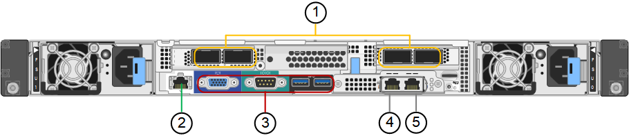

= Panoramica delle appliance SG100 e SG1000
:allow-uri-read: 
:icons: font
:imagesdir: ../media/

[role="lead"]
L'appliance di servizi StorageGRID SG100 e l'appliance di servizi SG1000 possono operare come nodo gateway e come nodo amministratore per fornire servizi di bilanciamento del carico ad alta disponibilità in un sistema StorageGRID. Entrambe le appliance possono operare contemporaneamente come nodi gateway e nodi di amministrazione (primari o non primari).

== Caratteristiche dell'appliance

Entrambi i modelli di appliance di servizi offrono le seguenti funzionalità:

* Funzioni nodo gateway o nodo amministratore per un sistema StorageGRID.
* Il programma di installazione dell'appliance StorageGRID per semplificare l'implementazione e la configurazione dei nodi.
* Una volta implementato, può accedere al software StorageGRID da un nodo di amministrazione esistente o dal software scaricato su un disco locale. Per semplificare ulteriormente il processo di implementazione, una versione recente del software viene precaricata sull'appliance durante la produzione.
* Un BMC (Baseboard Management Controller) per il monitoraggio e la diagnosi di alcuni componenti hardware dell'appliance.
* La possibilità di connettersi a tutte e tre le reti StorageGRID, tra cui la rete di rete, la rete amministrativa e la rete client:
+
** SG100 supporta fino a quattro connessioni a 10 o 25 GbE alla rete grid e alla rete client.
** SG1000 supporta fino a quattro connessioni a 10, 25, 40 o 100 GbE alla rete grid e alla rete client.

== Diagrammi SG100 e SG1000

Questa figura mostra la parte anteriore di SG100 e SG1000 con il pannello rimosso.

NOTE: Dalla parte anteriore, i due apparecchi sono identici, ad eccezione del nome del prodotto sul pannello.

I due dischi a stato solido (SSD), indicati dal contorno arancione, vengono utilizzati per memorizzare il sistema operativo StorageGRID e vengono mirrorati utilizzando RAID1 per la ridondanza. Quando l'appliance di servizi SG100 o SG1000 è configurata come nodo di amministrazione, questi dischi vengono utilizzati per memorizzare registri di audit, metriche e tabelle di database.

Gli slot rimanenti sono vuoti.

image::../media/sg1000_front_with_ssds.png[Anteriore con SSD SG100 e SG1000]

== Connettori sul retro di SG100

Questa figura mostra i connettori sul retro dell'unità SG100.

image::../media/sg100_rear_connectors.png[Connettori posteriori SG100]

|===
|  | Porta | Tipo | Utilizzare 

 a| 
1
 a| 
Porte di rete 1-4
 a| 
10/25-GbE, basato sul tipo di ricetrasmettitore via cavo o SFP (sono supportati i moduli SFP28 e SFP+), la velocità dello switch e la velocità di collegamento configurata
 a| 
Connettersi alla rete griglia e alla rete client per StorageGRID.

 a| 
2
 a| 
Porta di gestione BMC
 a| 
1 GbE (RJ-45)
 a| 
Connettersi al controller di gestione della scheda base dell'appliance.

 a| 
3
 a| 
Porte di supporto e diagnostica
 a| 
* VGA
* Seriale, 115200 8-N-1
* USB

 a| 
Riservato per l'utilizzo del supporto tecnico.

 a| 
4
 a| 
Admin Network port (porta di rete amministratore) 1
 a| 
1 GbE (RJ-45)
 a| 
Collegare l'appliance alla rete di amministrazione per StorageGRID.

 a| 
5
 a| 
Admin Network Port (porta di rete amministratore) 2
 a| 
1 GbE (RJ-45)
 a| 
Opzioni:

* Collegamento con la porta di gestione 1 per una connessione ridondante alla rete di amministrazione per StorageGRID.
* Lasciare disconnesso e disponibile per l'accesso locale temporaneo (IP 169.254.0.1).
* Durante l'installazione, utilizzare la porta 2 per la configurazione IP se gli indirizzi IP assegnati da DHCP non sono disponibili.

|===

== Connettori sul retro di SG1000

Questa figura mostra i connettori sul retro dell'unità SG1000.

|===
|  | Porta | Tipo | Utilizzare 

 a| 
1
 a| 
Porte di rete 1-4
 a| 
10/25/40/100-GbE, in base al tipo di cavo o ricetrasmettitore, alla velocità dello switch e alla velocità di collegamento configurata. QSFP28 e QSFP+ (40/100GbE) sono supportati in modo nativo e i ricetrasmettitori SFP28/SFP+ possono essere utilizzati con un QSA (venduto separatamente) per utilizzare velocità 10/25GbE.
 a| 
Connettersi alla rete griglia e alla rete client per StorageGRID.

 a| 
2
 a| 
Porta di gestione BMC
 a| 
1 GbE (RJ-45)
 a| 
Connettersi al controller di gestione della scheda base dell'appliance.

 a| 
3
 a| 
Porte di supporto e diagnostica
 a| 
* VGA
* Seriale, 115200 8-N-1
* USB

 a| 
Riservato per l'utilizzo del supporto tecnico.

 a| 
4
 a| 
Admin Network port (porta di rete amministratore) 1
 a| 
1 GbE (RJ-45)
 a| 
Collegare l'appliance alla rete di amministrazione per StorageGRID.

 a| 
5
 a| 
Admin Network Port (porta di rete amministratore) 2
 a| 
1 GbE (RJ-45)
 a| 
Opzioni:

* Collegamento con la porta di gestione 1 per una connessione ridondante alla rete di amministrazione per StorageGRID.
* Lasciare disconnesso e disponibile per l'accesso locale temporaneo (IP 169.254.0.1).
* Durante l'installazione, utilizzare la porta 2 per la configurazione IP se gli indirizzi IP assegnati da DHCP non sono disponibili.

|===