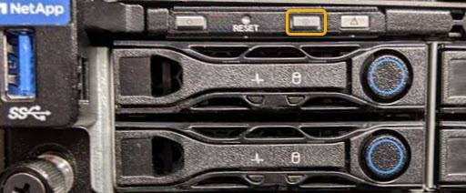

= Accendere e spegnere il LED di identificazione del controller
:allow-uri-read: 
:icons: font
:imagesdir: ../media/

[role="lead"]
Il LED blu di identificazione sulla parte anteriore e posteriore del controller può essere acceso per facilitare l'individuazione dell'appliance in un data center.

.Di cosa hai bisogno
È necessario disporre dell'indirizzo IP BMC del controller che si desidera identificare.

.Fasi
. Accedere all'interfaccia BMC del controller.
. Selezionare *Server Identify* (identificazione server).
. Selezionare *ON*, quindi *Perform Action* (Esegui azione).
+
image::../media/sg6060_service_identify_turn_on.jpg[Attivare il LED di identificazione del controller da BMC]

.Risultato
I LED blu indicano la luce sulla parte anteriore e posteriore del controller.

image::../media/sg6060_front_panel_service_led_on.jpg[LED di identificazione anteriore - acceso]

NOTE: Se sul controller è installato un pannello, potrebbe essere difficile vedere il LED di identificazione anteriore.

.Al termine
Per spegnere il LED di identificazione del controller:

* Premere l'interruttore di identificazione LED sul pannello anteriore del controller.
* Dall'interfaccia BMC del controller, selezionare *Server Identify*, selezionare *OFF*, quindi selezionare *Perform Action* (Esegui azione).

I LED blu indicano che i LED anteriori e posteriori del controller si spengono.

.Informazioni correlate
xref:locating-controller-in-data-center.adoc[Individuare il controller nel data center]

xref:accessing-bmc-interface-sg1000.adoc[Accedere all'interfaccia BMC]
