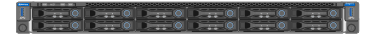

= Disimballare le scatole (SG100 e SG1000)
:allow-uri-read: 
:icons: font
:imagesdir: ../media/

[role="lead"]
Prima di installare l'appliance StorageGRID, disimballare tutte le confezioni e confrontare il contenuto con gli elementi riportati sulla confezione.

== Hardware dell'appliance

* *SG100 o SG1000*
+

* *Kit guida con istruzioni*
+
image::../media/rail_kit.gif[Kit di guide]

== Cavi di alimentazione

La spedizione per l'appliance StorageGRID include i seguenti cavi di alimentazione:

* *Due cavi di alimentazione per il tuo paese*
+
image::../media/power_cords.gif[Cavi di alimentazione]

+
Il cabinet potrebbe essere dotato di cavi di alimentazione speciali utilizzati al posto dei cavi di alimentazione forniti con l'apparecchio.

