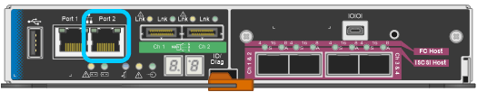

= Accedere al programma di installazione dell'appliance StorageGRID
:allow-uri-read: 
:icons: font
:imagesdir: ../media/

[role="lead"]
È necessario accedere al programma di installazione dell'appliance StorageGRID per configurare le connessioni tra l'appliance e le tre reti StorageGRID: Rete griglia, rete amministrativa (opzionale) e rete client (opzionale).

.Di cosa hai bisogno
* Si sta utilizzando un xref:../admin/web-browser-requirements.adoc[browser web supportato].
* L'appliance è connessa a tutte le reti StorageGRID che si intende utilizzare.
* Si conoscono l'indirizzo IP, il gateway e la subnet dell'appliance su queste reti.
* Sono stati configurati gli switch di rete che si intende utilizzare.

.A proposito di questa attività
Quando si accede per la prima volta al programma di installazione dell'appliance StorageGRID, è possibile utilizzare l'indirizzo IP assegnato da DHCP per la rete amministrativa (supponendo che l'appliance sia connessa alla rete amministrativa) o l'indirizzo IP assegnato da DHCP per la rete griglia. Si consiglia di utilizzare l'indirizzo IP per la rete amministrativa. In caso contrario, se si accede al programma di installazione dell'appliance StorageGRID utilizzando l'indirizzo DHCP per la rete griglia, la connessione con il programma di installazione dell'appliance StorageGRID potrebbe andare persa quando si modificano le impostazioni di collegamento e si inserisce un indirizzo IP statico.

.Fasi
. Ottenere l'indirizzo DHCP dell'appliance sulla rete di amministrazione (se collegata) o sulla rete di griglia (se non collegata).
+
È possibile effettuare una delle seguenti operazioni:

+
** Fornire l'indirizzo MAC per la porta di gestione 1 all'amministratore di rete, in modo che possa cercare l'indirizzo DHCP per questa porta nella rete di amministrazione. L'indirizzo MAC è stampato su un'etichetta sul controller E5600SG, accanto alla porta.
** Osservare il display a sette segmenti sul controller E5600SG. Se le porte di gestione 1 e 10 GbE 2 e 4 del controller E5600SG sono collegate a reti con server DHCP, il controller tenta di ottenere indirizzi IP assegnati dinamicamente all'accensione dell'enclosure. Una volta completato il processo di accensione, il display a sette segmenti visualizza *ho*, seguito da una sequenza di due numeri.
+
[listing]
----
HO -- IP address for Admin Network -- IP address for Grid Network HO
----
+
Nella sequenza:

+
*** Il primo set di numeri è l'indirizzo DHCP per il nodo di storage dell'appliance sulla rete di amministrazione, se connesso. Questo indirizzo IP viene assegnato alla porta di gestione 1 sul controller E5600SG.
*** Il secondo gruppo di numeri è l'indirizzo DHCP per il nodo di storage dell'appliance sulla rete di rete. Questo indirizzo IP viene assegnato alle porte 2 e 4 da 10 GbE quando si alimenta l'appliance per la prima volta.
+

NOTE: Se non è stato possibile assegnare un indirizzo IP utilizzando DHCP, viene visualizzato 0.0.0.0.

. Se è stato possibile ottenere uno degli indirizzi DHCP:
+
.. Aprire un browser Web sul laptop di assistenza.
.. Inserire questo URL per il programma di installazione dell'appliance StorageGRID: +
`*https://_E5600SG_Controller_IP_:8443*`
+
Per `_E5600SG_Controller_IP_`, Utilizzare l'indirizzo DHCP per il controller (utilizzare l'indirizzo IP per la rete amministrativa, se disponibile).

.. Se viene richiesto un avviso di protezione, visualizzare e installare il certificato utilizzando l'installazione guidata del browser.
+
L'avviso non verrà visualizzato al successivo accesso a questo URL.

+
Viene visualizzata la pagina iniziale del programma di installazione dell'appliance StorageGRID. Le informazioni e i messaggi visualizzati al primo accesso a questa pagina dipendono dalla modalità di connessione dell'appliance alle reti StorageGRID. Potrebbero essere visualizzati messaggi di errore che verranno risolti nelle fasi successive.

+
image::../media/appliance_installer_home_5700_5600.png[Schermata della parte superiore della home page del programma di installazione dell'appliance StorageGRID webscale]

. Se il controller E5600SG non riesce ad acquisire un indirizzo IP utilizzando DHCP:
+
.. Collegare il laptop di servizio alla porta di gestione 2 del controller E5600SG, utilizzando un cavo Ethernet.
+

.. Aprire un browser Web sul laptop di assistenza.
.. Inserire questo URL per il programma di installazione dell'appliance StorageGRID: +
`*\https://169.254.0.1:8443*`
+
Viene visualizzata la pagina iniziale del programma di installazione dell'appliance StorageGRID. Le informazioni e i messaggi visualizzati al primo accesso a questa pagina dipendono dalla modalità di connessione dell'appliance.

+

NOTE: Se non è possibile accedere alla home page tramite una connessione link-local, configurare l'indirizzo IP del laptop di servizio come `169.254.0.2`e riprovare.

. Esaminare tutti i messaggi visualizzati nella home page e configurare la configurazione del collegamento e la configurazione IP, secondo necessità.

.Informazioni correlate
xref:../admin/web-browser-requirements.adoc[Requisiti del browser Web]
