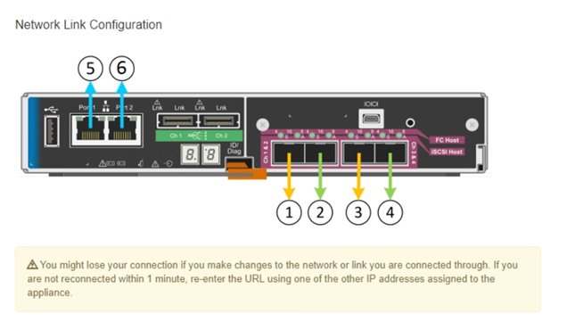
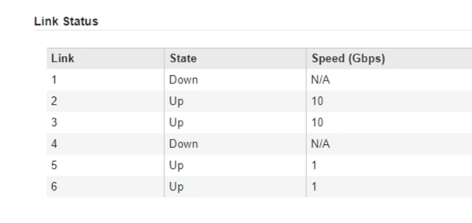

= Configurazione dei collegamenti di rete (SG5600)
:allow-uri-read: 
:icons: font
:imagesdir: ../media/

[role="lead"]
È possibile configurare i collegamenti di rete per le porte utilizzate per collegare l'appliance a Grid Network, Client Network e Admin Network. È possibile impostare la velocità di collegamento e le modalità di connessione di rete e porta.

.Di cosa hai bisogno
Se si intende utilizzare la modalità aggregate port bond, LACP network bond mode o tagging VLAN:

* Le porte 10 GbE dell'appliance sono state collegate a switch in grado di supportare VLAN e LACP.
* Se nel bond LACP partecipano più switch, questi supportano i gruppi MLAG (Multi-chassis link Aggregation groups) o equivalenti.
* Si comprende come configurare gli switch per l'utilizzo di VLAN, LACP e MLAG o equivalente.
* Si conosce il tag VLAN univoco da utilizzare per ciascuna rete. Questo tag VLAN verrà aggiunto a ciascun pacchetto di rete per garantire che il traffico di rete venga instradato alla rete corretta.

.A proposito di questa attività
Questa figura mostra come le quattro porte 10-GbE sono collegate in modalità Fixed Port Bond (configurazione predefinita).

image::../media/e5600sg_fixed_port.gif[Immagine che mostra come le porte 10-GbE sul controller E5600SG sono collegate in modalità fissa]

|===
| Didascalia | Quali porte sono collegate 

 a| 
C.
 a| 
Le porte 1 e 3 sono collegate tra loro per la rete client, se viene utilizzata questa rete.

 a| 
G
 a| 
Le porte 2 e 4 sono collegate tra loro per la rete Grid.

|===
Questa figura mostra come le quattro porte 10-GbE sono collegate in modalità aggregate Port Bond.

image::../media/e5600sg_aggregate_port.gif[Immagine che mostra come le porte 10-GbE sul controller E5600SG sono collegate in modalità aggregata]

|===
| Didascalia | Quali porte sono collegate 

 a| 
1
 a| 
Tutte e quattro le porte sono raggruppate in un unico collegamento LACP, consentendo l'utilizzo di tutte le porte per il traffico Grid Network e Client Network.

|===
La tabella riassume le opzioni per la configurazione delle quattro porte 10-GbE. Se si desidera utilizzare un'impostazione non predefinita, è necessario configurare le impostazioni nella pagina di configurazione del collegamento.

* *Modalità port bond fissa (predefinita)*
+
|===
| Network bond mode (modalità bond di | Client Network disabled (rete client disattivata) (impostazione predefinita) | Rete client abilitata 

 a| 
Active-Backup (impostazione predefinita)
 a| 
** Le porte 2 e 4 utilizzano un bond di backup attivo per Grid Network.
** Le porte 1 e 3 non vengono utilizzate.
** Un tag VLAN è opzionale.

 a| 
** Le porte 2 e 4 utilizzano un bond di backup attivo per Grid Network.
** Le porte 1 e 3 utilizzano un bond di backup attivo per la rete client.
** I tag VLAN possono essere specificati per entrambe le reti.

 a| 
LACP (802.3ad)
 a| 
** Le porte 2 e 4 utilizzano un collegamento LACP per la rete Grid.
** Le porte 1 e 3 non vengono utilizzate.
** Un tag VLAN è opzionale.

 a| 
** Le porte 2 e 4 utilizzano un collegamento LACP per la rete Grid.
** Le porte 1 e 3 utilizzano un collegamento LACP per la rete client.
** I tag VLAN possono essere specificati per entrambe le reti.

|===
* *Aggregate port bond mode*
+
|===
| Network bond mode (modalità bond di | Client Network disabled (rete client disattivata) (impostazione predefinita) | Rete client abilitata 

 a| 
Solo LACP (802.3ad)
 a| 
** Le porte 1-4 utilizzano un unico collegamento LACP per la rete Grid.
** Un singolo tag VLAN identifica i pacchetti Grid Network.

 a| 
** Le porte 1-4 utilizzano un unico collegamento LACP per Grid Network e Client Network.
** Due tag VLAN consentono di separare i pacchetti Grid Network dai pacchetti Client Network.

|===

Per ulteriori informazioni sulle modalità di bond di porta e di rete, consultare "`connessioni delle porte 10-GbE per il controller E5600SG`".

Questa figura mostra come le due porte di gestione 1-GbE sul controller E5600SG sono collegate in modalità bond di rete Active-Backup per la rete di amministrazione.

image::../media/e5600sg_aggregate_ports_bonded.gif[Porte di gestione collegate]

.Fasi
. Dalla barra dei menu del programma di installazione dell'appliance StorageGRID, fare clic su *Configura rete* > *Configurazione del collegamento*.
+
La pagina Network link Configuration (Configurazione collegamento di rete) visualizza un diagramma dell'appliance con le porte di rete e di gestione numerate.

+

+
La tabella link Status (Stato collegamento) elenca lo stato del collegamento (su/giù) e la velocità (1/10/25/40/100 Gbps) delle porte numerate.

+

+
La prima volta che si accede a questa pagina:

+
** *Velocità di collegamento* impostata su *10GbE*. Questa è l'unica velocità di collegamento disponibile per il controller E5600SG.
** *Port bond mode* è impostato su *Fixed*.
** *Network bond mode* per Grid Network è impostato su *Active-Backup*.
** L'opzione *Admin Network* (rete amministrativa) è attivata e la modalità Network bond (bond di rete) è impostata su *Independent* (indipendente).
** La *rete client* è disattivata.
+
image::../media/network_link_configuration_fixed.png[Configurazione del collegamento di rete corretta]

. Attivare o disattivare le reti StorageGRID che si intende utilizzare.
+
La rete grid è obbligatoria. Non è possibile disattivare questa rete.

+
.. Se l'appliance non è connessa alla rete di amministrazione, deselezionare la casella di controllo *Enable network* (attiva rete) per la rete di amministrazione.
+
image::../media/admin_network_disabled.gif[Schermata che mostra la casella di controllo per attivare o disattivare la rete di amministrazione]

.. Se l'appliance è connessa alla rete client, selezionare la casella di controllo *Enable network* (attiva rete) per la rete client.
+
Vengono ora visualizzate le impostazioni di rete client per le porte 10-GbE.

. Fare riferimento alla tabella e configurare la modalità Port bond e la modalità Network bond.
+
L'esempio mostra:

+
** *Aggregate* e *LACP* selezionati per le reti Grid e Client. È necessario specificare un tag VLAN univoco per ciascuna rete. È possibile selezionare valori compresi tra 0 e 4095.
** *Active-Backup* selezionato per la rete di amministrazione.
+
image::../media/network_link_configuration_aggregate.gif[Schermata che mostra le impostazioni di configurazione del collegamento per la modalità aggregata]

. Una volta selezionate le opzioni desiderate, fare clic su *Save* (Salva).
+

NOTE: La connessione potrebbe andare persa se sono state apportate modifiche alla rete o al collegamento tramite il quale si è connessi. Se la connessione non viene riconnessa entro 1 minuto, immettere nuovamente l'URL del programma di installazione dell'appliance StorageGRID utilizzando uno degli altri indirizzi IP assegnati all'appliance: +
`*https://_E5600SG_Controller_IP_:8443*`

.Informazioni correlate
xref:port-bond-modes-for-e5600sg-controller-ports.adoc[Modalità di port bond per le porte del controller E5600SG]
