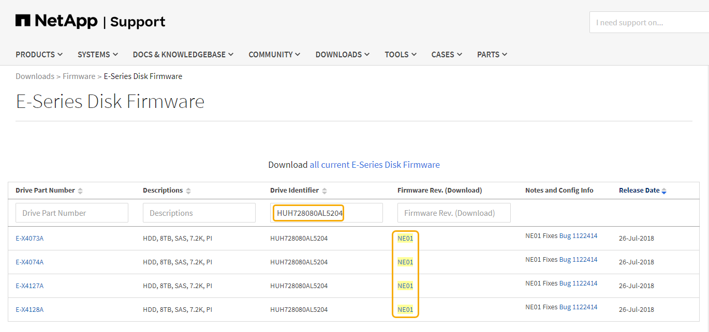

= Aggiornare il firmware del disco utilizzando Gestione storage SANtricity
:allow-uri-read: 
:icons: font
:imagesdir: ../media/

[role="lead"]
Il firmware del disco viene aggiornato per assicurarsi di disporre delle funzionalità più recenti e delle correzioni dei bug.

.Di cosa hai bisogno
* Lo stato dell'appliance di storage è ottimale.
* Tutti i dischi hanno uno stato ottimale.
* È installata la versione più recente di Gestione storage SANtricity compatibile con la versione di StorageGRID.
+
xref:upgrading-santricity-os-on-storage-controllers-using-grid-manager-sg5600.adoc[Aggiorna il sistema operativo SANtricity sui controller di storage utilizzando Grid Manager]

+
xref:upgrading-santricity-os-on-e2700-controller-using-maintenance-mode.adoc[Aggiornare il sistema operativo SANtricity sul controller E2700 utilizzando la modalità di manutenzione]

* Lo hai fatto xref:placing-appliance-into-maintenance-mode.adoc[Impostare l'appliance StorageGRID in modalità di manutenzione].
+

NOTE: La modalità di manutenzione interrompe la connessione al controller di storage, interrompendo tutte le attività di i/o e mettendo tutti i dischi offline.

IMPORTANT: Non aggiornare il firmware del disco su più appliance StorageGRID alla volta. In questo modo, i dati potrebbero non essere disponibili, a seconda del modello di implementazione e delle policy ILM.

.Fasi
. Verificare che l'apparecchio sia in posizione xref:placing-appliance-into-maintenance-mode.adoc[modalità di manutenzione].
. Aprire un browser Web e inserire l'indirizzo IP come URL per Gestione storage SANtricity: +
`*https://_E2700_Controller_IP_*`
. Immettere il nome utente e la password dell'amministratore di SANtricity Storage Manager, se necessario.
. Da Gestione aziendale SANtricity, selezionare la scheda *dispositivi*.
+
Viene visualizzata la finestra Gestione array SANtricity.

. Da Gestione array SANtricity, fare doppio clic sull'array di storage con i dischi da aggiornare.
. Verificare che lo stato dello storage array e dei dischi sia ottimale.
. Verificare la versione del firmware del disco attualmente installata nell'appliance di storage:
+
.. Da Gestione aziendale SANtricity, selezionare *Aggiorna* > *firmware unità*.
+
La finestra Download Drive firmware - Add Packages (Scarica firmware unità - Aggiungi pacchetti) visualizza i file del firmware del disco attualmente in uso.

.. Annotare le revisioni del firmware del disco e gli identificatori dei dischi correnti nei pacchetti firmware correnti.
+
image::../media/sg_storagemanager_upgrade_drive_firmware.png[Aggiornare il firmware del disco]

+
In questo esempio:

+
*** La revisione del firmware del disco è *NE00*.
*** L'identificatore del disco è *HUH728080AL5204*.

+
Selezionare *View Associated Drives* (Visualizza unità associate) per visualizzare la posizione in cui queste unità sono installate nell'appliance di storage.

. Scaricare e preparare l'aggiornamento del firmware del disco disponibile:
+
.. Aprire il browser Web, accedere al sito Web del supporto NetApp ed effettuare l'accesso utilizzando ID e password.
+
https://mysupport.netapp.com/site/["Supporto NetApp"^]

.. Sul sito Web del supporto NetApp, selezionare la scheda *Downloads*, quindi selezionare *e-Series Disk Drive firmware*.
+
Viene visualizzata la pagina e-Series Disk firmware (firmware disco e-Series).

.. Cercare ciascun *Drive Identifier* installato nell'appliance di storage e verificare che ciascun identificatore di unità disponga della versione firmware più recente.
+
*** Se la revisione del firmware non è un collegamento, l'identificatore del disco ha la revisione del firmware più recente.
*** Se per un identificatore di unità sono elencati uno o più codici prodotto, è disponibile un aggiornamento del firmware per questi dischi. È possibile selezionare qualsiasi collegamento per scaricare il file del firmware.
+

.. Se viene elencata una revisione del firmware successiva, selezionare il collegamento nella sezione firmware Rev. (Rev. Firmware) (Download) per scaricare un `.zip` archivio contenente il file del firmware.
.. Estrarre (decomprimere) i file di archivio del firmware del disco scaricati dal sito del supporto.

. Installare l'aggiornamento del firmware del disco:
+
.. Nella finestra Download firmware unità - Aggiungi pacchetti di SANtricity Storage Manager, selezionare *Aggiungi*.
.. Accedere alla directory contenente i file del firmware e selezionare fino a quattro file del firmware.
+
I file del firmware del disco hanno un nome file simile a +
`D_HUC101212CSS600_30602291_MS01_2800_0002.dlp`

+
La selezione di più file firmware per aggiornare il firmware dello stesso disco potrebbe causare un errore di conflitto del file. Se si verifica un errore di conflitto del file, viene visualizzata una finestra di dialogo di errore. Per risolvere questo errore, selezionare *OK* e rimuovere tutti gli altri file del firmware ad eccezione di quello che si desidera utilizzare per aggiornare il firmware del disco. Per rimuovere un file del firmware, selezionare il file del firmware nell'area informazioni pacchetti da trasferire e selezionare *Rimuovi*. Inoltre, è possibile selezionare fino a quattro pacchetti firmware per volta.

.. Selezionare *OK*.
+
Il sistema aggiorna l'area informazioni pacchetti da trasferire con i file del firmware selezionati.

.. Selezionare *Avanti*.
+
Viene visualizzata la finestra Download Drive firmware - Select Drives.

+
*** Tutti i dischi dell'appliance vengono sottoposti a scansione per ottenere informazioni sulla configurazione e sull'idoneità all'aggiornamento.
*** Viene visualizzata una selezione (a seconda della varietà di dischi presenti nell'array di storage) di dischi compatibili che possono essere aggiornati con il firmware selezionato. I dischi che possono essere aggiornati come operazione online vengono visualizzati per impostazione predefinita.
*** Il firmware selezionato per il disco viene visualizzato nell'area Proposed firmware information (informazioni firmware proposte). Se è necessario modificare il firmware, selezionare *Indietro* per tornare alla finestra di dialogo precedente.

.. Dalla funzione di aggiornamento del disco, selezionare l'operazione di download *Parallel* o *All*.
+
È possibile utilizzare uno di questi metodi di aggiornamento perché l'appliance è in modalità di manutenzione, in cui l'attività i/o viene interrotta per tutti i dischi e tutti i volumi.

.. In Compatible Drives (unità compatibili), selezionare le unità per le quali si desidera aggiornare i file del firmware selezionati.
+
*** Per uno o più dischi, selezionare ciascun disco che si desidera aggiornare.
*** Per tutte le unità compatibili, selezionare *Seleziona tutto*.
+
La procedura consigliata consiste nell'aggiornare tutti i dischi dello stesso modello alla stessa revisione del firmware.

.. Selezionare *fine*, quindi digitare `yes` E selezionare *OK*.
+
*** Viene avviato il download e l'aggiornamento del firmware del disco, con Download Drive firmware - Progress che indica lo stato del trasferimento del firmware per tutti i dischi.
*** Lo stato di ogni disco che partecipa all'aggiornamento viene visualizzato nella colonna Transfer Progress (avanzamento trasferimento) dei dispositivi aggiornati.
+
Il completamento di un'operazione di aggiornamento del firmware di un disco parallelo può richiedere fino a 90 secondi se tutti i dischi vengono aggiornati su un sistema a 24 dischi. Su un sistema più grande, il tempo di esecuzione è leggermente più lungo.

.. Durante il processo di aggiornamento del firmware, è possibile: +
+
*** Selezionare *Stop* per interrompere l'aggiornamento del firmware in corso. Tutti gli aggiornamenti del firmware attualmente in corso sono stati completati. Tutti i dischi che hanno tentato di aggiornare il firmware mostrano il loro stato individuale. Tutti i dischi rimanenti vengono elencati con lo stato non tentato.
+

IMPORTANT: L'interruzione dell'aggiornamento del firmware del disco potrebbe causare la perdita di dati o l'impossibilità di utilizzare dischi.

*** Selezionare *Salva con nome* per salvare un report di testo del riepilogo dell'avanzamento dell'aggiornamento del firmware. Il report viene salvato con un'estensione file .log predefinita. Se si desidera modificare l'estensione del file o la directory, modificare i parametri in Save Drive Download Log (Salva registro download unità).

.. USA Download Drive firmware - Progress per monitorare l'avanzamento degli aggiornamenti del firmware del disco. L'area Drives Updated (dischi aggiornati) contiene un elenco di dischi pianificati per l'aggiornamento del firmware e lo stato di trasferimento di ciascun disco scaricato e aggiornato.
+
L'avanzamento e lo stato di ogni disco che partecipa all'aggiornamento vengono visualizzati nella colonna Transfer Progress (avanzamento trasferimento). Eseguire l'azione consigliata appropriata in caso di errori durante l'aggiornamento.

+
*** *In sospeso*
+
Questo stato viene visualizzato per un'operazione di download del firmware online pianificata ma non ancora avviata.

*** *In corso*
+
Il firmware è in fase di trasferimento sul disco.

*** *Ricostruzione in corso*
+
Questo stato viene visualizzato se il trasferimento di un volume avviene durante la ricostruzione rapida di un disco. Questo è dovuto in genere a un ripristino o a un guasto del controller e il proprietario del controller trasferisce il volume.

+
Il sistema avvia una ricostruzione completa del disco.

*** *Non riuscito - parziale*
+
Il firmware è stato trasferito solo parzialmente sul disco prima che un problema impedisse il trasferimento del resto del file.

*** *Non riuscito - stato non valido*
+
Il firmware non è valido.

*** *Non riuscito - Altro*
+
Impossibile scaricare il firmware, probabilmente a causa di un problema fisico con il disco.

*** *Non tentato*
+
Il firmware non è stato scaricato, il che potrebbe essere dovuto a una serie di motivi diversi, come ad esempio l'interruzione del download prima che si verificasse il problema, l'unità non era idonea per l'aggiornamento o il download non si è verificato a causa di un errore.

*** *Riuscito*
+
Il firmware è stato scaricato correttamente.

. Al termine dell'aggiornamento del firmware del disco:
+
** Per chiudere la procedura guidata di download del firmware del disco, selezionare *Chiudi*.
** Per avviare nuovamente la procedura guidata, selezionare *Trasferisci altro*.

. Se questa procedura è stata completata correttamente e si dispone di procedure aggiuntive da eseguire mentre il nodo è in modalità di manutenzione, eseguirle ora. Al termine dell'operazione, o se si verificano errori e si desidera ricominciare, selezionare *Avanzate* > *Riavvia controller*, quindi selezionare una delle seguenti opzioni:
+
** Selezionare *Riavvia in StorageGRID*
** Selezionare *Reboot into Maintenance Mode* (Riavvia in modalità di manutenzione) per riavviare il controller con il nodo in modalità di manutenzione. Selezionare questa opzione se si verificano errori durante la procedura e si desidera ricominciare. Al termine del riavvio del nodo in modalità di manutenzione, riavviare dalla fase appropriata della procedura che ha avuto esito negativo.
+
image::../media/reboot_controller_from_maintenance_mode.png[Riavviare il controller in modalità di manutenzione]

+
Il riavvio dell'appliance e il ricongiungersi alla griglia possono richiedere fino a 20 minuti. Per confermare che il riavvio è stato completato e che il nodo ha ricongiungersi alla griglia, tornare a Grid Manager. La pagina *Nodes* dovrebbe visualizzare uno stato normale (nessuna icona a sinistra del nome del nodo) per il nodo appliance, a indicare che non sono attivi avvisi e che il nodo è connesso alla griglia.

+
image::../media/node_rejoin_grid_confirmation.png[Nodo appliance riconentrato in Grid]

