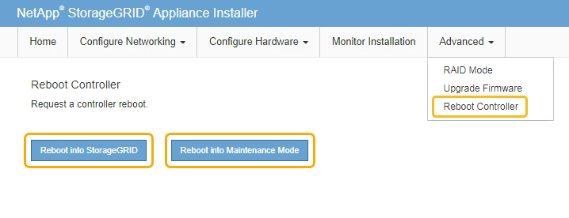

= Aggiornare il sistema operativo SANtricity sul controller E2700 utilizzando la modalità di manutenzione
:allow-uri-read: 
:icons: font
:imagesdir: ../media/

[role="lead"]
Se non si riesce ad aggiornare il software SANtricity OS utilizzando Grid Manager, utilizzare la procedura della modalità di manutenzione per applicare l'aggiornamento.

.Di cosa hai bisogno
* Hai consultato lo strumento matrice di interoperabilità NetApp (IMT) per confermare che la versione del sistema operativo SANtricity che stai utilizzando per l'aggiornamento è compatibile con l'appliance.
* Inserire il controller E5600 in xref:placing-appliance-into-maintenance-mode.adoc[modalità di manutenzione] Se non si utilizza Grid Manager. L'attivazione della modalità di manutenzione del controller interrompe il collegamento al controller E2700.
+

NOTE: In rari casi, l'attivazione della modalità di manutenzione di un'appliance StorageGRID potrebbe rendere l'appliance non disponibile per l'accesso remoto.

.A proposito di questa attività
Non aggiornare il sistema operativo SANtricity o NVSRAM nel controller e-Series su più appliance StorageGRID alla volta.

IMPORTANT: L'aggiornamento di più appliance StorageGRID alla volta potrebbe causare l'indisponibilità dei dati, a seconda del modello di implementazione e delle policy ILM.

.Fasi
. Verificare che l'apparecchio sia in posizione xref:placing-appliance-into-maintenance-mode.adoc[modalità di manutenzione].
. Da un laptop di assistenza, accedere a Gestione storage SANtricity ed effettuare l'accesso.
. Scaricare il nuovo file del software SANtricity OS e IL file NVSRAM sul client di gestione.
+

IMPORTANT: L'NVSRAM è specifico dell'appliance StorageGRID. Non utilizzare IL download STANDARD DI NVSRAM.

. Seguire le istruzioni riportate nelle _istruzioni per l'aggiornamento del software e del firmware E2700 e E5600 SANtricity_ o nella guida in linea di SANtricity Storage Manager e aggiornare il firmware DEL controller E2700, NVSRAM o entrambi.
+

IMPORTANT: Se è necessario aggiornare L'NVSRAM nel controller E2700, è necessario confermare che il file SANtricity OS scaricato è stato designato come compatibile con le appliance StorageGRID.

+

NOTE: Attivare immediatamente i file di aggiornamento. Non rinviare l'attivazione.

. Se questa procedura è stata completata correttamente e si dispone di procedure aggiuntive da eseguire mentre il nodo è in modalità di manutenzione, eseguirle ora. Al termine dell'operazione, o se si verificano errori e si desidera ricominciare, selezionare *Avanzate* > *Riavvia controller*, quindi selezionare una delle seguenti opzioni:
+
** Selezionare *Riavvia in StorageGRID*
** Selezionare *Reboot into Maintenance Mode* (Riavvia in modalità di manutenzione) per riavviare il controller con il nodo in modalità di manutenzione. Selezionare questa opzione se si verificano errori durante la procedura e si desidera ricominciare. Al termine del riavvio del nodo in modalità di manutenzione, riavviare dalla fase appropriata della procedura che ha avuto esito negativo.
+

+
Il riavvio dell'appliance e il ricongiungersi alla griglia possono richiedere fino a 20 minuti. Per confermare che il riavvio è stato completato e che il nodo ha ricongiungersi alla griglia, tornare a Grid Manager. La pagina Nodes (nodi) dovrebbe visualizzare uno stato normale (nessuna icona a sinistra del nome del nodo) per il nodo appliance, a indicare che non sono attivi avvisi e che il nodo è connesso alla griglia.

+
image::../media/node_rejoin_grid_confirmation.png[Nodo appliance riconentrato in Grid]

