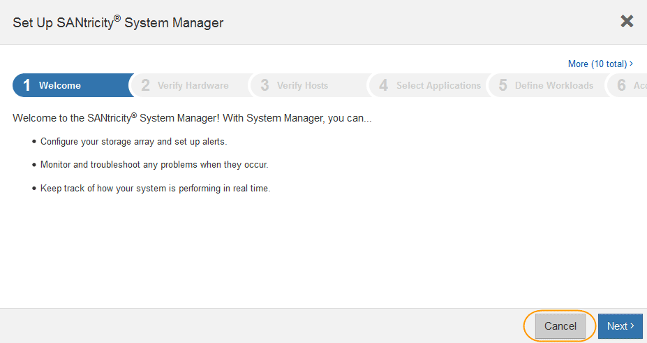

= Configurare e accedere a Gestore di sistema di SANtricity
:allow-uri-read: 
:icons: font
:imagesdir: ../media/

[role="lead"]
Potrebbe essere necessario accedere a Gestore di sistema di SANtricity sul controller di storage per monitorare l'hardware nello shelf del controller di storage o per configurare e-Series AutoSupport.

.Di cosa hai bisogno
* Si sta utilizzando un xref:../admin/web-browser-requirements.adoc[browser web supportato].
* Per accedere a Gestore di sistema SANtricity tramite Gestione griglia, è necessario aver installato StorageGRID e disporre dell'autorizzazione di amministratore o di accesso root.
* Per accedere a Gestione di sistema di SANtricity utilizzando il programma di installazione dell'appliance di StorageGRID, è necessario disporre del nome utente e della password dell'amministratore di Gestione di sistema di SANtricity.
* Per accedere direttamente a Gestore di sistema di SANtricity utilizzando un browser Web, è necessario disporre del nome utente e della password dell'amministratore di Gestione di sistema di SANtricity.

NOTE: È necessario disporre del firmware SANtricity 8.70 (11.70) o superiore per accedere a Gestione sistemi SANtricity utilizzando Gestione griglia o il programma di installazione dell'appliance StorageGRID. È possibile verificare la versione del firmware utilizzando il programma di installazione dell'appliance StorageGRID e selezionando *Guida* > *informazioni*.

IMPORTANT: L'accesso a Gestione di sistema SANtricity da Gestione griglia o dal programma di installazione dell'appliance è generalmente destinato solo al monitoraggio dell'hardware e alla configurazione di e-Series AutoSupport. Molte funzionalità e operazioni di Gestione sistema di SANtricity, come l'aggiornamento del firmware, non si applicano al monitoraggio dell'appliance StorageGRID. Per evitare problemi, seguire sempre le istruzioni di installazione e manutenzione dell'hardware dell'appliance.

.A proposito di questa attività
Esistono tre modi per accedere a Gestore di sistema di SANtricity, a seconda della fase del processo di installazione e configurazione in cui ci si trova:

* Se l'appliance non è ancora stata implementata come nodo nel sistema StorageGRID, utilizzare la scheda Avanzate del programma di installazione dell'appliance StorageGRID.
+

NOTE: Una volta implementato il nodo, non è più possibile utilizzare il programma di installazione dell'appliance StorageGRID per accedere a Gestione di sistema di SANtricity.

* Se l'appliance è stata implementata come nodo nel sistema StorageGRID, utilizzare la scheda Gestore di sistema di SANtricity nella pagina nodi di Gestione griglia.
* Se non è possibile utilizzare il programma di installazione dell'appliance StorageGRID o Gestione griglia, è possibile accedere direttamente a Gestione sistema SANtricity utilizzando un browser Web collegato alla porta di gestione.

Questa procedura include i passaggi per l'accesso iniziale a Gestore di sistema di SANtricity. Se è già stato configurato Gestore di sistema di SANtricity, accedere alla <<config_hardware_alerts_sg5700,Configurare gli avvisi hardware>> fase.

NOTE: L'utilizzo di Gestione griglia o del programma di installazione dell'appliance StorageGRID consente di accedere a Gestione di sistema SANtricity senza dover configurare o collegare la porta di gestione dell'appliance.

Si utilizza Gestore di sistema di SANtricity per monitorare quanto segue:

* Dati sulle performance come performance a livello di array storage, latenza i/o, utilizzo della CPU e throughput
* Stato dei componenti hardware
* Funzioni di supporto, inclusa la visualizzazione dei dati diagnostici

È possibile utilizzare Gestore di sistema di SANtricity per configurare le seguenti impostazioni:

* Avvisi e-mail, SNMP o syslog per i componenti nello shelf dello storage controller
* Impostazioni AutoSupport e-Series per i componenti nello shelf dello storage controller.
+
Per ulteriori informazioni su e-Series AutoSupport, consultare il centro di documentazione di e-Series.

+
http://mysupport.netapp.com/info/web/ECMP1658252.html["Sito di documentazione dei sistemi NetApp e-Series"^]

* Drive Security keys, necessari per sbloccare dischi protetti (questa operazione è necessaria se la funzione Drive Security è attivata)
* Password dell'amministratore per accedere a Gestione di sistema di SANtricity

.Fasi
. Utilizzare il programma di installazione dell'appliance StorageGRID e selezionare *Avanzate* > *Gestore di sistema SANtricity*
+

NOTE: Se il programma di installazione dell'appliance StorageGRID non è disponibile o la pagina di accesso non viene visualizzata, è necessario utilizzare l'indirizzo IP del controller di storage. Accedere a Gestore di sistema SANtricity accedendo all'IP del controller di storage: +
`*https://_Storage_Controller_IP_*`

+
Viene visualizzata la pagina di accesso per Gestore di sistema di SANtricity.

. Impostare o inserire la password dell'amministratore.
+

NOTE: Gestore di sistema di SANtricity utilizza una singola password di amministratore condivisa tra tutti gli utenti.

+
Viene visualizzata la procedura guidata di configurazione.

+

. Selezionare *Annulla* per chiudere la procedura guidata.
+

IMPORTANT: Non completare la configurazione guidata di un'appliance StorageGRID.

+
Viene visualizzata la home page di Gestore di sistema di SANtricity.

+
image::../media/sam_home_page.gif[Schermata iniziale di Gestione sistema SANtricity]

. [[config_hardware_alerts_sg5700,start=4]]Configura avvisi hardware.
+
.. Selezionare *Guida* per accedere alla guida in linea di Gestione di sistema di SANtricity.
.. Per ulteriori informazioni sugli avvisi, consultare la sezione *Impostazioni* > *Avvisi* della guida in linea.
.. Seguire le istruzioni "`How To`" per impostare avvisi e-mail, SNMP o syslog.

. Gestire AutoSupport per i componenti nello shelf dello storage controller.
+
.. Selezionare *Guida* per accedere alla guida in linea di Gestione di sistema di SANtricity.
.. Consulta la sezione *SUPPORT* > *Support Center* della guida in linea per scoprire la funzionalità di AutoSupport.
.. Seguire le istruzioni "`How To`" per gestire AutoSupport.
+
Per istruzioni specifiche sulla configurazione di un proxy StorageGRID per l'invio di messaggi e-Series AutoSupport senza utilizzare la porta di gestione, consultare le istruzioni per l'amministrazione di StorageGRID e cercare "Impostazioni proxy per e-Series AutoSupport".

+
xref:../admin/index.adoc[Amministrare StorageGRID]

. Se la funzione Drive Security è attivata per l'appliance, creare e gestire la chiave di sicurezza.
+
.. Selezionare *Guida* per accedere alla guida in linea di Gestione di sistema di SANtricity.
.. Per ulteriori informazioni su Drive Security, consultare la sezione *Impostazioni* > *sistema* > *Gestione delle chiavi di sicurezza* della guida in linea.
.. Seguire le istruzioni "`How To`" per creare e gestire la chiave di sicurezza.

. Se si desidera, modificare la password dell'amministratore.
+
.. Selezionare *Guida* per accedere alla guida in linea di Gestione di sistema di SANtricity.
.. Consultare la sezione *Home* > *Amministrazione array di storage* della guida in linea per informazioni sulla password dell'amministratore.
.. Seguire le istruzioni per modificare la password.

